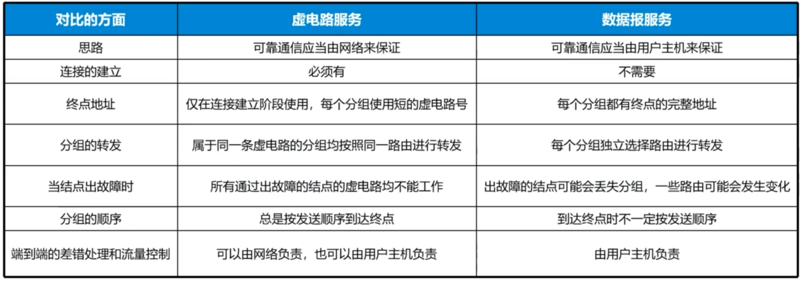
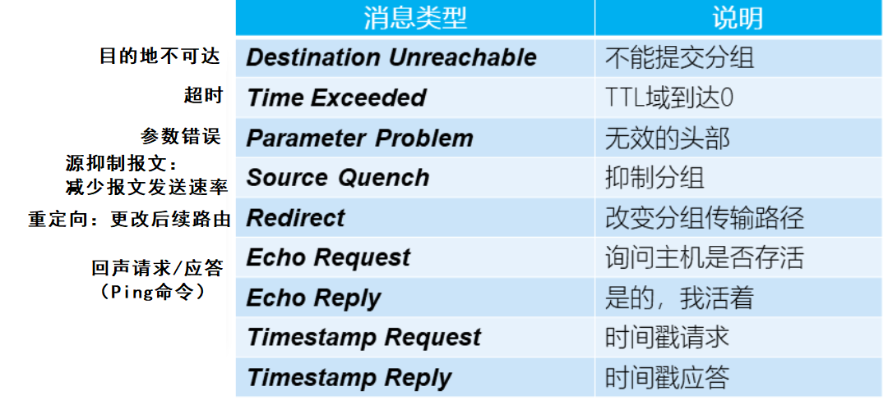
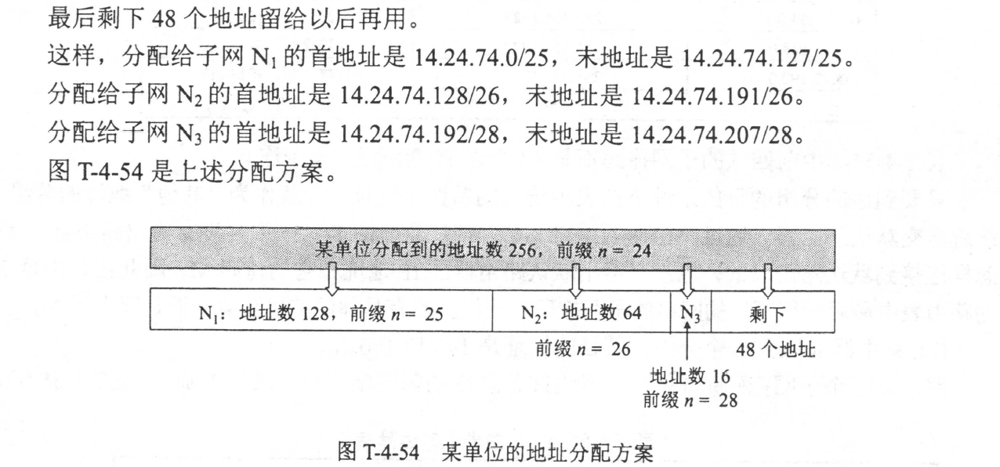
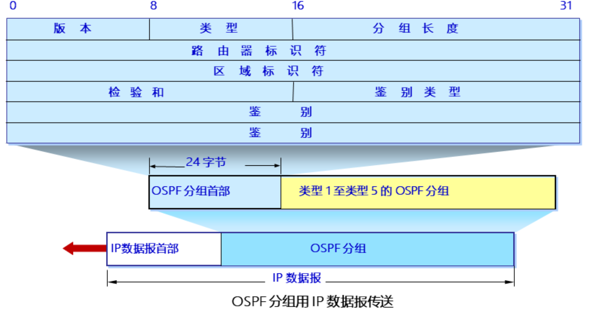
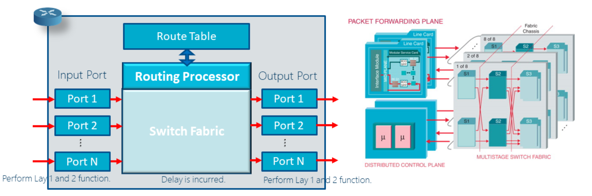
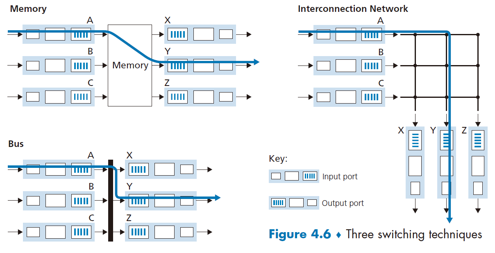
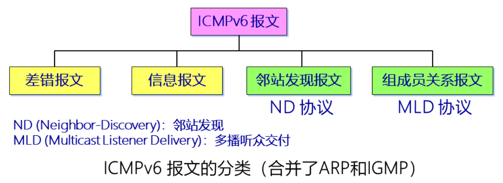
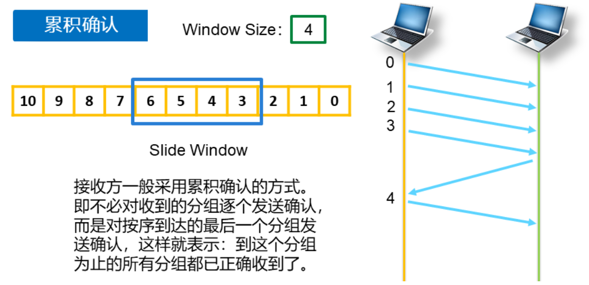

# 计算机网络

<b>By Recogerous</b>

<b>v6.3.5</b>

[TOC]

## 第一章  概述

计算机网络是<u>通信技术</u>与<u>计算机技术</u>相结合，实现<u>信息传输</u>和<u>资源共享</u>的一种信息系统。

### 分类

| 基于地域距离分类 | 局域网LAN、城域网MAN、广域网WAN、个域网、体域网、因特网 |
| ---------------- | ---------------------- |
| 基于传输技术分类 | 广播式网络、点到点网络（见 1.7 练习与拓展） |
| 基于传输介质分类 | 有线网、无线网（移动通讯 ≠ 无线通讯） |
| 基于管理技术分类 | 客户机-服务器方式（CS方式）、对等网方式 |

### 网络拓扑结构

网络拓扑结构分类指网上<u>计算机或设备</u>与<u>传输媒介</u>形成的<u>结点与线</u>的物理构成模式。计算机网络拓扑结构取决于**通信子网**。（见 1.4 OSI 参考模型）

网络的结点有两类：
- —类是转换和交换信息的转接结点，包括结点交换机、集线器和终端控制器等；
- 另一类是访问结点，包括计算机主机和终端等。

线则代表各种传输媒介，包括有形的和无形的。

#### 总线型

特点：一根电缆连接所有节点；简单，易于部署，成本低，易于扩展；电气信息延迟时间不确定，故障隔离和监测困难。

应用：主干线路、小型网络、某一网段

#### 星型

特点：所有节点连接到中心设备；集中监测和管理；需要更多的电缆；中央设备的故障可能影响全网；网络性能基本上由中心节点决定。

应用：局域网连接

#### 环形

持有令牌的节点发送信息，发送完后交给环的下一个节点。

特点：**时延确定**；网络中所有的节点组成一个闭合的环；网络结点同时充当转发器；环上的数据只能按一个方向传输；节点通过环发送数据的机会均等；任何时刻，只能有一个节点传输数据。

应用：令牌环

#### 网状（典型的计算机网络拓扑）

特点：网状是几种标准网络拓扑的混合形式；拓扑中的任意两个节点之间均有不止一条连接。

应用：广域网连接

$p.s.$ 判断网络拓扑类型，还需要看网络的工作机制，而非只看物理形式。

#### 对比

| **网络拓扑** | **优点**                                                     | **缺点**                                                     |
| ------------ | ------------------------------------------------------------ | ------------------------------------------------------------ |
| 总线         | 简单，易于部署，成本低，易于扩展。                           | 时延不确定，故障隔离和检测困难。                             |
| 星型         | 能集中监测和管理，易于部署， 一个节点的故障不影响其他节点。 | 如果中心连接设备故障， 可能影响整个网络。                |
| 环型         | 所有节点同等访问机会， 性能稳定均衡。                    | —个节点的故障影响整个网络； 在负载很轻时，信道利用率较低。 |
| 网状         | 可靠性较高，当—条线路有故障时， 不会影响整个系统工作。   | 由于节点与多个节点连接， 节点的路由选择和流量控制难度大， 管理软件复杂，硬件成本高。 |

### 计算机网络体系结构

#### 网络分层

优点：1. 各层的功能独立，复杂问题简单化；2. 实现模块化设计；3. 便于实现和维护；4. 有利于标准化；5. 各层的功能、结构相对稳定；6. 实现功能分工。

接口与服务：

- IDU：Interface Data Unit，接口数据单元，上下层要交互的信息，包括接口控制信息。
- SDU：服务数据单元，即传递的用户数据。
- ICI：上下层实体（entity）之间通讯的约束。    报头：对等实体之间的约束。

每一层收到上层发来的 IDU，根据 IDU 的控制信息进行处理之后，将 SDU 封装，加上报头，发送出去。

#### 服务原语 (Primitive)

将服务定义为原语，原语通常指不可再分的操作，在这里为：请求、指示、响应、证实。

建立连接需要上述四步，取消连接可能只需要其中两个原语，没有响应和证实。

#### 服务

服务分类：
- 面向连接的服务（通讯前是否协商、信息是否可以标识出顺序）
- 无连接的服务
- 有确认（可靠）的服务（是否对接受的信息进行确认，即是否有响应和证实）
- 无确认（不可靠）的服务

服务质量（QoS）：针对不同用户或数据流采用不同的优先级

##### 面向连接的服务

基于电话系统——首先建立连接、其次使用此连接通信、最后释放连接。

最本质的特点：发送端将数据依次压入管道，接收方依次取出数据，数据基本依次序抵达。

| **服务类型** | **应用例子** |
| ------------ | ------------ |
| 可靠的消息流 | 报文序列     |
| 可靠的字节流 | 远程登录     |
| 不可靠的连接 | 数字化的声音、视频 |

##### 无连接的服务

基于邮政系统——通信双方直接发送报文（message），无需握手。

最本质的特点：每个报文均携带完整地址，被独立路由，可能存在后发先到的情况。

| **服务类型**   | **应用例子** |
| -------------- | ------------ |
| 不可靠的数据报（datagram） | 电子函件     |
| 有确认的数据报 | 挂号邮件     |
| 问答           | 数据查询     |

#### 协议与协议栈

 - 协议：为进行网络中的数据交换而建立的规则、标准或约定。
 - 语法：数据与控制信息的结构或格式。
 - 语义：发出何种控制信息，完成何种动作以及做出何种响应。
 - 同步：事件实现顺序的详细说明。

- 协议是“水平的”，即协议是控制对等实体之间通信的规则。
- 服务是“垂直的”，即服务是由下层向上层通过层间接口提供的。

> 在文献中也还可以见到术语“协议栈”(protocol stack)。这是因为几个层次画在一起很像一个栈 (stack) 的结构。

### OSI参考模型

> 计算机网络是通信技术与计算机技术相结合，实现信息传输和资源共享的一种信息系统。

资源子网：计算机技术，负责实现资源共享。处于网络的外围，由主机系统、终端、终端控制器、外设、各种软件资源和信息组成。

通信子网：通信技术，负责进行信息传输。由通信控制处理机、通信线路与其他设备组成。

- 通信子网至少应分为三层：

  - 网络层（Network Layer）：寻址和路由、附加不同网络的互联
  - 数据链路层（Data Link Layer）：将网络层交下来的 IP 数据报组装成帧；规范相邻转发节点之间行为；流量控制、差错控制
  - 物理层（Physical Layer）：把数据包转换成电信号，以比特流为介质传输信息，确保正确的编码方式

- 资源子网分四层：

  - 传输层（Transport Layer）：完成屏蔽通信子网的不同，向上提供统一接口的功能（最核心）
  - 会话层（Session Layer）：管理不同的会话，当会话中断时恢复状态、同步
  - 表示层（Presentation Layer）：格式转换、数据压缩、数据加密
  - 应用层（Application Layer）：为用户提供应用接口，提供界面和应用程序；分配 IP 地址；域名解析

| 应用层     | 文件传输访问，消息、作业处理等各类应用程序进程及服务     |
| ---------- | ----------------------------------------------------|
| 表示层     | 数据表示（格式转换）、数据加解密、压缩和恢复、协议转化和语法协商等 |
| 会话层     | 会话连接和管理，同步控制                               |
| 传输层     | （最重要）建立端对端的连接、流量控制，并决定向上层提供的服务       |
| 网络层     | 寻址、路由选择、地址解析、数据分组、拥塞控制与网络互连等   |
| 数据链路层 | 成帧、差错和流量控制、数据链路管理                     |
| 物理层     | 物理网络的机械、电气和光特性以及接口的定义，以传输比特流 |

> 虽然应用进程数据要经过如图 1-17 所示的复杂过程才能送到终点的应用进程，但这些复杂过程对用户屏蔽掉了，以致应用进程 AP$_1$ 觉得好像是直接把数据交给了应用进程 AP$_2$。同理，任何两个同样的层次（例如在两个系统的第 4 层）之间，也好像如同图 1-17 中的水平虚线所示的那样，把数据（即数据单元加上控制信息）通过水平虚线直接传递给对方。这就是**所谓的“对等层”(peer layers) 之间的通信。** 我们以前经常提到的各层协议，实际上就是在各个对等层之间传递数据时的各项规定。

#### 各层具体功能

1. 物理层约束四个接口：机械接口、电气接口、光接口、过程接口（见 1.7 练习与拓展）
2. 数据链路层：
   1. 成帧（framing）：避免歧义，限制出现错误的范围（即对于消息流定义消息边界、分帧后减少消息出错的概率）
   2. 差错控制、流量控制、链路管理
   3. 另外，分两个子层：逻辑链路控制子层 (Logical Link Control) 和媒体访问控制子层 (Media Access Control)

3. 网络层
   1. 把网络协议数据单元从源传到目标 (路由)
   2. 寻址
   3. 网络互联
   4. 为上层提供虚连接或数据报服务

路由选择要素：性能标准、路由选择时机、路由选择地点、路由信息来源、路由选择策略、路由信息更新

路由算法：静态（扩散法、固定路由选择、随机路由选择、基于流量的路由选择）、动态（独立路由选择、集中路由选择、分布式路由选择）

4. 传输层：传输质量控制——分 ABC 类网络分别提供不同级别的服务：
	1. 简单类
	2. 基本错误恢复类
	3. 多路复用类
	4. 错误恢复和多路复用类
	5. 错误检测和恢复类
	
5. 会话层：概念上的层，功能很弱，往往与传输层和应用层合并（见 1.7 练习与拓展）
	1. 会话管理
	2. 同步管理
	3. 活动管理
	
6. 表示层：概念上的层
   1. 数据表达：
   
      提供数据表示和传送中的数据结构、提供数据编码及解码中的数据结构
   
   2. 数据压缩（和数据表达实际上都在应用层实现）
   
   3. 数据加密（在除了物理层之外的实际的层次都有实现）
   
7. 应用层：直接与应用程序接口，分与通信相关和与通信无关两大类；路由协议大部分在应用层

   1. 远程管理
   2. 电子邮件
   3. 虚拟终端
   4. 域名解析
   5. 路由协议

### TCP/IP 参考模型

TCP/IP参考模型：应用层、传输层、网络层/互连层、网络接口层（链路层，主机一网络层）

TCP/IP 协议栈的特点：是工业标准协议集，是可路由协议网状，具有健壮、可伸缩、跨平台结构，是 lnternet 访问通用协议集。

OSI 参考模型与 TCP/IP 参考模型的映射关系：

#### 应用层

应用层提供端口号的机制，套接字 Socket = lP Address + TCP (80) or UDP (53) Port

> 所谓套接字 (Socket)，就是对网络中不同主机上的应用进程之间进行双向通信的端点的抽象。套接字 Socket =（IP 地址：端口号）

- 服务器端：

  - 80 端口：上网用的端口号，Web 服务器，为 HTTP 协议保留，TCP 协议；

  - 53 端口：进行域名解析的端口号，DNS 服务器，UDP 协议。

- 客户端：端口号不固定，从 1024 以上随机产生。

#### 传输层

| **TCP**                      | **UDP**                    |
| ---------------------------- | -------------------------- |
| 可靠的、字节流的             | 不可靠的，数据流的         |
| 单播通信                     | 多播或广播通信             |
| 往往在传输大文件时使用       | 小文件                     |
| 快速性无要求（需要三次握手） | 快速发送数据（不建立连接） |

#### 网络层

核心协议：IP，负责寻址和路由；

辅助协议：ARP（将 IP 地址（逻辑地址）运算成网卡（物理）地址）、ICMP（对网络中的故障进行定位，进行简单的网络管理）、IGMP（支持在网络层实现多播通讯）

#### 网络接口层

没有明确的约束

### 网络性能参数

#### 速率

指的是连接在计算机网络上的主机在数字信道上传送数据的速率，它也称为数据率 (data rate) 或比特率 (bit rate)。

速率的单位是 bit/s、kbit/s、Mbit/s、Gbit/s 等，以 $10^3$ 为单位递增。例如 4×10^10 bit/s 的数据率就记为 40 Gbit/s。b/s = bps (bit per second)

M：Mega，兆‌，一百万，$10^6$ 　　G：Giga，吉，千兆，十亿，$10^9$ ‌　　T：Tera，太，$10^{12}$

速率往往是指额定速率或标称速率，非实际运行速率。

#### 带宽（Band width）

本来是指信号具有的频带宽度，其单位是赫 (或千赫、兆赫、吉赫等)。

在计算机网络中，指在单位时间内网络中的某信道所能通过的“最高数据率”。

> 这种意义的带宽的单位就是数据率的单位 bit/s，是“比特每秒”。

前者为频域称谓，而后者为时域称谓。通信链路的“带宽”越宽，其所能传输的“最高数据率”也越高。

#### 吞吐量 (Throughput)

在单位时间内通过某个网络（或信道、接口）成功传送的实际数据量。速率中还包含报头信息、控制信息，吞吐量指有效数据量。

吞吐量受网络的带宽或网络的额定速率的限制。

吞吐量更能准确在表示到底有多少数据量通过网络。

#### 时延（Delay / latency）

指数据 (一个报文或分组，甚至比特) 从网络 (或链路) 的一端传送到另一端所需的时间。包括：

- 发送时延：数据帧从结点进入到传输媒体所需的时间。

  发送时延 = 接收时延 = 传输时延

  <u>发送时延 = 数据帧长度 (bit) / 发送速率 (bit/s)</u>

- 传播时延：电磁波在信道中传播花费的时间。<u>传播时延与链路的带宽没有关系。</u>

  <u>传播时延 = 信道长度 (m) / 电磁波在信道上的传播速率 (m/s)</u>

- 处理时延：主机或路由器处理收到数据花费的时间。

- 排队时延：数据在路由器中队列中排队花费的时间。

- 接入时延：有数据发送到获得信道使用权发送出去的时间。

> 发送时延 (transmission delay) 是主机或路由器发送数据帧所需要的时间，也就是从发送数据帧的**第一个比特**算起，到该帧的**最后一个比特发送完毕**所需的时间。

> 发送时延发生在**机器内部的发送器**中（一般就是发生在网络适配器中......)，与传输信道的长度（或信号传送的距离）没有任何关系。但传播时延则发生在**机器外部的传输信道媒体**上，而与信号的发送速率无关。信号传送的距离越远，传播时延就越大。

总时延=发送时延＋传播时延＋处理时延＋排队时延

#### 时延带宽积（Bandwidth delay product）

链路的时延带宽积又称为以比特为单位的链路长度。时延带宽积 = 传播时延 × 带宽

> 我们可以用图 1-13 的示意图来表示时延带宽积。这是一个代表链路的圆柱形管道，**管道的长度**是链路的**传播时延**（请注意，现在以时间作为单位来表示链路长度)，而管道的**截面积**是链路的**带宽**。因此时延带宽积就表示这个管道的体积，表示这样的链路可容纳多少个比特。

> 链路的时延带宽积又称为以比特为单位的链路长度。

> 不难看出，管道中的比特数表示从发送端发出但尚未到达接收端的比特数。

只有在代表链路的管道都充满比特时，链路才得到了充分利用。

#### 时延抖动（Delay jitter）

指分组延迟的变化程度。网络时延随时都在不停的变化称为抖动。每个数据报传输路径不同，造成到达节点的时延不确定，因此出现时延抖动。

抖动对于实时性的传输将会是一个重要参数。

利用缓存可以克服过量的抖动，但是这将会增加时延。

#### 往返时间（Round-Trip Time，RTT）

指发送一个信号所花费的时间加上确认接收该信号所花费的时间。

RTT 也称为 ping 时间，可以通过 ping 命令确定。

RTT 对于实现可靠通信非常重要，用于计算重传时间。

#### 利用率（Utilization）

- 信道利用率指发送方在一个发送周期的时间内，有效的发送数据所需要的时间占整个发送周期的比率。

- 网络利用率是全网络的信道利用率的加权平均值。

信道利用率并非越高越好。$D=\dfrac{D_0}{1-U}$，$D_0$ 是网络空闲时的时延，$U$ 是网络利用率。当网络利用率接近最大值 1 时，网络产生的时延就趋于无穷大，即 $U\to1=U_\max$，$D\to \infty$。因此，信道利用率或网络利用率过高就会产生非常大的时延。

#### 非性能指标

费用 Cost、质量 Quality、标准化 Standardization、可靠性 Reliability、扩展性 Scalability、维护性 Maintainability

 

### 练习与拓展

1.计算机网络系统的基本组成是：（C）
A. 局域网和广域网  B. 本地计算机网和通信网  C. **通信子网和资源子网**  D. 服务器和工作站

> **计算机网络的组成**：
> 从组成部分来看：硬件，软件，协议
> 从工作方式来看：边缘部分（主机），核心部分（网络和路由器）
> 从功能组成来看：通信子网（实现信息传输的设备和软件），资源子网（实现资源共享的设备和软件）
>
> > ————————————————
> > 版权声明：本文为CSDN博主「YouDaoHua」的原创文章，遵循CC 4.0 BY-SA版权协议，转载请附上原文出处链接及本声明。
> > 原文链接：https://blog.csdn.net/YouDaoHua/article/details/105521260

---

2.关于广播式网络，说法错误的是（D）。
 A. 共享广播信道  B.**不存在路由选择问题**  C.**可以没有网络层**  D.不需要网络地址/不需要服务访问点

- 广播式网络：在网络中只有一个单一、公共的通信信道，由这个网络中所有的主机所共享，是局域网主要采用的方式。涉及到信道分配的问题。

- 点到点网络：发送者和接收者通过专属链路连接。

----

3.在计算机网络分层结构中，第 N 层与其上的 N+1 层的关系是<u>第 N 层向 N+1 层提供服务</u>。

> 我们再次关注某层**向它的上一层提供**的服务，即所谓一层的服务模型（service model）。...... 每层通过在该层中执行某些动作或**使用直接下层的服务**来提供服务。例如，由第 n 层提供的服务可能包括报文从网络的一边到另一边的可靠交付。这可能是通过使用第 n-1 层的边缘到边缘的不可靠报文传送服务，加上第 n 层的检测和重传丢失报文的功能来实现的。

“向上提供，使用下层”

----

4.网络协议的要素中（语义）用于协调和进行差错。

> 在计算机网络中要做到有条不紊地交换数据，就必须遵守一些事先约定好的规则。这些规则明确规定了所交换的数据的格式以及有关的同步问题。这里所说的**同步**不是狭义的（即同频或同频同相）而是广义的，即<u>在一定的条件下应当发生什么事件</u>（例如，应当发送一个应答信息），因而**同步含有时序的意思**。这些为进行网络中的数据交换而建立的规则、标准或约定称为**网络协议** （Network protocol)。网络协议也可简称为协议。更进一步讲，**网络协议主要由以下三个要素组成**：
> （1） 语法，即数据与控制信息的结构或格式；
> （2） 语义，即需要发出何种控制信息，完成何种动作以及做出何种响应；
> （3） 同步，即事件实现顺序的详细说明。

---

> 当两台主机要通信时，网络会在**两台主机之间**创建一条专用的**端到端**连接（end-to-end connection） 。

> 网络要通信，必须建立连接，不管有多远，中间有多少机器，都必须在两头（源和目的）间建立连接，一旦连接建立起来，就说已经是端到端连接了，即端到端是**逻辑链路**，这条路可能经过了很复杂的物理路线，但两端主机不管，只认为是有两端的连接，而且一旦通信完成，这个连接就释放了，物理线路可能又被别的应用用来建立连接了。

> **直接相连的节点对等实体的通信**叫点到点通信。它只提供一台机器到另一台机器之间的通信，不会涉及到程序或进程的概念。同时点到点通信并不能保证数据传输的可靠性，也不能说明源主机与目的主机之间是哪两个进程在通信，这些工作都是由传输层来完成的。  
>   
> 端到端通信建立在点到点通信的基础之上，它是由**一段段的点到点通信信道构成**的，是比点到点通信更高一级的通信方式，完成应用程序(进程)之间的通信。

>......计算机网络专业中端到端指客户端到客户端，也就是 pc 到 pc，p2p 也就是点到点通常指路由器某接口到某接口......
>
>> 作者：celeron533
>> 链接：https://www.zhihu.com/question/49245486/answer/114998653
>> 来源：知乎
>> 著作权归作者所有。商业转载请联系作者获得授权，非商业转载请注明出处。

---

5.以下关于对 OSI 划分层次的原则的论述哪一个是正确的（D）。

A.网中各结点可以有不同的层次

B.不同结点的同等层可以有不同的功能

C.每一层使用上层提供的服务，并向其下层提供服务

D.不同结点的同等层按照协议实现对等层之间的通信

【解析】ISO 在制定 OSI 参考模型时对**层次划分的主要原则**：

1. 网络中各结点都具有相同的层次；

2. 不同结点的同等层具有相同的功能；

3. 不同结点的同等层通过协议来实现对等层之间的通信；

4. 同一结点内相邻层之间通过接口通信；

5. 每个层可以使用下层提供的服务，并向其上层提供服务。“提上用下”

---

6.( **传输层** ) 在系统之间提供可靠、**透明**的数据传送，提供链路传输的错误恢复和流量控制。

7.物理层接口的 4 个特性是（**机械特性、电气特性、功能特性、过程特性**）。

8.在 OSI 七层协议中，**提供**一种建立连接并有序传输数据的**方法**的层是（**会话层**）。

> OSI 采用了分层的结构化技术，从下到上共分七层：
>
> （1）物理层：该层包括物理连网媒介，如电缆连线连接器。该层的协议产生并检测电压以便发送和接收携带数据的信号。<u>提供为建立、维护和拆除物理链路所需要的机械的、电气的、功能的和规程的特性。</u>具体标准有 RS232、V.35、RJ-45、FDDI。
>
> （2）数据链路层：它控制网络层与物理层之间的通信。它的主要功能是将从网络层接收到的数据分割成特定的可被物理层传输的帧。常见的协议有IEEE802.3/.2、HDLC、PPP、ATM。
>
> （3）网络层：其主要功能是将网络地址（例如IP地址）翻译成对应的物理地址（例如，网卡地址并决定如何将数据从发送方路由到接收方。在TCP/IP协议中，网络层具体协议有IP、ICMP、IGMP、IPX、ARP等。
>
> （4）传输层：主要负责确保数据可靠、顺序、无错地从A点传输到B点。如提供建立、维护和拆除传送连接的功能；选择网络层提供最合适的服务；<u>在系统之间提供可靠的透明的数据传送，提供端到端的错误恢复和流量控制。</u>在TCP/IP协议中，具体协议有TCP、UDP、SPX。
>
> （5）会话层：负责在网络中的两节点之间建立和维持通信，以及提供交互会话的管理功能，如三种数据流方向的控制，即一路交互、两路交替和两路同时会话模式。常见的协议有RPC、SQL、NFS。
>
> （6）表示层：如同应用程序和网络之间的翻译官，在表示层，数据将按照网络能理解的方案进行格式化；这种格式化也因所使用网络的类型不同而不同。表示层管理数据的解密加密、数据转换、格式化和文本压缩。常见的协议有JPEG、ASCII、GIF、DES、MPEG。

> **机械特性：** 指明接口所用接线器的形状和尺寸、引脚数目和排列、固定和锁定装置等。
>
> **电气特性：** 指明在接口电缆的各条线上出现的电压范围。
>
> **功能特性：** 指明某条线上出现某一电平的电压意义。
>
> **过程特性：** 指明对于不同功能的各种可能事件的出现顺序。

> 传输层的主要任务是：向用户提供可靠的端到端的差错和流量控制，保证报文的正确传输。传输层的作用是向高层**屏蔽下层**数据通信的细节，即向用户**透明地**传送报文。

---

9.传播时延与链路带宽的关系是 ( A )。

A.**没有关系**  B.反比关系  C.正比关系  D.无法确定

【解析】传播时延 = 信道长度 (m) / 电磁波在信道上的传播速率 (m/s)

---

10.如果收发两端的传输距离是 10km，信号在信道上的传播速率是 2.0´105 km/s，数据长度为 1000B，数据发送速率为 100kbit/s，则其发送时延是 ( A )。

A.0.08s    B.0.16s    C.0.00005s    D.0.0001s

【解析】首先注意审题，“发送时延”；其次，1000B=1000×8bit。

## 第二章  物理层

### 物理层基本概念

物理层考虑如何在传输介质上传输比特流，尽量屏蔽掉不同的传输介质、不同的通讯手段的差异，向上提供一个统一的接口。用于物理层的协议也常称为物理层**规程(procedure)**。

物理层的主要任务为确定与传输媒体的接口有关的一些特性，即：

**①机械特性：** 指明接口所用接线器的形状和尺寸、引脚数目和排列、固定和锁定装置等。

**②电气特性：** 指明在接口电缆的各条线上出现的电压范围。

**③功能特性：** 指明某条线上出现某一电平的电压意义。

**④过程特性：** 指明对于不同功能的各种可能事件的出现顺序。（某种事件组合代表发生某事）

#### 数据通信的基础知识

##### 数据通信系统的模型

##### 常用术语

- 数据：运送消息的实体。

- 信号(signal)：数据的电气的或电磁的表现。

  - **模拟/连续信号**：代表消息的参数的**取值是连续**的。

  - **数字信号**：代表消息的参数的**取值是离散**的。

有时**离散信号**又与数字信号产生区分，数字信号在取值上离散，离散信号在**时间分布**上离散。

例如，在图 2-1 中，用户家中的调制解调器到电话端局之间的用户线上传送的就是模拟信号；用户家中的计算机到调制解调器之间或在电话网中继线上传送的就是数字信号。

从数据链路层往上，处理的基本都是数字信号。

---

在使用时间域 (简称时域）的波形表示数字信号时，代表不同离散数值的基本波形就称为**码元（符号）**。在使用二进制编码时，只有两种不同的码元，一种代表 0 状态而另一种代表 1 状态。

码元：在数字通信中常常用时间间隔相同的符号来表示一位二进制数字，这样的时间间隔内的信号称为二进制码元。每秒钟传送码元的数目称为**波特率**。幅值不同可以使码元承载更多的二进制值，这使得波特率和传播信息的速率——**比特率**有所不同。<u>比特率 = 波特率 × $log_2$符号状态数</u>

##### 有关信道的几个基本概念

- 信道：一般用来表示向某一个方向传送信息的媒体。

- 单向通信：只能有一个方向的通信而没有反方向的交互。

- 双向交替通信（半双通通信）：通信的双方都能发送信息，但不能双方同时发送或接收。

- 双向同时通信（全双通通信）：通信的双方可以同时发送和接收信息。

---

- 基带信号：没有经过调制（进行频谱搬移和变换）的原始，包括数字基带信号和模拟基带信号。
- 基带调制：仅对基带信号的波形进行变换，使它能够与信道特性相适应。变换后的信号仍然是基带信号。把这种过程称为编码（coding）。
- 带通信号：把基带信号经过载波调制后的信号，把信号的频率范围搬移到较高的频段以便在信道中传输。
- 带通调制：使用载波（carrier）进行调制，把基带信号的频率范围搬移到较高的频段，并转换为模拟信号。

局域网涉及基带调制。以下为基带调制的类型。

##### 编码方式（encoding）

- 不归零制：正电平代表 1，负电平代表 0。
- 归零制：正脉冲代表 1，负脉冲代表 0。
- 曼彻斯特编码：位周期中心的向上跳变代表 0，位周期中心的向下跳变代表 1。但也可反过来定义。
- 差分曼彻斯特编码：在每一位的中心处始终都有跳变。位开始边界有跳变代表 0，而位开始边界没有跳变代表 1。

$p.s.$ 单极性的不归零制会出现歧义，实际上得不到使用。

不归零制中，连续的 0 或 1 会在电平变换时出现放电效应，会造成采样出现错误。

归零制中，需要在脉冲的正中间进行采样，采样偏离就可能采样不到数据，因此发送方和接收方需要有严格的同步。局域网中可能不存在授时机构或装置，设备本身也可能产生偏移，从而影响判决，因而有曼彻斯特编码。

> 曼彻斯特编码(Manchester coding)，又称**自同步编码**、相位编码(phase encoding, PE)，能够用信号的变化来保持发送设备和接收设备之间的同步。

差分曼彻斯特编码也为自同步编码方式。

差分曼彻斯特编码中，如果线路接反了，不影响接收效果。但成本太高。

##### 带通调制方式（Modulation）

- 调幅（AM）：载波的**振幅**随基带数字信号而变化。
- 调频（FM）：载波的**频率**随基带数字信号而变化。
- 调相（PM）：载波的**初始相位**随基带数字信号而变化。

为了达到更高的信息传输速率，必须采用技术上更为复杂的多元制的振幅相位混合调制方法。例如，正交振幅调制 QAM (Quadrature Amplitude Modulation)。（见 2.1.2 练习与拓展）

不是码元越多越好。若每一个码元可表示的比特数越多，则在接收端进行解调时要正确识别每一种状态就越困难，出错率增加。

##### 信道的极限容量

信息传输速率不可能无限提高。实际的信道带宽受限，有噪声、干扰和失真，失真过大会无法识别。码元传输的速率越高、信号传输的距离越远、噪声干扰越大或传输媒体质量越差，在接收端的波形的失真就越严重。

信息的传输速率受限于两个准则：

- 奈氏准则（无噪声/理想条件下信道的最大数据速率）$\displaystyle C =2W\cdot \log_{2}V \;\textrm{(b/s)}$
文字描述：$V$ 为进制数/信号状态数，即“采用 $V$ 相制技术”；$V$ 表示<u>每个码元离散电平的数目（即多少种不同的码元）</u>，比如有 16 种不同的码元，则需要 4 位二进制位，因此数据传输率是码元传输率的 4 倍。在<u>带宽为 $W$ (Hz)</u> 的低通信道中，若不考虑噪声影响，则<u>码元传输的最高速率是 $2W$ (码元/秒)</u>。传输速率超过此上限，就会出现严重的码间串扰的问题，使接收端对码元的判决（即识别）成为不可能。

- <u>香农定理（有噪声/非理想条件下信道的最大数据速率）$\displaystyle C = W \cdot \log_{2} (1+S/N) \;\textrm{(b/s)}$</u> 
  文字描述：式中，$C$ 为信道的极限信息传输速率，$W$ 为信道的带宽（以 Hz 为单位)，$S$ 为信道内所传信号的平均功率，$N$ 为信道内部的高斯噪声功率。
  香农公式表明，信道的带宽或信道中的信噪比越大，信息的极限传输速率就越高。

所谓信噪比就是信号的平均功率和噪声的平均功率之比，常记为 $S/N$。但通常大家都是使用分贝 (dB) 作为度量单位。即：信噪比 (dB) = $\displaystyle 10 \log_{10} (S/N) \;\textrm{(dB)}$

【例】用香农公式计算一下，假定信道带宽为 $3100 \rm{Hz}$，最大信息传输速率为 $35 \textrm{kbit/s}$，那么若想使最大信息传输速率增加 $60\%$, 问信噪比 $S/N$ 应增大到多少倍? 如果在刚才计算出的基础上将信噪比 $S/N$ 再增大到 $10$ 倍，问最大信息速率能否再增加 $20\%$?

【解】将以上数据代入香农公式，得出：$35000=3100\log_2(1+S/N)$

$\log_{2}(1+S/N)=35000/3100=350/31=\lg(1+S/N)/\lg2$

$\text{lg}(1+S/N)=\lg 2\times350/31$

$S/N=10^{\lg 2\times350/31}-1=2505$

使最大信息传输速率增加 $60\%$ 时，设信噪比 $S/N$ 应增大到 $x$ 倍，则

$35000\times1.6=3100\log_2(1+xS/N)$

$\log_2(1+xS/N)=35000\times1.6/3100=350\times1.6/31$

$\lg(1+xS/N)/\lg2=350\times1.6/31$

$xS/N=10^{\operatorname{lg}2\times350\times1.6/31}-1$

$\!\!\!\!\!\!\begin{array}{l}&x\!\!\!\!&=(10^{\lg2\times339\times1.6/31}-1)/(10^{\lg2\times350/31}-1)=(10^{5.438}-1)/(10^{3.399}-1)\\&&=10^{5.438}/10^{3.399}\\&&=10^{2.039}=109.396\\ \end{array}$

信噪比应增大到约 $100$ 倍。

设在此基础上将信噪比 $S/N$ 再增大到 $10$ 倍，而最大信息传输速率可以再增大到 $y$ 倍，则利用香农公式，得出

$35000\times1.6\times y=3100\:\log_2(1+2505\times109.396\times10)$

$\begin{array}{l}y\!\!\!\!\!\!&=3100\log_2(1+2505\times109.396\times10)/35000\times1.6\\&=(3100\lg2740370.8\ /\lg2)/35000\times1.6=1.184\end{array}$

即最大信息速率只能再增加 $18.4\%$ 左右。

#### 练习与拓展

1.( B ) 传递需要进行调制编码。

A.数字数据在数字信道上        B.**数字数据在模拟信道上**

C.模拟数据在数字信道上        D.模拟数据在模拟信道上

【解析】调制是指数字信号转变为模拟信号，也叫D/A转换。

- 数字数据在数字信道上传输需要将其转变为数字信号，采用相应的数字编码；
- 数字数据在模拟信道上传输需要调制成模拟信号；
- 模拟数据在数字信道上传输时，需要将其通过量化编码转成数字信号；
- 模拟数据在模拟信道上传输时，可以进行调制也可以不进行调制传输。

> ##### **模拟信号与数字信号**
>
> “模拟信号”（analog signal）是“模拟数据”的电平信号表示形式，其信号电平是一个随时间连续变化的（中间没有跳跃）函数曲线（每个周期的曲线是一样的）；
>
> 而“数字信号”（digital signal）是“数字数据”的信号电平表示形式（由一个个“码元”组成，一个“码元”就包括一个脉冲周期），用两种不同的电平表示二进制的 0 和 1 信号所对应的电压脉冲，是离散（非连续变化）的。

2.利用模拟通信信道传输数据信号的方法称为 ( D ) 。

A.同步传输    B.基带传输    C.异步传输    D.**频带传输**

> ##### 基带、频带与宽带
>
> 信源信号（也就是信号源发送的信号）经过信源编码之后成为离散的二进制数字信号。我们用一些离散的波形来代替这些数字信号。这些离散的信号可以直接进行传输，或者调制到载波上进行传输。这样就形成了两种最基本的数字信号的传输类型——基带传输和频带传输。在频带传输基础上，通过信道的复用又诞生了一种称为宽带传输的数据传输类型。
>
> 基带是指信源发出的，没有经过调制（进行频谱搬移和变换）的原始电信号所固有的频带（频率带宽），也称为基本频带。
>
> 而频带是指**对基带信号调制后**所占用的频率带宽（一个信号所占有的从最高的频率到最低的频率之差）。
>
> 所谓“宽带”（Broadband）就是采用比音频（4kHz）更宽的频带，该频带包括了大部分电磁波频谱，是相对前面的“频带”来说的，因为“频带”只具有有限的频率宽度。使用这种宽频带进行的数据传输就称为宽带传输。宽带传输其实与频带传输具有相同的特点，它也需要对信源发出的原始信号进行调制，但它将一个信道分成多个子信道，分别传送音频、视频和数字信号，而且宽带传输中的所有子信道都可以同时发送信号。
>
> > ————————————————
> > 版权声明：本文为CSDN博主「hongdi」的原创文章，遵循CC 4.0 BY-SA版权协议，转载请附上原文出处链接及本声明。
> > 原文链接：https://blog.csdn.net/hongdi/article/details/113991912

---

3.单位时间内所传送的**二进制信息**的位数称为（ B ）

A.信号传输率      B.**数据传输率**      C.信号传播率      D.误码率

4.**波特率**等于（ B )

A.每秒传输的比特           B.**每秒钟传输的数据位数**

C.每秒传输的周期数       D.每秒传输的字节数

> **1. 数据传输速率**
>
> 又称**码率、比特率或数据带宽**，描述通信中每秒传送数据代码的比特数，单位是bps。这个很好理解，是“刚需”，每秒传多少bit的数据。
>
> **2. 码元（符号）**
>
> ......通过不同的调制方式（诸如FSK、QAM等等），可以在一个码元符号上负载多个bit位信息。举个例子，下图是4QAM（即QPSK）调制的全部四种码元符号，一种符号可以带两个bit的信息。$4=2^2$
>
> 
>
> **3. 符号率**
>
> 符号率也就是**码元速率**，单位是Baud/s或sym/s，表示每秒传输码元符号的数目。符号率也叫**波特率**或符码率。符号率决定了通信效率，显然一种调制方式符号状态数（上例中4QAM是4种）越多，符号率数值越大，每秒可以传更多的bit信息。显然有
>
> 数据传输速率 = 符号率 $\times$ 一种符号所带的bit数
>
> > ————————————————
> > 版权声明：本文为CSDN博主「guangod」的原创文章，遵循CC 4.0 BY-SA版权协议，转载请附上原文出处链接及本声明。
> > 原文链接：https://blog.csdn.net/guangod/article/details/104913751

【结论】

<u>比特率 = 波特率 × $log_2$符号状态数（或称进制数）</u>

<u>数据传输(速)率=比特率，信号传输(速)率=波特率</u>

波特率：单位时间内传送<u>二进制数据/码元符号/波形</u>的位数。

比特率：单位时间内传送<u>二进制数据位/二进制代码/二进制信息</u>的位数。

---

5.调制解调器的作用是（ A ）。

A.**把计算机信号和模拟信号<u>相互</u>转换**              B.把计算机信号转换为模拟信号

C.把模拟信号转换为计算机信号                      D.防止外部病毒进入计算机中

> 调制解调器是Modulator（调制器）与Demodulator（解调器）的简称，中文称为调制解调器，根据Modem的谐音，亲昵地称之为“猫”，是一种能够实现通信所需的**调制和解调功能**的电子设备。一般由调制器和解调器组成。

---

6.如果电缆调制解调器使用 8MHz 的频带宽度，那么在利用 64QAM（正交幅度调制）时，它可以提供的速度为（  48MB/s  ）。

> CABLE MODEM 使用的是一种称为 QAM (Quadrature Amplitude Modulation，正交幅度调制) 的传输方式。QAM 前面的数字代表在转换群组 (所谓转换群组，就是相位及振幅的特殊组合) 中的点数。也就是值或等级。
>
> > 作者：拜德英纳夫 https://www.bilibili.com/read/cv2498712/ 出处：bilibili

<u>计算公式为：速度 $=\log_2$QAM 值 $\times$ 频带宽度。</u>

根据此公式计算速率为 $\log_2 64 \times 8\,\textrm{MHz}=48\text{Mbps}$。

> 等到 QAM 调制方式的时候，由于要描述的状态多了，只靠相位区分状态就不够了（相互区别起来有些困难了），需要加入幅度的变化来表示一个状态...... 所以说对接收机的要求比较高了。16QAM 就是状态空间为 16，每个状态是 4 个比特的信息；**而 64QAM 的状态空间是 64，每个状态是 6 个比特的信息。**
>
> > ————————————————
> > 版权声明：本文为CSDN博主「phymat.nico」的原创文章，遵循CC 4.0 BY-SA版权协议，转载请附上原文出处链接及本声明。
> > 原文链接：https://blog.csdn.net/shixin_0125/article/details/113448711

例题 1：在无噪声的情况下，若某通信链路的带宽为 3kHz，采用 4 个相位，每个相位具有 4 中振幅的 QAM 调制技术，则该通信链路的最大数据传输率是多少？

解答：采用4个相位，每个相位具有4种振幅的QAM调制技术，则有16种不同的组合，则1个码元可携带4bit信息量，根据奈氏准则：**最高信息传输速率=2W Baud=2×3kHz=6000Baud=6000码元/s×4bit/码元=24000b/s**

> > ————————————————
> > 版权声明：本文为CSDN博主「白芷加茯苓」的原创文章，遵循CC 4.0 BY-SA版权协议，转载请附上原文出处链接及本声明。
> > 原文链接：https://blog.csdn.net/qq_43627631/article/details/111240359

 

### 物理层下面的传输介质

> 传输媒体也称为传输介质或传输媒介，它就是数据传输系统中在发送器和接收器之间的物理通路。传输媒体可分为两大类，即导引型传输媒体和非导引型传输媒体（这里的“导引型”的英文就是 guided，也可译为“导向传输媒体”)。

- 有线介质（导引型）：

  在有线（导引型）传输介质中，电磁波被导引沿着固体媒体（铜线或光纤） 传播。常见的介质有双绞线、同轴电缆、光纤。

- 无线介质（非导引型）：

  无线（非导引型）传输介质就是指自由空间。在非导引型传输媒体中，电磁波的传输常称为无线传输。包括长波、中波、短波、微波和红外线。

#### 双绞线

分为非屏蔽双绞线 UTP、屏蔽双绞线 STP (Shielded Twisted Pair，带金属屏蔽层) 

RJ45 Pinout 有 T-568A、T-568B 两种线序，B 最常见。

直通缆：一根网线两段都有水晶头，都使用 T-568B；交叉缆：一端使用 A，另一端用 B。

目前基本使用超 5 类线、7 类线。区别主要为工艺、是否有屏蔽装置。到了 7 类线，支持的带宽越来越高。

#### 同轴电缆

#### 光纤

| **单模光纤（上图右下）** | **多模光纤（上图右上）** |
| ---------------------- | ---------------------------------------------- |
| 传输距离不低于2km      | 传输距离不大于2km                              |
| 采用激光光源           | 采用 LED 光源 |
| 带宽和成本高、黄色护套 | 带宽和成本低、橙色护套 |
| 通过绕射实现，效率更高 | 利用反射原理 |

优点：
(1) 传输损耗小，中继距离长，对远距离传输特别经济。
(2) 抗雷电和电磁干扰性能好。这在有大电流脉冲干扰的环境下尤为重要。
(3) 无串音干扰，保密性好，不易被窃听或截取数据。
(4) 体积小，重量轻。这在现有电缆管道已拥塞不堪的情况下特别有利。

#### 无线介质

| **长波、中波、短波**                       | **微波**                                   | **红外线、激光**                             |
| ------------------------------------------ | ------------------------------------------ | -------------------------------------------- |
| 穿透和绕射力强 远距离通信 速率较低 | 穿透和绕射力弱 视距中继传输 速率高 | 穿透性差 短距离通信 无需授权分配频率 |

### 电路交换、报文交换、分组交换

#### 特点

- **电路交换**——整个报文的比特流连续地从源点直达终点，好像在一个管道中传送。
- **报文交换**——整个报文先传送到相邻节点，全部存储下来后查找转发表转发到下一节点。
- **分组交换**——单个分组传送到相邻节点，存储下来后查找转发表，转发到下一个节点。

##### 电路交换（circuit switching）

经过建立连接(占用通信资源)—通话(一直占用通信资源)—释放连接(归还通信资源)三个步骤的交换方式成为电路交换。

通信双方建立一条**被双方独占**的通路，<u>在两台设备进行通话的整个过程中，通话的两个用户始终占用端到端的通信资源</u>。整个报文的比特流连续地从源点直达终点。**线路的传输效率往往很低。**

在电路交换网络中，在端系统间通信会话期间，**预留**了端系统间沿路径通信所需要的**资源**（缓存，链路传输速率）。

##### 报文交换

报文交换中数据传输的**最小单位**就是**报文（message）**，报文是站点一次性所发送的**完整**的数据块，其**长度不限且可变**。

报文交换采用**存储转发（store-and-forward transmission）**的传输方式，将目的地址附加到报文，每个节点在收到整个报文并检查无误后（**需要确认**），就暂存这个报文，然后根据所附加的地址，利用路由信息找出下一个节点的地址，再把整个报文传送给下一个节点，故**发送、接收两端之间无需连接**。注意，**整个报文**先传送到相邻结点，**全部存储下来**之后查找转发表，转发到下一个结点。

##### 分组交换（packet switching）

**基于报文交换**，将报文划分为更小的数据单位：报文**分组**（也称为包、段、分组，packet）。每个分组的长度有一个**固定的上限**。各分组被**连续发送**，逐个传输，可以使后一个分组的存储操作与前一个分组的转发操作并行，如同流水线。分组的**首部**也可称为“包头”，包含了诸如目的地址和源地址等**重要控制信息**，使每一个分组能在互联网中独立地选择传输路径，并被正确地交付到分组传输的终点。

分组交换同样采用**存储转发**方式，从源端系统向目的端系统发送一个报文，源将长报文划分为较小的分组。在源和目的地之间，每个分组都通过通信链路和分组交换机（packet switch）传送。

> 交换机主要有两类：路由器（router）和链路层交换机（link-layer switch）。

> 存储转发传输是指在交换机能够开始向输出链路传输该分组的第一个比特之前，必须接收到整个分组。......源已经传输了分组 1 的一部分，分组 1 的前沿已经到达了路由器。因为该路由器应用了存储转发机制，所以此时它还不能传输已经接收的比特，而是必须先缓存（即“存储“）该分组的比特。仅当路由器已经接收完了该分组的所有比特后，它才能开始向出链路传输（即”转发“）该分组。

分组交换技术使用**统计复用**，与电路交换相比大大提高了带宽利用率。

#### 优缺点

##### 电路交换：

- 优点：

时延短。数据是直达的，通信的线路为用户双方专用；

**实时性强**。通信的双方之间有专用的信道，建立后双方可以随时通信；

不会出现失序的问题。通信的双方按发送的顺序来传送数据；

既能传输模拟信号也能传输数字信号，能将数据很好的进行数模或模数转换；

电路交换设备和控制都比较简单。

- 缺点：

**线路的传输效率往往很低**。由于占用专有的信道，即使信道空闲也不能为其他人所服务；

由于数据的类型、规格、速率各不相同，其数据交互通信中就难以避免出现差错；

计算机交换数据的速度比电路速度快出了很多倍，因此出现通信滞后的现象；

会受到协议的约束；

在短时间数据传输时电路建立和拆除所用的时间得不偿失。

##### 报文交换：

- 优点：

报文交换不需要预先建立一条专用通信线路，用户可随时发送报文；

报文交换有着较高的信道利用率。通信双方不是固定占有一条通信线路，而是在不同的时间一段一段地部分占有这条物理通路；

报文交换网络可实现速度、代码的转换，便于类型、规格和速度不同的计算机之间进行通信；

提供多目标服务，即一个报文可以同时发送到多个目的地址；

允许建立数据传输的优先级，使优先级高的报文优先转换。

- 缺点：

实时性差，延迟时间长且不定。由于数据进入交换结点后要经历存储、转发这一过程，从而引起转发时延（包括接收报文、检验正确性、排队、发送时间等），而且网络的通信量愈大，造成的时延就愈大；

由于报文长度没有限制，而每个中间结点都要完整地接收传来的整个报文，要求网络中每个结点有较大的缓冲区。为了降低成本，减少结点的缓冲存储器的容量，有时要把等待转发的报文存在磁盘上，进一步增加了传送时延。

报文交换只适用于数字信号；

有时节点收到过多的数据而无空间存储或不能及时转发时，就不得不丢弃报文，而且发出的报文不按顺序到达目的地；

相关设备费用高。

##### 分组交换：

- 优点：

1.高效：在分组传输的过程中动态分配传输带宽，对通信链路是逐段占用。

2.灵活：为每一个分组独立地选择最合适的转发路由。

3.迅速：以分组作为传送单位，可以不先建立连接就能向其他主机发送分组。

4.可靠：保证可靠性的网络协议；分布式多路由的分组交换网，使网络有很好的生存性。

- 缺点：

1.分组在各结点存储转发时需要排队，这就会造成一定的时延

2.分组必须携带的首部（里面有必不可少的控制信息）也造成了一定的开销。

#### 区别

##### 电路交换相比于报文交换和分组交换

不使用后两者所用的存储转发的传输方式。

报文交换和分组交换的信道利用率优于电路交换。

通信线路为通信双方用户专用，时延相比后两者非常小。且后两者提供多目标服务。

电路交换既适用于传输模拟信号，也适用于传输数字信号；而后两者只适用于数字信号。

报文交换和分组交换不需要预先分配带宽，在传送突发数据时可提高整个网络的信道利用率。

分组交换不适合实时服务（例如电话和视频会议），因为它的端到端时延是可变的、不可预测的。但分组交换提供了比电路交换更好的带宽共享，它比电路交换更简单、有效，实现成本更低。

若要传送的数据量很大，且其传送时间远大于呼叫时间，则采用电路交换较为合适；当端到端的通路有很多段的链路组成时，采用分组交换传送数据较为合适。

电路交换中，不同终端很难相互进行通信，容错率较后两者低。

##### 报文交换与分组交换

分组交换所传输的数据的最小单位比报文交换小，且分组的长度有一个固定不变的上限，而报文长度不限且可变。报文交换每次传输的是完整的报文，分组交换不传输完整报文。

- 传输一个分组所需的缓冲区比传输一份报文所需的缓冲区小得多，这样因缓冲区不足而等待发送的机率及等待的时间也必然少得多；

- 分组的长度固定，相应的缓冲区的大小也固定，在交换结点中存储器的管理通常被简化为对缓冲区的管理，相对比较容易；

- 分组较短，出错率少，容错率比报文交换高，且每次重发的数据量大大减少；

- 分组交换相对于报文交换会产生额外开销，因为要进行数据的拆分和重组。

报文交换在节点之间的数据传递不连续，而分组交换如同流水线，数据连续传递，减少了报文的传输时间。

报文交换中，网络的通信量愈大，造成的时延就愈大。而分组交换比报文交换的传输时延少，但仍存在存储转发时延。

分组交换使用统计多路复用。

##### 数据传输时延

电路交换：通信线路为通信双方用户专用，数据直达，传输数据的时延非常小。

报文交换：网络的通信量越大，造成的时延就越大。

分组交换：分组交换比报文交换的传输时延少，但仍存在存储转发时延。

##### 实时性

电路交换：通信双方之间的物理通路一旦建立，可随时通信。

报文交换：不需要预先建立一条专用的通信线路，可随时发送报文。

分组交换：不需要预先建立一条专用的通信线路，可随时发送报文。同时分组短小，便于及时传送一些紧急数据，更适合采用优先级策略。

### 多路复用（Multiplexing）

复用允许用户使用一个共享信道进行通信，降低成本，提高利用率。

时分复用（Time Division Multiplexing，TDM）：将提供给整个信道传输信息的时间划分成若干时间片 (简称时隙，slot)，并将这些时隙分配给每一个信号源使用。

频分复用（Frequency Division Multiplexing，FDM）：将用于传输信道的总带宽划分成若干个子频带 (或称子信道、频点)，每一个子信道分配给每一个信号源使用。

码分复用（Code Division Multiplexing，CDM）：用一组包含互相正交的码字的码组携带多路信号。

#### 时分复用

>对于一条 TDM 链路，时间被划分为固定期间的帧，并且每个帧又被划分为固定数量的时隙。当网络跨越一条链路创建一条连接时，网络在每个帧中为该连接指定一个时隙，这些时隙专门由该连接单独使用，一个时隙（在每个帧内）可用于传输该连接的数据。  （见上图）

同步时分复用：时间片预先分配好且固定不变，因此各种信号源的传输定时是同步的。

缺点：当某用户暂时无数据发送时，在分配给自己的时隙上信道是空闲的，参与复用的其它用户也无法使用这个暂时空闲的线路资源，因此时分复用系统的利用率不高。

异步时分复用（Statistical TDM，STDM）：又称智能时分复用或统计时分复用，集中器 （concentrator）常使用这种统计时分复用。它对用户采用动态“按需分配”时隙策略。复用器收下所有数据并封到一帧中，完整地发送出去。

缺点：发送信息过多，使缓冲区过满，造成信息丢失；时隙中包含不同节点发送的信息，信息中必须增加地址信息。

> 统计时分复用使用 STDM 帧来传送复用的数据。但每一个 STDM 帧中的时隙数小于连接在集中器上的用户数。<u>各用户有了数据就随时发往集中器的输入缓存，然后集中器按顺序依次扫描输入缓存，把缓存中的输入数据放入 STDM 帧中。对没有数据的缓存就跳过去。</u>当一个帧的数据放满了，就发送出去。可以看出，STDM 帧不是固定分配时隙，而是按需动态地分配时隙。因此，统计时分复用可以提高线路的利用率。我们还可看出，在输出线路上，某一个用户所占用的时隙并不是周期性地出现的。因此，统计时分复用又称为异步时分复用，而普通的时分复用称为同步时分复用。这里应注意的是，虽然统计时分复用的输出线路上的数据率小于各输入线路数据率的总和，但从平均的角度来看，这二者是平衡的。<u>假定所有的用户都不间断地向集中器发送数据，那么集中器肯定无法应付，它内部设置的缓存都将溢出，所以集中器能够正常工作的前提是假定各用户都是间歇地工作的。</u>

> <u>由于 STDM 帧中的时隙并不是固定地分配给某个用户的，因此在每个时隙中还必须有用户的地址信息，这是统计时分复用必须有的和不可避免的一些开销。</u>图 2-18 中输出线路上每个时隙之前的短时隙（白色）就用于放入这样的地址信息。使用统计时分复用的集中器也叫作**智能复用器**，它能提供对整个报文的存储转发能力（但大多数复用器一次只能存储一个字符或一个比特），通过排队方式使各用户更合理地共享信道。此外，许多集中器还可能具有路由选择、数据压缩、前向纠错等功能。

负载高用同步，负载低用异步。

#### 频分复用

若干个频谱互不重叠的信号一并传输的方式。在每路信号进入传输频带前，先要依次搬移频率（调制），而在接收端，再搬回到原来频段，恢复每路的信号。

波分复用 WDM (Wavelength Division Multiplexing)：即光的频分复用，是频分复用的特例。在同一根光纤中同时让两个或两个以上的光波长信号通过不同光信道各自传输信息。

#### 码分复用

亦称为码分多址（CDMA）。各用户使用经过特殊挑选的不同码型，因此彼此不会造成干扰。有很强的抗干扰能力，其频谱类似于白噪声，不易被敌人发现。

每一个比特时间划分为 m 个短的间隔，称为码片 (chip)。每个站被指派一个唯一的 m bit 码片序列 (chip sequence) 各用户使用。若发送比特 1，则发送自己的 m bit 码片序列。若发送 0，则发送该码片序列的二进制反码。

例如，S 站的 8 bit 码片序列是 00011011。发送比特 1 时，就发送序列 0001101，发送比特 0 时，就发送序列 11100100。按照惯例，将 0 记做 -1。则 S 站的码片序列为：
$(-1\ -1\ -1\ +1 \ +1\ -1\  +1\  +1)$。

令向量 $\boldsymbol{S}$ 表示站 S 的码片向量，再令 $\boldsymbol{T}$ 表示其他任何站的码片向量。两个不同站的码片序列正交 (orthogonal)，就是向量 $\boldsymbol{S}$ 和 $\boldsymbol{T}$ 的规格化内积 (inner product) 等于 $0$。任何一个码片向量和该码片向量自己的规格化内积都是 $1$，和该码片反码的向量的规格化内积值是 $-1$。
$$
\boldsymbol{S}\cdot \boldsymbol{T}=\frac{1}{m}\sum\limits^{m}_{i=1}S_{i}T_{i}=0\quad\:
\boldsymbol{S}\cdot \boldsymbol{S}=\frac{1}{m}\sum\limits^{m}_{i=1}S_{i}S_{i}=1\quad\:
\boldsymbol{S}\cdot \boldsymbol{S_{反}}=-\frac{1}{m}\sum\limits^{m}_{i=1}S_{i}S_{i}=-1
$$
推导可得，① $\boldsymbol{S}$ 与 $\boldsymbol{T}$ 正交；②“ $\boldsymbol{S}$ 的反码” 与 $\boldsymbol{T}$ 正交；③ $\boldsymbol{S}$ 与“ $\boldsymbol{T}$ 的反码”正交；④“$\boldsymbol{S}$ 的反码”与“ $\boldsymbol{T}$ 的反码” 正交。

$$
\boldsymbol{S}\cdot\boldsymbol{T}=\boldsymbol{S_{反}}\cdot\boldsymbol{T}=\boldsymbol{S}\cdot\boldsymbol{T_{反}}=\boldsymbol{S_{反}}\cdot\boldsymbol{T_{反}}=0=\boldsymbol{S}\cdot\boldsymbol{T_{x}}\qquad\boldsymbol{T_{x}}\cases{\boldsymbol{T} \\ \boldsymbol{T_{反}}}
$$
接收方收到的信号实际上是 $\boldsymbol{S_{x}}+\boldsymbol{T_{x}}$，若接收方想接收 S 站的信号，则将 S 站码片向量 $\boldsymbol{S}$ 与接收信号向量 $\boldsymbol{S_{x}}+\boldsymbol{T_{x}}$ 进行规格化内积，有 $\boldsymbol{S}\cdot (\boldsymbol{S_{x}}+\boldsymbol{T_{x}})=\boldsymbol{S}\cdot\boldsymbol{S_{x}}+\boldsymbol{S}\cdot\boldsymbol{T_{x}}=\boldsymbol{S}\cdot\boldsymbol{S_{x}}$，因此当 $\boldsymbol{S_x}=\boldsymbol{S}$ 时，内积为 $1$；当 $\boldsymbol{S_x}=\boldsymbol{S_{反}}$ 时，内积为 $0$ 。

>......在上图中 “ $\boldsymbol{S}\cdot\boldsymbol{T_{x}}$ ” 对应的那条信号不太像是 “ $\boldsymbol{S}\cdot\boldsymbol{T_{x}}=0$ ” 的意思呢？
>
>这里，我们数数，在一个区间内，那条信号的 0、1 相加为多少？不就是 1 + 1 - 1 - 1 + 1 - 1 + 1 - 1 = 0 嘛。所以说 “ $\boldsymbol{S}\cdot\boldsymbol{T_{x}}=0$ ” 是这样子体现的。
>
>最后，有一个拓展问题：假如有 100 个站点，则码片序列至少要多少位？
>
>从简单入手，如果有 2 个站点，那么需要 “0、1” 这两个码片行吗？ 显然不行，起码用 “01、00” 或 “01、11” 这两个码片。$m$ 位的码片能表示 $2^m$ 种码片，况且某一个站使用了码片 A，那连它的补码也要算给这个站的。所以 100 个站点至少需要 8 位的码片甚至更多( $2^8=256$ ) 。
>
>> ————————————————
>> 版权声明：本文为CSDN博主「一支王同学」的原创文章，遵循CC 4.0 BY-SA版权协议，转载请附上原文出处链接及本声明。
>> 原文链接：https://blog.csdn.net/Wang_Dou_Dou_/article/details/123481009

---

> 总结：
>
> **频分复用** 指：在信道中按频率划分不同的子信道，每个子信道占用不同的频率范围，**同时**传输多路信号，每路信号占用**部分**带宽，信号是以 0、1 的形式传输。
>
> **时分复用** 指：每个 **终端** 在一个时间周期内，以 “分时间片” 的形式来传输信号，**分时**传输多路信号，每路信号占用**全部**带宽，信号是以 0、1 的形式传输。
>
> **码分复用** 指：每个 **终端** 在一个时间周期内，以 “分码片” 的形式来传输信号，**同时**传输多路信号，每路信号占用**全部**带宽，信号是以 “码片”、“码片的补码” 的形式传输。
>
> > ————————————————
> > 版权声明：本文为CSDN博主「一支王同学」的原创文章，遵循CC 4.0 BY-SA版权协议，转载请附上原文出处链接及本声明。
> > 原文链接：https://blog.csdn.net/Wang_Dou_Dou_/article/details/123481009

对于模拟信号，可以将 TDM 和 FDM 组合起来使用。

 

### 2.2-4 练习与拓展

1.传输介质是网络中收发双方之间的物理通路。下列传输介质中．具有很高的数据传输速率、信号传输衰减最小、抗干扰能力最强的是（ D ）。

A.电话线          B.同轴电缆          C.双纹线          D.**光缆**

2.下面关于光纤的叙述，不正确的是（ D ）

A.频带很宽      B.误码率很低      C.不受电磁干扰      D.容易维护和维修

【总结】光纤相关：

优点：数据传输速率最高、频带宽、信号传输衰减最小，误码率低、抗干扰能力最强

缺点：不易维护和维修

光传输系统由三部分组成：光源（光发送机），传输介质、检测器（光接收机）。

---

3.下列双绞线的叙述，不正确的是（ C ）

A.它既可以传送模拟信号，也可以传送数字信号

B.安装方便，价格较低

C.不易受外部干扰，误码率较低

D.通常只用作建筑物内局域网的通信介质

> 在电话系统中使用的双绞线，其通信距离一般为几公里。如果使用较粗的导线，则传输距离也可以达到十几公里。距离太长时就要加放大器以便将衰减了的信号放大到合适的数值（对于**模拟传输**)，或者加上中继器以便对失真了的数字信号进行整形（对于**数字传输**)。导线越粗，其通信距离就越远，但价格也越高。

> 在局域网发展的初期曾广泛地使用同轴电缆作为传输媒体。但随着技术的进步，在**局域网**领域基本上都采用**双绞线**作为传输媒体。目前同轴电缆主要用在有线电视网的居民小区中。
>

【总结】双绞线相关：

优点：安装方便，扩展灵活，价格较低；既可以传送模拟信号，也可以传送数字信号

缺点：易受外部干扰，误码率较高

双绞线由两根具有绝缘保护层的铜导线按一定密度绞合构成，这样可降低信号干扰的程度。

目前双绞线价格低，所以经常使用。

---

本题存在一个偷鸡的点，即接收到的信号中最大值是 3，且有两个 3 同号，A、B、D 在这两个 3 所在位置的两个数同号，B 又是+1，所以 A、D 发送了 +1，B 发送了 -1。

## 第三章  数据链路层

### 数据链路层基本功能

#### 封装成帧（Framing）

为网络层传下来的报文添加首部和尾部，用于标记帧的开始和结束。

1. 字符计数法

帧开头的第一个字符表示该帧包含几个字符（上图），可能出现差错（下图）。

2. 特殊字符界定法。

在 FLAG 前添加特殊字符（ESC）来避免控制字符出现在数据当中。

> 前面提到的“透明”是一个很重要的术语。......“在数据链路层透明传送数据”表示无论什么样的比特组合的数据，都能够按照原样没有差错地通过这个数据链路层。因此，对所传送的数据来说，这些数据就“看不见”数据链路层有什么妨碍数据传输的东西。或者说，数据链路层对这些数据来说是透明的。
> 
> 为了解决**透明传输**问题，就必须设法使数据中可能出现的控制字符“SOH”和“EOT”在接收端不被解释为控制字符。具体的方法是：发送端的数据链路层在数据中出现控制字符“SOH”或“EOT”的前面插入一个转义字符“ESC”(其十六进制编码是 1B，二进制是 00011011)。而在接收端的数据链路层在把数据送往网络层之前删除这个插入的转义字符。这种方法称为字节填充 (byte stuffing) 或字符填充 (character stuffing)。如果转义字符也出现在数据当中，那么解决方法仍然是在转义字符的前面插入一个转义字符。

3. 特殊位串界定法

假设界定符是 01111110，两个 0 中间夹着六个 1，当正文中也出现这一序列时，则在正文中每连续五个 1 强制填充一个 0，接收端再强制将这个 0 去掉。

4. 物理层编码违例法

引入没有特定含义的波形作为帧开始或结束的标志。

---

上述四种编码方法一般都是要结合使用，最经典的成帧方法是 特殊位串界定法 + 字符计数法。

#### 差错控制

具备发现差错的能力，使差错被控制在所能允许的尽可能小的范围内。(检错+纠错)

##### 检错码

目前在数据链路层广泛使用**循环冗余检验**（Cyclic Redundancy Check，CRC）的检错技术。

把余数 $R$ 作为冗余码添加在数据 $M$ 的后面发送出去。接收方用同一除数 $P$ 去除接收到的数据，若能除尽表示传输过程中没有差错。加上确认和重传机制实现可靠传输。

> 在发送端，先把数据划分为组，假定每组 $k$ 个比特。现假定待传送的数据 $M=101001$ $(k = 6)$ 。CRC 运算就是在数据 $M$ 的后面添加供差错检测用的 $n$ 位**冗余码**，然后构成一个帧发送出去，一共发送 $(k+ n)$ 位。在所要发送的数据后面增加 $n$ 位的冗余码，虽然增大了数据传输的开销，但却可以进行差错检测。......
>
> 这 $n$ 位冗余码可用以下方法得出。用二进制的**模 2 运算**进行 $2^n$ 乘 $M$ 的运算，这相当于在 $M$ 后面添加 $n$ 个 $0$。得到的 $(k + n)$ 位的数**除以**收发双方事先商定的长度为 $(n+ 1)$ 位的除数 $P$，得出商是 $O$ 而余数是 $R$（$n$ 位，比 $P$ 少一位）。
>
> 在图 3-8 所示的例子中 *（下图）*，$M = 101001$ (即 $k =6$)。假定除数 $P=1101$ (即 $n = 3$)。经模 $2$ 除法运算后的结果是：商 $Q=110101$ (这个商并没有什么用处)，而余数 $R =001$。这个余数 $R$ 就作为冗余码拼接在数据 $M$ 的后面发送出去。这种为了进行检错而添加的冗余码常称为帧检验序列 FCS (Frame Check Sequence)。因此加上 FCS 后发送的帧是 $101001001$（即 $2^{n}M＋ FCS$），共有 $(k+n)$ 位。

$p.s.\;$ 模 $2$ 运算：

1. 模 $2$ 加法：不带进位的二进制加法，等同于“异或”运算；
2. 模 $2$ 减法：不带借位的二进制减法；
3. 模 $2$ 乘法：多位数乘一位数和普通二进制乘法一样，在累加时遵循模 $2$ 加法；
4. **模 $2$ 除法**：除数首位总是 $1$，再进行模 $2$ 减法，并使余数位数与除数位数相同，得到的余数首位是 $1$ 就商 $1$，是 $0$ 就商 $0$。（基础方法，下左）

在上面的基础上，不保留余数的最高位的 $0$，若余数位数小于除数位数，则在余数和商 $Q$ 后面补 $0$，直到余数位数与除数位数相同时，余数补 $0$，商补 $1$。（简化方法，下右，上方截图也是）

$$
\require{enclose}
\begin{array}{rll}
    1011 && \hbox{(Q)} \\[-2pt]
   (P)\;1101\, \enclose{longdiv}{1111000}\kern-.2ex &&\hbox{(除数$P$有$4$位)}\\[-2pt]
      \underline{1101\phantom{000}} \kern.2ex && \hbox{(进行模2减法)}\\[-2pt]
      0100\phantom{00} && \hbox{(余数，保留4位)} \\[-2pt]
      \underline{0000\phantom{00}} && \hbox{(这一步可简化)} \\[-2pt]
       1000 \phantom{0} && \hbox{(余数，保留4位)} \\[-2pt]
      \underline{1101 \phantom{0}}  \\[-2pt]
      1010 && \hbox{(余数，保留4位)} \\[-2pt]
      \underline{1101}\\[-2pt]
      111 && \hbox{(最终余数$R$)}
  \end{array}
  \qquad
  \begin{array}{rll}
    1\fbox{\!01\!}1 && \hbox{(Q)} \\[-2pt]
   1101\, \enclose{longdiv}{1111000}\kern-.2ex &&\hbox{(除数$P$有$4$位)}\\[-2pt]
      \underline{1101\phantom{000}} \kern.2ex \\[-2pt]
  10\fbox{\!00\!}\phantom{0} && \hbox{(高位0舍去，右补0)} \\[-2pt]
      \underline{1101 \phantom{0}}  \\[-2pt]
      1010 && \hbox{(余数，保留4位)} \\[-2pt]
      \underline{1101}\\[-2pt]
      111 && \hbox{(最终余数$R$)}\\[-2pt]
      \\[-2pt]
      \\[-2pt]
  \end{array}
$$

【例 1】发送准备发送的信息位为 $1101011011$，采用 CRC 校验算法，生成多项式是 $G(x)=x^4+x+1$，那么发出的校验位应该是（ 1110 ）。

**解：**$P=10011,\ \ n=4,\ \ M=1101011011\fbox{0000}$，求余数 $R$ 。见下左

$$
\require{enclose}
\begin{array}{rll}
   \textbf{Example 1:}\phantom{10011000000} 1100001010 \\[-2pt]
   10011\, \enclose{longdiv}{1101011011\fbox{\!0000\!}}\kern-.8ex \\[-2pt]
      \underline{10011\phantom{000000000}} \kern.1ex \\[-2pt]
      10011\phantom{00000000}\\[-2pt]
      \underline{10011\phantom{00000000}} \\[-2pt]
       10110 \phantom{000}  \\[-2pt]
      \underline{10011 \phantom{000}}  \\[-2pt]
      10100 \phantom{0} \\[-2pt]
      \underline{10011\phantom{0}}\\[-2pt]
      1110 
  \end{array}
  \qquad\qquad
  \begin{array}{rll}
     \textbf{Example 2:}\phantom{10011000000} 1101010 \\[-2pt]
   11001\, \enclose{longdiv}{1011001\fbox{\!0000\!}}\kern-.8ex \\[-2pt]
      \underline{11001\phantom{000000}} \kern.1ex \\[-2pt]
      11110\phantom{00000}\\[-2pt]
      \underline{11001\phantom{00000}} \\[-2pt]
       11110 \phantom{000}  \\[-2pt]
      \underline{11001 \phantom{000}}  \\[-2pt]
       11100 \phantom{0}  \\[-2pt]
      \underline{11001 \phantom{0}}  \\[-2pt]
      1010
  \end{array}
$$

【例 2】在数据传输过程中，如果接收方接收到的信息位为 $10110011010$，采用 CRC 校验算法，生成多项式是 $G(x)=x^4+x^3+1$，则表明（ 该比特序列在传输过程中没有发生差错 ）。

**解：**$P=11001,\ \ n=4,\ \ M=1011001\fbox{\!0000\!},\ \ R=1010$，检验余数是否 $=R$ 。见上右

##### 纠错码

最经典的是海明码（汉明码，Hamming Code）。

用多个比特表示一个比特，传 111 代表 1，传 000 代表 0。若传输中出现错误，接收到 011、101 或 110，我们近似地认为传递的是 111（即 1），否则认为是 000。

> **检错** $d$ 位需要码距为 $d+1$ 的编码方案；**纠错** $d$ 位需要码距为 $2d+1$ 的编码方案。
>
> 海明码的编码规则：如果有 $n$ 个数据位和 $k$ 个**冗余校验位**，则必有 $2^k-1\geqslant k+n$ 。
>
> > ————————————————
> > 版权声明：本文为 CSDN 博主「大多数的沉默|」的原创文章，遵循 CC 4.0 BY-SA 版权协议，转载请附上原文出处链接及本声明。
> > 原文链接： https://blog.csdn.net/xun08042/article/details/121056181

#### 流量控制

用于确保实体发送的数据不会覆盖接受实体已接收的数据。

即，流量控制实际上是对**发送方**的数据流量的控制，是为防止**接收方**缓冲区溢出所需要的。

可以使用滑动窗口协议来实现。见传输层。

#### 链路管理

在两个网络实体之间提供数据链路连接的创建、维持和释放管理。

#### 练习与拓展

1.在数据链路层，网络互联表现为（B）。

A.在电缆段之间复制比特流		**B.在网段之间转发数据帧**

C.在网络之间转发报文				D.连接不同体系结构的网络

---

2.对于**信道比较可靠**并且对通信**实时性要求高**的网络，采用（A）数据链路层服务比较合适。

**A. 无确认的无连接服务**			  	B. 有确认的无连接服务

C. 有确认的面向连接的服务			D. 无确认的面向连接的服务

> 无确认的无连接服务是指源机器向目标机器发送独立的帧，目标机器并不对这些帧进行确认。事先并不建立逻辑连接，事后也不用释放逻辑连接。若由于线路上有噪声而造成了某一帧丢失，则数据链路层并不会检测这样的丢帧现象，也不会回复。当误码率很低时，这类服务是非常适合的，这时回复过程可以留给上面的各层来完成。这类服务对于实时通信也是非常适合的，因为实时通信中数据的迟到比数据损坏更加不好。
>
> > ————————————————
> > 版权声明：本文为CSDN博主「大多数的沉默|」的原创文章，遵循CC 4.0 BY-SA版权协议，转载请附上原文出处链接及本声明。
> > 原文链接：https://blog.csdn.net/xun08042/article/details/121056181

### PPP协议

#### 链路类型（Link Type）

- 广播链路：使用一对多的广播通信方式，表现为总线型拓扑结构，因此过程比较复杂。广播信道上连接的主机很多，因此必须使用专用的共享信道协议来协调这些主机的数据发送。常用于局域网通信。相关协议为MAC协议。
- 点到点链路：使用一对一的点对点通信方式。协议相对简单。使用最广的协议：PPP协议

#### 协议组成/功能

1. 成帧方法：

   将 IP 数据封装至串行链路，毫无岐义地确定帧边界，并支持帧的错误检测。

2. 链路控制协议 LCP (Link Control Protocol)：

   启动、检测、关闭线路，**协商链路参数**，支持同步和异步线路。

   亦即在链路建立阶段协商**数据链路层**协议的**选项**。

3. 网络层选项协商方法 NCP (Network Control Protocol) ：

   协商网络通信的参数，用于**配置网络层**。

#### 帧格式

- F 为 Flag，首尾各占一个字节，值为 0x7E（0111 1110）；

- A 为 Address，由于点到点链路中两端各只有一台主机，没必要区分地址，所以是全 1；

- C 为 Ctrl，为了以后升级可附加其他控制信息；

- PPP 有一个默认 2 个字节的协议字段，通过协商可以为 1 个字节。其值以 0 开始表示网络层协议，以 1 开始用于协商其它协议。
	- 若为 0x0021，则信息字段就是 IP 数据报。
	- 若为 0x8021，则信息字段是网络控制数据。
	- 若为 0xC021，则信息字段是 PPP 链路控制数据。
	- 若为 0xC023，则信息字段是鉴别数据。
	
- 信息部分默认不超过 1500 字节，长度可以协商；
- FCS：即上文“差错控制-检错码”中的帧检验序列（余数 $R$），通过协商可以为 4 个字节。

#### 透明传输

若 PPP 用在异步传输（一个一个字节发送）时采用字符填充法，若用在同步传输（逐位发送）时采用比特填充法。

字符填充法：（RFC1662）

- 将信息字段中出现的每一个 0x7E 字节转变成为 2 字节序列（0x7D，0x5E）。

- 若信息字段中出现一个 0x7D 的字节，则将其转变成为 2 字节序列（0x7D，0x5D）。

- 若信息字段中出现 ASCII 码的控制字符（即数值小于 0x20 的字符)，则在该字符前面要加入一个 0x7D 字节，同时将该字符的编码加以改变。

比特填充法：

- 在发送端，只要发现有 5 个连续 1，则立即填入一个 0。
- 接收端扫描帧中的比特流，每当发现 5 个连续 1 时，就把这 5 个 1 后的一个 0 删除。

【例 1】一个PPP帧的**数据部分**是<u>7D 5E</u> FE 27 <u>7D 5D 7D 5D</u> 65 <u>7D 5E</u>，则真正的数据是（ <u>7E</u> FE 27 <u>7D 7D</u> 65 <u>7E</u> ）。

【例 2】PPP 协议传输比特串 0<u>111 11</u>11 1000 001，在**比特填充**后输出为 ( 0<u>111 110</u>1 1100 0001 )。

#### 工作流程

PPP 协议的工作流程可以用拨号上网的流程来描述：
1. PPP 协议尝试建立物理层连接，探测物理链路。
2. 之后是 LCP 协商过程，协商内容包括协议字段、FCS，以及是否进行身份认证、承载数据长度，甚至是去除地址和控制字段。
3. 若协商通过且需要身份认证，则进入“鉴别”(Authenticate) 状态，需输入用户名、口令，可采用的协议有：PAP（明文传输口令，不安全）、CHAP（采用“挑战-质询”方式）、RADIUS（认证服务器和接入服务器分开）。
4. 若认证未通过，则断开连接；若认证通过，则进行 NCP 协议网络配置，使用 IPCP（IP 控制）协议，配置 IP 地址、子网掩码、默认网关、DNS 服务器。
5. 最后，断开连接也是由 LCP 来协商。

> 当用户拨号接入 ISP 后，就建立了一条从用户个人电脑到 ISP 的物理连接。这时，用户个人电脑向 ISP 发送一系列的链路控制协议 LCP 分组（封装成多个 PPP 帧)，以便建立 LCP 连接。这些分组及其响应选择了将要使用的一些 PPP 参数。接着还要进行网络层配置，网络控制协议 NCP 给新接入的用户个人电脑分配一个临时的 IP 地址。这样，用户个人电脑就成为互联网上的一个有 IP 地址的主机了。
> 
> 当用户通信完毕时，NCP 释放网络层连接，收回原来分配出去的 IP 地址。接着，LCP 释放数据链路层连接。最后释放的是物理层的连接。（计网谢希仁 P83，有更多内容）

#### PPP 协议无差错控制

在数据链路层出现差错的概率不大时，使用比较简单的 PPP 协议较为合理。

PPP 协议主要承载的数据是 IP 数据报。数据链路层的可靠传输并不能够保证网络层的传输也是可靠的。

帧检验序列 FCS 字段可保证无差错接受。

### 局域网 MAC 协议

广播式链路中，首先需解决**介质访问控制**（Media Access Control，MAC）问题。局域网 LAN 采用广播式通信，节点可访问网内其它节点，是单位、家庭接入网络的主要形式。

需要解决信道接入技术，CSMA/CD（有线局域网）和 CSMA/CA（无线局域网）是目前主要的解决方案。这两个协议在网卡（Network Interface Card，NIC）中实现。

#### 网卡（NIC）

网卡功能是进行数据的串/并行转换和缓存。需要在计算机的操作系统安装设备驱动程序。

IP 地址（逻辑地址）标识网络节点，以 IP 标识的网络空间数据由 CPU 产生，通过总线交给网卡，网卡加上自己的地址，即硬件地址，通过串行方式发送到局域网中。

> 计算机与外界局域网的连接是通过适配器（adapter）。适配器本来是在主机箱内插入的一块网络接口板（或者是在笔记本电脑中插入一块 PCMCIA 卡——个人计算机存储器卡接口适配器）。这种接口板又称为网络接口卡 NIC（Network Interface Card）或简称为“网卡”。由于<u>现在计算机主板上都已经嵌入了这种适配器，不再使用单独的网卡了</u>，因此本书使用适配器这个更准确的术语。在这种通信适配器上面装有处理器和存储器（包括RAM和ROM)。
>
> 请注意，虽然我们把适配器的内容放在数据链路层中讲授，但适配器所实现的功能却包含了**数据链路层**及**物理层**这两个层次的功能。

#### MAC地址

MAC 地址也称为硬件地址、LAN 地址或物理地址。IEEE 802 标准规定 MAC 地址字段可采用 6 字节或 2 字节两种之一。48 位（6 字节）MAC 地址中，前 24 位为厂商标识（组织唯一标识符 OUI），后 24 位为厂家自行指派的扩展标识（扩展唯一标识符 EUI），通常为生产序列号，须保证网卡无重复地址。

适配器从网络上收到 MAC 帧时，首先用检查 MAC 帧中目的地址字段。如果是发往本站的帧则收下，否则丢弃。以混杂模式工作的网卡可收到所有帧。

地址匹配：

- 单播（unicast），一对一，地址完全匹配才接收；
- 多播（multicast，组播），一对多/一对部分，组播地址相同才接收。
- 广播（broadcast），一对全体，地址为全 1，也接收；

IEEE 规定地址字段的第一字节的最低位为 I/G 位。I/G 表示 Individual / Group。

- 当 I/G 位 = 0 时，地址字段表示一个单播地址。
- 当 I/G 位 = 1 时，地址字段表示一个多播地址。
- 48 位地址全为 1，地址字段表示一个表示广播地址。

#### 多址接入协议

局域网拓扑结构有：星型、总线型、环形，因此 MAC 协议需要解决多址接入问题。

##### 随机多址接入协议（Contention Media Access Protocol）

1. 完全随机的多址接入协议：ALOHA，易冲突，信道利用率低。

- 纯 ALOHA：用户在新数据产生时立即发送，不考虑信道占用状态。冲突的报文被丢弃。发生冲突后随机延迟。
- 时隙 ALOHA：报文长度是固定的，必须在一个时隙内传输。减小了冲突发生的概率。

2. 载波侦听多址协议 (CSMA，Carrier Sense Multiple Access)

- 非坚持 CSMA：当节点监听到信道忙时，不再坚持监听，而是随机后延一段时间再监听。
- 1-坚持 CSMA：当节点要送数据时，先监听信道，若信道忙，就坚持监听，直到信道空闲为止，当空闲时立即发送—帧。
- P-坚持 CSMA：当某站准备发送信息时，它首先监听信道，若空闲，便以概率 $P$ 传送信息，而以概率 $(1-P)$ 推迟发送。

> *如果其他人正在说话， 等到他们说完话为止。*在网络领域中， 这被称为载波侦听（carrier sensing），即一个节点在传输前先听信道。如果来自另一个节点的帧正向信道上发送，节点则等待直到检测到一小段时间没有传输， 然后开始传输。
>
> *如果与他人同时开始说话， 停止说话。*在网络领域中，这被称为碰撞检测（collision detection，CD）, 即当一个传输节点在传输时一直在侦听此信道。如果它检测到另一个节点正在传输干扰帧， 它就停止传输，在重复“侦听－当空闲时传输”循环之前等待一段随机时间。

##### 受控多址接入协议（Controlled Media Access Protocol）

1. 基于预约的多址接入：节点在发送报文之前进行资源预约，预约成功则无冲突传输。
2. 基于轮询的多址接入：一个节点作为主站，其余节点在主站控制下使用信道，发送报文。
3. 基于令牌的多址接入：所有节点构成一个环形拓扑，令牌沿环进行流转，持有令牌的节点可以占用信道发送报文。

#### 练习与拓展

1.网卡实现的主要功能是（物理层与数据链路层的功能）。

2.在计算机网络中，一方面连接局域网中的计算机，另一方面连接局域网中的传输介质的部件是（网卡）。

---

3.在下列多址接入协议中，不会发生冲突的协议是（A）。

A.TDMA       B.ALOHA       C.时隙ALOHA       D.CSMA

【解析】本题 A 选项为固定分配多址接入协议，其余选项为随机多址接入协议。另外，受控多址接入协议同样不会发生冲突。

> 所谓**固定分配多址接入**是指在用户接入信道时，专门为其分配一定的信道资源（如频率、时隙、码字或空间），用户独享该资源，直到通信结束。
>
> 所谓**随机多址接入**是指用户可以随时接入信道，并且可能不会顾及其他用户是否在传输。当信道中同时有多个用户接入时，在信道资源的使用上就会发生冲突（碰撞）。因此，对于有竞争的多址接入协议如何解决冲突，从而使所有碰撞用户都可以成功进行传输是一个非常重要的问题。
>
> 所谓基于预约的多址接入协议，是指在数据分组传输之前，先进行资源预约。一旦预约到资源（如频率、时隙），则在该资源内可进行无冲突的传输。
>
> > ————————————————
> > 版权声明：本文为CSDN博主「阿正的梦工坊」的原创文章，遵循CC 4.0 BY-SA版权协议，转载请附上原文出处链接及本声明。
> > 原文链接：https://blog.csdn.net/shizheng_Li/article/details/108150067

---

4.在以下 CSMA 协议中，（C）协议在监听到信道空闲时仍有可能不发送数据。

A.1-坚持CSMA      B.非坚持CSMA      C.P-坚持CSMA      D.以上都不是

5.CSMA协议可以使用多种监听算法来减少冲突发生的概率，下面关于各种监听算法中，描述正确的是（D）。

A.非坚持型监听算法有利于减少网络空闲时间

B.1-坚持型监听算法有利于减少冲突发生的概率

C.P-坚持型监听算法无法减少网络的空闲时间

D.1-坚持型监听算法能够及时抢占信道

> 按总线争用协议来分类，CSMA 有三种类型：
>
> 1）非坚持 CSMA。采用随机的监听延迟时间可以**减少冲突的可能性**，但其缺点也是很明显的：即使有多个站点有数据要发送，因为此时所有站点可能都在等待各自的随机延迟时间，而媒体仍然可能处于空闲状态，这样就使得**媒体的利用率较为低下**。
>
> 2）1-坚持 CSMA。之所以叫“1-坚持”，是因为当一个站点发现媒体空闲的时候，它传输数据帧的概率是 1。1-坚持 CSMA 的优点是：只要媒体空闲，站点就立即发送（即**能及时抢占信道，信道利用率高**）；它的缺点在于：假如有两个或两个以上的站点有数据要发送，**冲突就不可避免**。
>
> 3）P-坚持 CSMA。P-坚持 CSMA 是非坚持 CSMA 和 1-坚持 CSMA 的**折中**。

### CSMA/CD协议

CSMA/CD 协议是目前最流行的局域网——以太网所采用的协议。该协议有两个**基本特点**：

- 采用**无连接、无确认**通信方式：这样做的理由是局域网**信道的质量很好**，因信道质量产生差错的概率是很小的。
- 采用**曼彻斯特编码**方式发送数据。

协议的功能要点：

- 载波侦听：在发送数据前、发送数据中，均检测信道中有无其它节点发送数据。

- 多点接入：多个节点以多点接入的方式连接在一根总线上。

- 冲突检测：节点边发送边监听，判断自己在发送数据时是否与其它节点发生冲突。

  "边听边说"

协议的工作流程：

 

#### 冲突检测（Collision Detection）

CSMA/CD 采用 1-坚持 CSMA（持续监听，空闲即发），包括传输期、争用期、空闲期。

端到端往返时延 $2\tau$ 称为争用期（Contention Period），或碰撞窗口、最小不发生碰撞时间。

经过争用期这段时间还没有检测到碰撞，就能肯定这次发送不会发生碰撞。

$10\text{Mbit/s}$ 以太网取 $51.2$ μs 为争用期的长度，对应帧长 64 字节，此为最小帧长度。

> ...... 以太网规定了一个最短帧长 64 字节，即 512 比特。如果要发送的数据非常少，那么必须加入一些填充字节，使帧长不小于 64 字节。对于 10 Mbit/s 以太网，发送 512 比特的时间需要 51.2 μs，也就是上面提到的争用期。
>
> 由此可见，以太网在发送数据时，如果在争用期（共发送了 64 字节) 没有发生碰撞，那么后续发送的数据就一定不会发生冲突。换句话说，如果发生碰撞，就一定是在发送的前 64 字节之内。由于一检测到冲突就立即中止发送，这时已经发送出去的数据一定小于 64 字节，因此凡长度小于 64 字节的帧都是由于冲突而异常中止的**无效帧**。只要收到了这种无效帧，就应当立即将其丢弃。

- <u>$2\ \times$ 信道长度 / 信号传播速度 = 往返时延（争用期）</u>
- <u>往返时延 $\times$ 传输速率 = 最小帧长度</u>
- <u>$\Longrightarrow$ $2\ \times$ 信道长度 $\times$ 传输速率 / 信号传播速度 = 最小帧长度 (bit)</u>
- 最小帧长度 (bit) = $8\ \times$ 最小帧长度 (字节)

【例 1】考虑建立一个 CSMA/CD 网络，电缆长度是 $1000$ m，无中继器。在上面建立一个 $1$ Gbit/s 速率的 CSMA/CD 网络。若信号在电缆中的传播速度为 $2.0\times10^8$ m/s。则其最小帧长度为 ( 1250 字节 )。

#### BEB 算法

二进制指数后退（binary exponenlial backoff）算法：发生碰撞的站在停止发送数据后，要推迟（退避）一个随机时间才能再发送数据。
- 基本退避时间取为争用期 $2\tau$。

- 从整数集合 $\left[ \, 0,\,1\,\cdots,\,(2^k -1)\,\right]$ 中随机地取出一个数，记为 $r$。
  
  重传所需的时延就是 $r$ 倍的基本退避时间，即：时延 $=r\cdot2\tau$。
  
- 参数 $k$ 的计算公式：$k = \text{min}\,[$ 重传次数 $,\,10\,]$，若成功发送则重传次数归零。

  即当 $k≤10$ 时，参数 $k$ 等于重传次数。

- 当重传达 $16$ 次仍不能成功时即丢弃该帧（即放弃发送），并向高层报告。

【例 1】在以太网的 BEB 算法中，若发生了 4 次碰撞，则站点会在 0~（15）中选择随机数。

【例 2】在以太网的 BEB 算法中，如果发生了 11 次碰撞，那么站点会在 0~（1023）中选择一个随机数。

#### 阻塞信号（Jam Signal）

在以太网上“阻塞”信号的功能是：所有站点接收到“阻塞”信号时，立即**停止发送数据**。

> 下面介绍**强化碰撞**的概念。这就是当发送数据的站一旦发现发生了碰撞时，除立即停止发送数据外，还要再继续发送 32 比特或 48 比特的人为**干扰信号（jamming signal）**，以便让所有用户都知道现在已经发生了碰撞（如上图所示）。对于 10 Mbit/s 以太网，发送 32（或 48）比特只需要 3.2（或 4.8）μs。
>
> 图中的 B 站在得知发生碰撞后，也要发送人为干扰信号。
>
> 总线被占用的时间是 $T_{\mathrm{B}}+T_{\mathrm{J}}+\tau$。（超过该时间后信道才会空闲）

#### CSMA/CD 协议帧格式

前导字段（8 字节）：
- 第一部分 Preamble：前导码字段，标准的前导部分，其格式为 7 个字节的 10101010，形成方波，告诉节点有载波到达，使接收端进入同步状态。
- 第二部分 SFD：帧开始标志，1 个字节，0111 1110

Dest. Addr.：目的节点 MAC 地址，DA；Source. Addr.：源节点 MAC 地址，SA。

Type：上层封装的协议。

Data：数据，为检测冲突，以太网帧长度最少为 64 字节，即数据最少为 46 字节。

FCS：帧检验序列，用于循环冗余校验码。

Inter Frame Gap：帧间间隔，必须在检测到**信道空闲后**等待至少 9.6 μs 才能发送数据。

#### 链路参数（link parameter）

CSMA/CD 定义了链路参数 $α$ 为端到端传播时延和帧发送时间之比。式中 $R$ 为传输速率，$d$ 为信道长度，$L$ 为帧长度，$V$ 为传播速度。

CSMA/CD 的极限信道利用率 $U_{\max}$ 和链路参数 $\dfrac{\tau}{T_0}$ 的关系如下。

$$
\alpha=\dfrac{prop a gation\ time}{frame\ time}=\dfrac{Rd}{LV}=\dfrac{\tau}{T_0}\qquad U=\frac{T_{t}}{T_{t}+T_{c}}\quad  U_{\max}=\frac{T_{0}}{T_{0}+\tau}=\frac{1}{1+\alpha}
$$

> 参数 $α$ 的值尽量小，以提高信道利用率。以太网端到端的距离受到限制，以太网帧的长度应尽量长些。

#### 练习与拓展

【例 1（谢书 3-24 题）】假定站点 A 和 B 在同一个 $10$ Mbit/s 以太网网段上。这两个站点之间的传播时延为  $225$ 比特时间。现假定 A 开始发送一帧，并且在 A 发送结束之前 B 也发送一帧。如果 A 发送的是以太网所容许的最短的帧。那么 A 在检测到和 B 发生碰撞之前能否把自己的数据发送完毕？换言之，如果 A 在发送完毕之前并没有检测到碰撞，那么能否肯定 A 所发送的帧不会和 B 发送的帧发生碰撞？（提示：<u>在计算时应当考虑到每一个以太网帧在发送到信道上时，在 MAC 帧前面还要增加若干字节的前同步码和帧定界符。</u>）

**解：**站点 A 和 B 在同一个 10Mb/s 以太网网段上，则在争用期内站点 A 发送的最短帧长是 10Mbit/s $\times$ 51.2us = 512bit，即 64 字节，**加上前导 8 个字节**，共 576bit。

A 节点在 0 时刻发送数据，经过 225 比特时到达 B，载波持续 576 比特时，共 801 比特时。B 在 225 比特时间就能检测到 A 的信号，在此之后直到接收完 A 发送的数据都不可能发送信号，因此 B 发送数据的时间肯定小于 225 比特时间。

设 B 在第 $n$ 比特时间开始发送数据，则 A 将会在 $n+225$ 比特时间检测到冲突，其中 $n<225$，故 $n+225\le450<576$，即 A 检测到冲突的时间必定小于 A 发送完毕的时间。

所以，A 在检测到和 B 发生碰撞之前不能把自己的数据发送完毕，即，如果 A 在发送完毕之前并没有检测到碰撞，则能肯定 A 所发送的帧不会和 B 发送的帧发生碰撞。

【例 2（谢书 3-25 题）】若站点 A 和 B 在 $t=0$ 时同时发送了数据帧。当 $t=225$ 比特时间 A 和 B 同时检测到发生了碰撞, 并且在 $t=225+48=273$ 比特时间完成了干扰信号的传输。A 和 B 在 CSMA/CD 算法中选择不同的 $r$ 值退避。假定 A 和 B 选择的随机数分别是 $r_A=0$ 和 $r_B=1$。试问 A 和 B 各在什么时间开始重传其数据帧？A 重传的数据帧在什么时间到达 B？A 重传的数据会不会和 B 重传的数据再次发生碰撞？B 会不会在预定的重传时间停止发送数据？

**解：**A 重传的数据帧到达 B 的时间包括：<u>冲突发现＋干扰信号传输＋A、B 干扰信号传播+退避时间＋帧最小间隔＋数据传播时延</u> $=225+48+225+0+96+225=819$ 比特时；B 重新侦听数据链路时间包括：<u>冲突发现＋干扰信号传输＋退避时间</u> $= 225+48+512=785$ 比特时间；$785<819$，此时 A 还在传数据给 B，B 侦听到信道忙，不会发送数据。（下图更准确）

> 图 T-3-25 给出了在几个主要时间所发生的事件。所有的时间单位都是“比特时间”。$t=0$ 时，A 和 B 开始发送数据。
>
> $t = 225$ 比特时间，A 和 B 都检测到碰撞。
>
> $t = 273$ 比特时间，A 和 B 结束干扰信号的传输。A 和 B 都马上执行退避算法。
>
> 因为 $r_A=0$ 和 $r_B= 1$，所以 A 立即检测信道，而 B 要推迟 $512$ 比特时间后才检测信道。也就是说，A 在 $t = 273$ 比特时间就开始检测信道，但 B 要等到 $t = 785$ 比特时间才检测信道。
>
> 当 $t=273＋225=498$ 比特时间，B 的干扰信号中的最后一个比特到达 A；A 检测到信道空闲。但 A 还不能马上发送数据，必须等待 $96$ 比特时间后才能发送数据（我们应当注意到，以太网的帧间最小间隔就是 $9.6$ us，相当于 $96$ 比特时间）。
>
> 这样，当 $t=498+96=594$ 比特时间，A 开始发送数据。
>
> 再看一下 B 什么时候可以发送数据。当 $t=273+512=785$ 比特时间（B 从 $273$ 比特时间算起，经过 1 个争用期 $512$ 比特时间），再次检测信道。如空闲，则 B 在 $96$ 比特时间后，即将在 $t=785+96=881$ 比特时间发送数据。请注意，只有从 $785$ 比特时间一直到 $881$ 比特时间 B 一直检测到信道是空闲的，B 才在 $881$ 比特时间发送数据。
>
> 当 $t=594+225=819$ 比特时间，A 在  $594$  比特时间发送的数据到达 B。
>
> 可见从 $785$ 比特时间算起，才经过了 $34$ 比特时间，B 就检测到信道忙，因此 B 在预定的 $881$ 比特时间不发送数据。

---

1. 载波监听多路访问冲突检测 (CSMA/CD) 技术，一般用于 ( **总线型网络** ) 拓扑结构。

2. 采用 CSMA/CD 协议的以太网，其通信是工作在 ( **半双工** ) 方式。

> 显然，在使用 CSMA/CD 协议时，一个站<u>不可能同时进行发送和接收</u>（但必须边发送边监听信道）。因此使用 CSMA/CD 协议的以太网不可能进行全双工通信而只能进行双向交替通信（半双工通信）。

3. 以太网介质访问控制技术CSMA/CD的机制是（ **争用信道** ）。
4. 以太网的MAC提供的是（ **无连接的不可靠的服务** ）。

> 为了通信的简便，以太网采取了以下两种措施：
>
> 第一，采用较为灵活的**无连接**的工作方式，即不必先建立连接就可以直接发送数据。适配器对发送的数据帧不进行编号，也不要求对方发回确认。这样做可以使以太网工作起来非常简单，而<u>局域网信道的质量很好，因通信质量不好产生差错的概率是很小的。</u>因此，以太网提供的服务是尽最大努力的交付，即**不可靠的交付**。当目的站收到有差错的数据帧时（例如，用CRC查出有差错），就把帧丢弃，其他什么也不做。对有差错帧是否需要重传则由高层来决定。例如，如果高层使用TCP协议，那么TCP就会发现丢失了一些数据。于是经过一定的时间后，TCP就把这些数据重新传递给以太网进行重传。但以太网并不知道这是重传帧，而是当作新的数据帧来发送。

5. 有关曼彻斯特编码的正确叙述是（B）．

   A.每个信号起始边界作为时钟信号有利于同步

   B.**将时钟与数据取值都包含在信号中**

   C.这种模拟信号的编码机制特别适合于传输声音

   D.每位的中间不跳变表示信号的取值为 0

> 位中间的**跳变作为时钟信号**，每个码元的电平作为数据信号，因此选项 B 正确。**曼彻斯特编码将时钟和数据包含在数据流中，在传输代码信息的同时，也将时钟同步信号一起传输到对方**，因此选项 A 错。声音是模拟数据，而**曼彻斯特编码最适合传输二进制数字信号**，因此选项 C 错。
>
> > ————————————————
版权声明：本文为 CSDN 博主「静妮子 i」的原创文章，遵循 CC 4.0 BY-SA 版权协议，转载请附上原文出处链接及本声明。
原文链接： https://blog.csdn.net/qq_39848541/article/details/124019442

> 第二，以太网发送的数据都**使用曼彻斯特（Manchester）编码的信号**。......二进制基带数字信号通常就是高、低电压交替出现的信号。使用这种信号的最大问题就是当出现一长串连续的 1 或连续的 0 时，接收端就无法从收到的比特流中**提取位同步（即比特同步）信号**。......曼彻斯特编码的编码方法是把每一个码元再分成两个相等的间隔。码元 1 是前一个间隔为低电压而后一个间隔为高电压。码元 0 则正好相反，从高电压变到低电压（**也可采用相反的约定**，即 1 是“前高后低”而 0 是“前低后高”）。这样就保证了在每一个比特的**正中间**出现一次电压的转换，而接收端就利用这种**电压的转换**很方便地把位同步信号提取出来。但是从曼彻斯特编码的波形图也不难看出其缺点，这就是它所占的频带宽度比原始的基带信号增加了一倍（因为每秒传送的码元数加倍了）。

### 无线网MAC协议

主流无线网络形式：无线个域网（无线个人局域网，Wireless Personal Area Network，WPAN）、无线局域网（Wireless Local Area Network，WLAN）、无线城域网（Wireless Metropolitan Area Network，WMAN）、无线广域网（Wireless Wide Area Network，WWAN）

覆盖范围不同；采用的通讯技术并不同。

#### WPAN

WPAN 实现活动半径小、业务类型丰富、面向特定群体、无缝连接的无线通信。

用在电话、计算机、附属设备及小范围（一般在 10 米以内）内的数字助理设备之间的通讯。

支持无线个人局域网的技术包括：蓝牙、ZigBee、超频波段（UWB）、IrDA、HomeRF 等，其中蓝牙技术在无线个人局域网中使用的最广泛。

##### 蓝牙

最早使用的 WPAN 是 1994 年爱立信公司推出的蓝牙系统，其标准是：IEEE 802.15.1。

蓝牙的数据率为 720 kbit/s，通信范围在 10 米左右。

蓝牙使用 TDM 方式和扩频跳频 FHSS 技术组成不用基站的皮可网 (piconet)。piconet 之间可以互相漫游形成 Scatternet。中间的“S”为桥接结点。

- 工作频段在 2.402GHz ~ 2.480GHz 的 ISM 频段。

- 同步信道速率 64kbps。

- 跳频速率为 1600 次/秒，频点数是 79 个频点/MHz。

- 非对称的异步信道速率为 723.2kbps/57.6kbps，对称的异步信道速率为 433.9kbps（全双工）。

- 发射功率为 0dBm（1mW）时，覆盖 1~10 米，20dBm（100mW）时覆盖 100 米。

##### ZigBee

物联网所采用的协议。

- 采用**自组织网络形式**建立网络拓扑。自组织：不依赖通讯基础设施，通过节点间互相协作，来形成通讯的网络组织形式。
- 低成本、低功耗、低带宽、计算和存储能力受限。
- 对网络安全性、抗干扰性、结点自动配置、网络动态重组等方面有一定的要求。

传感器网络就是由各个节点构成的分层的、自组织网络形态。

#### WWAN

指移动电话及数据服务所使用的数字移动通信网络，由电信运营商所经营。可涵盖相当广的地理区域。**蜂窝通信**系统是主要的 WWAN 解决方案。

5G 的一个重要技术指标就是要实现更高的数据率。理论上限下载速率 10GB/s，是 4G 10 倍。

#### WMAN

指在地域上覆盖城市及其郊区范围的分布节点之间传输信息的本地分配无线网络。其覆盖范围的典型值为 3~5km。

WiMAX (全球微波接入互操作性) 是一种典型的无线宽带接入城域网的技术标准。覆盖范围可达 50km，最大数据速率可达 75Mbit/s。

其它的 WMAN 技术有 LMDS 技术（“最后一公里”，受天气影响大）和 MMDS 技术（有线电视，受天气影响小）。

#### WLAN

用于解决有线局域网在布线、改造、成本方面的不足。

- 优点是安装便捷、易于规划、易于扩展、灵活性和移动性高。
- 不足是安全性和传输速率不如有线局域网。

WLAN 中最重要的协议是 802.11 系列。b、a、g、n 为目前家庭主要使用的协议。

##### 802.11 基本业务集(Basic Service Set，BSS)

802.11 实现服务的基本样式称为基本业务集。是 802.11 的基本组件，由一组工作站组成，工作站可与同一业务集内的工作站通信。由 SSID 标识。分为 BSS、IBSS（独立的基本业务集）。

BSS 存在一个中心的接入点（Access Point，AP），负责集内工作站之间通信。BSSID 是 AP 的 MAC 地址。

IBSS 不存在 AP，无通讯基础设施，工作站之间可直接通信，但必须位于直接通信范围内；或通过不同站点的中继实现通信。这种方式称为 ad-hoc（移动自组网）模式。若要属于同一个局域网，则需要具有同一个 SSID。

ESS（扩展业务集）：802.11 允许利用骨干将多个 BSS 串联为 ESS，扩展网络的覆盖范围。最大特点是同一个 ESS 内所有接入点采用相同的服务组标识符（SSID）。

DS（分布式系统）：802.11 并未规范 DS 的细节，一般认为 DS 将多个 AP 连接起来提供工作站的移动性，并提供 802.11 到以太网的连接功能。

上述工作模式的运作依靠 802.11 的 MAC 协议，即 CSMA/CA 协议。

#### 练习与拓展

1. 目前无线局域网主要以（ **微波** ）作为传输介质。

---

2. 某办公室工作人员使用台式计算机无线连接到一个 AP 时，这种工作模式是（BSS）。

3. 某同学在实验室使用笔记本无线连接到另一个同学的笔记本，这种工作模式是（IBSS）。

---

4. 在无线局域网中，客户端设备用来访问接入点 (AP) 的唯一标识是（ **SSID** ）。

> 当网络管理员安装 AP 时，必须为该 AP 分配一个不超过 32 字节的服务集标识符 SSID (Service Set IDentifier) 和一个通信信道。SSID 就是指使用该 AP 的无线局域网的名字。
>
> 在网络通信中，链路层设备的唯一标志是其 MAC 地址。接入点 AP 在出厂时就已有了一个唯一的 48 位二进制数字的 MAC 地址，其正式名称是基本服务集标识符 BSSID。在无线局域网中传送的各种帧的首部中，都必须有节点的 MAC 地址（即 BSSID，但不是 SSID）。请不要把 BSSID 和 SSID 弄混，用户通常都知道所连接的无线局域网的名 SSID，但可以不知道其 MAC 地址 BSSID。

> 当网络管理员安装 AP 时，必须为该 AP 分配一个 1-32 字节的服务集标识符 SSID（Service Set IDentifier）和一个信道。SSID 就是一个无线局域网的名字。SSID 通常是由可读懂的字符组成（但标准并没有规定必须是这样的），这是为了方便用户，使用户一看就知道哪一个 SSID 是自己使用的无线局域网的服务集标识符。
> 
> 相互连接的基本服务集 BSS 必须具有相同的 SSID，而这里面的多个 AP 也具有同一个 SSID （ 这些 AP 能够提供到同一个网络的接入）。无线终端和 AP 的 SSID 必须相同方可通信。
> 
> 基本服务集标识符 BSSID 则是一个基本服务集 BSS 的唯一标识符，它就是接入点 AP 的 MAC 地址。BSSID 长度是固定的 6 字节，即 48 位二进制数字。在 802.11 帧中的 AP 地址就是这里所说的 BSSID，而不是前面说的 SSID。

5. WLAN 上的两个设备之间使用的标识码叫（ SSID ）。

6. 下列对 802.11b 无线局域网的多蜂窝漫游工作方式的描述中，错误的是（ B ）。

A.随着位置的变换，信号会由一个接入点自动切换到另外一个接入点

B.无线节点漫游时，当接入不同的 AP 时，SSID 会随着 AP 的不同而改变。

C.在部署无线网络时，可以布置多个接入点构成一个 ESS。

D.微蜂窝系统允许一个用户在不同的接入点覆盖区域内任意漫游

> 无线 AP 必须设置为相同的 SSID。不同的 SSID 意味着不同的无线网络，而无法实现无线漫游。需要注意的是，SSID 区分大小写。

### CSMA/CA协议

802.11 面临的问题：隐藏终端问题、暴露终端问题。

- 隐藏终端问题：节点在某一节点的通讯覆盖范围之外，发送数据会产生冲突。
- 暴露终端问题：节点在某一节点的通讯覆盖范围之内，因检测到另一节点发送数据，认为信道忙而不发送数据。

> 隐藏终端问题可以简单定义为：节点之间无法互相监听对方。但当其不可以同时传输时，其同时传输，从而导致冲突发生。隐藏终端在单个 AP（或者单个 Receiver）时就有可能发生。
>
> 暴露终端问题可以简单定义为：节点之间能够互相监听对方。但其可以同时传输时，其不传输，从而造成浪费。暴露终端在多个 AP（或者多个 Receiver）时才有可能发生。

隐藏终端问题更重要，会造成无法正确接收数据；而暴露终端问题只是降低信道利用率。

#### 信道预约（Reserve Channel）

A 发送 RTS（Request to sent），C 可收到该消息，收到后会暂停对信道的使用。

若 B 空闲，则回复 CTS（Clear to sent），D 可收到该消息，收到后也会退避。

上述握手过程仍存在问题：D 不知 A 的存在，也发送 RTS 消息，与 A 的 RTS 消息冲突，为此需要留出帧间间隔。

#### 帧间间隔（lnterFrame Spacing）

802.11 规定 4 种帧间间隔：

- SIFS（Short InterFrame Spacing）：用于一次交互过程中，两帧之间的间隔。（例：RTS 和 CTS 之间，CTS 和 Data 之间，Data 和 ACK 之间）

- PIFS（PCF InterFrame Spacing）：点协调方式下访问信道的时间间隔。由 AP 来协调各节点使用总线。重要性低。

- DIFS（Distributed InterFrame Spacing）：用于节点发送数据前判断信道是否空闲。两次业务之间，例：RTS 到 ACK 之后，至少空闲一个 DIFS，其他节点才能使用信道。

- EIFS（Extended InterFrame Spacing）：前一帧出错时，节点需延迟 EIFS 再发送帧。

结合上述信道预约，CSMA/CA实际工作流程如下图：

NAV（Network Allocation Vector，网络分配向量）：RTS 消息中包含了 A 将占用信道的时间，C 可以据此计算出退避时间，即 NAV。

802.11 无法通过增大功率来无限增大覆盖范围，原因就在于 RTS 和收到 CTS 之间的时间间隔是固定的。

无线通讯设备往往是单工，双工设备体积较大不适合使用，因此无线通讯不支持“边听边说”，无法检测冲突，所以无线网络中使用“冲突避免（CA）”而不是“冲突检测（CD）”。

#### 退避窗口（Backoff Window）

信道由忙转为空闲且经过 DIFS 时间后，为防止多个站点同时发送数据而产生碰撞，还要退避一段随机时间才能使用信道。
‌

B、C、D 一开始在 DIFS 之后都认为信道空闲，尝试发送数据，于是进入退避窗口（BW），随机选择一个数作为时隙（slot）个数，即退避定时器初始值，并启动定时器，每经过一个时隙，定时器递减（decrement）一个时隙个数。B 的计数器初始值为 1，首先归零，于是可以开始发送数据。C 选择的随机数为 3，递减一次之后 B 开始发送数据，C 便不再计数，定时器挂起，等待信道空闲并再经过 DIFS 后，节点进入退避窗口，定时器从剩余时间开始继续递减。

> （1）站点若想发送数据必须先监听信道。若信道在时间间隔 DIFS 内均为空闲，则发送整个数据帧。否则，进行（2）。
>
> （2）站点选择一随机数，设置退避计时器。计时器的运行规则是：
>
> - 若信道忙，则冻结退避计时器，继续等待，直至信道变为空闲（这叫作推迟接入）；
> - 若信道空闲，并在时间间隔 DIFS 内均为空闲，则开始争用信道，进行倒计时。
> - 当退避计时器的时间减到零时（显然这只能发生在信道空闲时），站点就发送数据帧，把一整帧发完。
> 
> （3）站点若收到接收方发来的确认帧，且还有后续帧要发送，就转到（2）。**若在设定时间内未收到确认，则准备重传**，并转到（2），但会在更大的范围内选择一随机数。

#### BEB 算法

退避窗口大小变化（即上一条引用中的“会在更大的范围内选择一随机数”）所遵从的算法为 BEB 算法（二进制指数退避算法，Binary exponential backoff）。

退避窗口（backoff window），也称竞争窗口（contention window），初始大小受物理层相关，默认范围为 $[0,\;31]$ 个 slot（不同厂家定义不同），slot 大小因介质而异。

发生第一次重传后，竞争窗口在 $[0,\;63]$ 个 slot 中随机选取一个。每发生一次重传，竞争窗口就移至下一个 2 的指数。六次重传后，竞争窗口不再增大。发送成功后竞争窗口恢复默认大小。

> <u>在进行第 $i$ 次退避时，退避时间在时隙编号 $\{0，1，...，2^{2+i}-1\}$ 中随机选择一个，然后乘以**基本退避时间**（也就是一个**时隙**的长度）就可以得到随机的退避时间。</u>这样做是为了使不同站点选择相同退避时间的概率减少。当时隙编号达到 255 时（对应于弟 6 次退避）就不再增加了。

#### 分片传输（Fragment）

C 节点在 A 节点覆盖范围内，其网络分配向量 NAV 一开始由 RTS 分配，之后若有第二份数据要发送，则在 Data1 报头部分声明下个 NAV 有多长（NAV (Data1)），再然后在第二份数据报头部分声明下一个 NAV，如此下去。

D 节点在 B 节点覆盖范围内，其网络分配向量 NAV 一开始由 CTS 分配，往后 D 节点的 NAV 由数据 1 的确认 ACK1 来分配、再由 ACK2 来分配，如此下去。

#### 802.11 帧结构

1. 协议版本：占 2 位，显示当前帧所使用的 MAC 版本，目前只有一个版本，编号为 0。
2. 类型字段：占 2 位，包括三种类型，管理帧（00）、控制帧（01）和数据帧（10）。
3. 子类型字段：占 4 位，在控制帧内 1011 为 RTS 帧、1100 为 CTS 帧、1101 为 ACK 帧。
4. 去往/来自 DS：各占 1 位，表明帧发送到或来自于分布系统，如以太网。其组合表明帧的具体类型，如均为 0 表示 lBSSS 中的管理和控制帧。
5. 更多分片字段：占用 1 位，表明上层数据是否被分段处理。
6. 重传字段：占 1 位，表明当前的帧是重传的帧，协助接收方剔除重复的帧。
7. 功率管理字段：占 1 位，由 AP 通知工作站唤醒或进入休眠状态（省电模式）。
8. 更多数据字段：占 1 位，表明后面还有更多分段数据。
9. WEP 字段：占 1 位，表明帧内容已经用 WEP 加密算法加密了。
10. 顺序字段：占用 1 位，表明数据必须严格依次进行传输。
11. 持续时间版本：占 2 字节，第 15 位为 0 时，用于设定 NAV，数值为预计占用信道多少微秒。第 14、15 位为 01 时，设定无竞争周期，11 时设定休眠模式。
12. 地址字段：包括 地址 1 - 地址 4 四个字段，地址 4 用于自组网。
    - 去往/来自 DS 字段为 01 时，地址 1/3 为目的/源地址，地址 2 为 BSSID；
    - 为 10 时，地址 3/2 为目的/源地址，地址 1 为 BSSID。
13. 序号控制字段：占 16 位，4 位分段编号、12 位顺序编号，用于重组帧或丢弃重复帧。
14. 帧主体字段：各占 0-2312 个字节，用于传输上层有效数据。
16. FCS 字段：占用 4 字节，表明检查帧数据的完整性，通常采用循环冗余校验码。

### 物理层和数据链路层网络互联设备

#### 集线器（Hub）、中继器（Repeater）

物理层网络互联设备。中继器：连接在两个总线上，负责信号的整形和放大，从而扩充以太网总线的连接范围。将中继器集中在一个盒子里，形成星型拓扑，就是集线器。

> 到了 20 世纪 90 年代后期，大多数公司和大学使用一种基于集线器的星形拓扑以太网安装替代了它们的局域网。在这种安装中，主机（和路由器）直接用双绞对铜线与一台集线器相连。集线器（hub）是一种物理层设备，它作用于各个比特而不是作用于帧。当表示一个 0 或一个 1 的比特到达一个接口时，集线器只是重新生成这个比特，将其能量强度放大，并将该比特向其他所有接口传输出去。因此，采用基于集线器的星形拓扑的以太网也是一个广播局域网。
> 
> 从历史上讲，以太网最初被构想为一段同轴电缆。早期的 10BASE-2 和 10BASE-5 标准规定了在两种类型的同轴电缆之上的 10Mbps 以太网，每种标准都限制在 500 米长度之内。通过使用转发器 (repeater) 能够得到更长的运行距离，而转发器是一种物理层设备，它能在输入端接收信号并在输出端再生该信号。

【例 1】在一个采用同轴电缆作为传输介质的总线式以太网中，两个节点之间的距离超过500m, 那么最简单的方法是选用（**中继器**）来扩大局域网覆盖范围。

#### ‌网桥（Bridge）

数据链路层网络互联设备。网桥将两个网络互联，转发数据；网桥还实现协议转换的功能。

网桥可能会形成转播风暴（环路），要使用生成树算法。

#### 交换机（Switch）

主流网络互联设备，即插即用（plug-and-play device），基本不用配置即可使用。

交换机内部 CPU 将端口与 MAC 地址对应，使发往该 MAC 地址的报文仅送对应端口，从而<u>隔离冲突域，但没有隔离广播域。（路由器隔离了广播域）</u>

交换机通过自学习过程实现端口与 MAC 地址对应。

交换机的转发有存储转发和直通转发两种工作方式。

##### 地址表（Mac Address Table）

> **过滤 (filtering)** 是决定一个帧应该转发到某个接口还是应当将其丢弃的交换机功能。**转发 (forwarcling)** 是决定一个帧应该被导向哪个接口，并把该帧移动到那些接口的交换机功能。交换机的过滤和转发借助于**交换机表 (switch table)** 完成。该交换机表包含某局域网上某些主机和路由器的但不必是全部的表项。交换机表中的一个表项包含： 一个 MAC 地址；通向该 MAC 地址的交换机接口；表项放置在表中的时间。

##### 地址学习和泛洪（Mac Address Learning and Flooding）

> 交换机是自学习 (self-learning) 的。这种能力是以如下方式实现的：
> 
> 1）交换机表初始为空。
> 
> 2）对于在每个接口接收到的每个入帧，该交换机在其表中存储： 在该帧源地址字段中的 MAC 地址； 该帧到达的接口； 当前时间。交换机以这种方式在它的表中记录了发送节点所在的局域网网段。如果在局域网上的每个主机最终都发送了一个帧，则每个主机最终将在这张表中留有记录。
> 
> 3）如果在一段时间（称为老化期 (aging time)）后，交换机没有接收到以该地址作为源地址的帧， 就在表中删除这个地址。以这种方式，如果一台 PC 被另一台 PC（具有不同的适配器）代替，原来 PC 的 MAC 地址将最终从该交换机表中被清除掉。

##### 转发（Forward）

存储转发：PC 机发送的数据完整地接受下来，检查是否发生‌错误，若无差错且完整则转发。　

直通转发：收到报文后依字节直接向对应端口转发，对数据不做检查和处理。

#### 虚拟局域网（Virtual LAN (VLAN)）

传统 LAN 基于地理位置划分网络，VLAN 可实现基于组织划分网络，将流量限制在组织内部，提高网络安全性。

VLAN 支持将位于不同位置的成员构成一个工作组，可调整 VLAN 的范围，提高组网便捷性。

VLAN 可有效限制广播域的范围，提高网络性能。

##### 划分 VLAN

- 基于端口划分 VLAN：就是将交换机的某些端口划分为一个 VLAN。优点是简单明了，管理方便，缺点是维护相对繁琐。

- 基于 MAC 地址划分 VLAN：根据 MAC 地址将若干节点划分在一个 VLAN 内。优点是用户移动时不用重配置，缺点是管理复杂。

- 根据网络层划分 VLAN：每个主机的网络层地址或协议类型划分。适用于广域网，基本不用在局域网。

- 基于组播划分 VLAN：即认为一个组播组就是一个 VLAN。这种划分方法将 VLAN 扩大到了广域网，不适合局域网。

##### 访问链路、干道链路

Access Link（访问链路）：某个端口配置为访问链路时，表示该端口只属于一个 VLAN，且仅向该 VLAN 转发数据帧。

Trunk Link（干道/骨干/汇聚链路）：某个端口配置为干道链路时，表示该端口用于实现多个 VLAN 之间的通信。

> 我们现在假设计算机工程系没有分离开来，某些电子工程和计算机科学教职员工位于一座建筑物中，他们当然需要网络接人，并且他们希望成为他们系 VLAN 的一部分。图 6-26 显示了第二台 8 端口交换机，其中交换机端口已经根据需要定义为属于 EE VLAN 或 CS VLAN。但是这两台交换机应当如何互联呢？一种容易的解决方案是在每台交换机上定义一个属于 CS VLAN 的端口（对 EE VLAN 也类似处理），并且如图 6-26 (a) 所示将这两个端口彼此互联起来。然而，这种解决方案不具有扩展性，因为在每台交换机上 N 个 VLAN 将要求 N 个端口直接互联这两台交换机。
>
> 一种更具扩展性互联 VLAN 交换机的方法称为 **VLAN 干线连接（VLAN trunking）**。在图 6-26 (b) 所示的 VLAN 干线方法中，每台交换机上的一个特殊端口（左侧交换机上的端口 16，右侧交换机上的端口 1）被配置为干线端口，以互联这两台 VLAN 交换机。
>
> <u>该干线端口属于所有 VLAN，发送到任何 VLAN 的帧经过干线链路转发到其他交换机。</u>但这会引起另外的问题：一个交换机怎样知道到达干线端口的帧属于某个特定的 VLAN 呢？
>
> IEEE 定义了一种**扩展的以太网帧格式 802.1Q**，用于跨越 VLAN 干线的帧。如图 6-27 中所示，802.1Q 帧由标准以太网帧与**加进首部的 4 字节 VLAN 标签（VLAN tag）**组成，而 VLAN 标签承载着该帧所属的 VLAN 标识符。<u>VLAN 标签由在 VLAN 干线发送侧的交换机加进帧中，解析后并由在 VLAN 干线接收侧的交换机删除。</u>VLAN 标签自身由一个 2 字节的标签协议标识符（Tag Protocol Identifier，TPID）字段（具有固定的十六进制值 81-00）、一个 2 字节的标签控制信息字段（包含一个 12 比特的 VLAN 标识符字段和一个 3 比特优先权字段（具有类似于 IP 数据报 TOS 字段的目的））组成。

VLAN 工作方式：输入端口添加 VLAN 标签识别不同的 VLAN 流量。交换机通过干道链路传输带有 VLAN 标签的帧。输出端口剥离 VLAN 标签。

##### 802.1Q 帧

在原来的 802.11 帧基础上添加了标签（Tag），其中包含：

- TPID（标签协议标识符，即上图的 EtherType）：2 字节（16 位），表示数据帧类型。

  VLAN 标签的前两个字节总是设置为 0x8100，称为 IEEE 802.1Q 标签类型。

- PRI（优先级）：3 位，取值范围是 0-7，取值越大优先级越高，越优先发送。

- CFI：1 位，取值为 0 表示 MAC 地址是用标准格式转发，为 1 表示是用非标准格式。

- VLAN ID（VID）：12 位，唯一地标志了 802.1Q 帧属于哪一个 VLAN。 

插入 VLAN 标签后，802.1Q 帧最后的帧检验序列 FCS 必须重新计算。

> 现在假定 A 向 B 发送帧。由于交换机 #1 能够根据帧首部的目的 MAC 地址 ，识别 B 属于本交换机管理的 VLAN-10，因此就像在普通以太网中那样直接进行帧的转发，不需要使用 VLAN 标签。这是最简单的情况。
> 
> 现在假定 A 向 E 发送帧。交换机 #1 查到 E 并没有连接到本交换机 ，因此必须从汇聚链路把帧转发到交换机 #2 ，但<u>在转发之前，要插入 VLAN 标签。</u>不插入 VLAN 标签，交换机 #2 就不知道应把帧转发给哪一个 VLAN 。因此在汇聚链路传送的帧是 802.1 Q 帧。<u>交换机 #2 在向 E 转发帧之前 ，要拿走已插入的 VLAN 标签</u>，因此 E 收到的帧就是 A 发送的标准以太网帧，而不是 802.1 Q 帧。图 3-28 说明了这种情况。

#### 练习与拓展

1.VLAN 在现代组网技术中占有重要地位。在由多个 VLAN 组成的一个局域网中，以下哪种说法是不正确的 ( B )。

A.<u>当站点从一个VLAN转移到另一个VLAN时，一般不需要改变物理连接</u>

B.VLAN中的一个站点可以和另一个VLAN中的站点直接通信

C.当站点在一个VLAN中广播时，其他VLAN中的站点不能收到

D.VLAN 可以通过 MAC 地址、交换机端口等进行定义（见上“划分 VLAN”）

【解析】VLAN 是建立在局域网交换机或 ATM 交换机之上的，它**以软件的方式来实现逻辑工作组的划分与管理**，逻辑工作组的结点组成不受物理位置的限制。在由多个 VLAN 组成的一个局域网中，VLAN 中的一个站点可以和同一 VLAN 中的站点直接通信，但 VLAN 之间不能直接通信。VLAN 可以通过 MAC 地址、交换机端口、物理层地址、IP 广播组等进行定义。

> 支持 VLAN 的交换机允许经一个单一的物理局域网基础设施定义多个虚拟局域网。在一个 VLAN 内的主机彼此通信，仿佛它们（并且没有其他主机）与交换机连接。在一个基于端口的 VLAN 中，交换机的端口（接口）由网络管理员划分为组。每个组构成一个 VLAN，<u>在每个 VLAN 中的端口形成一个广播域（即来自一个端口的广播流量仅能到达该组中的其他端口）。</u>

2.VLAN 以软件方式来实现逻辑工作组的划分与管理。如果同一 VLAN 的成员之间希望进行通信，那么它们（可以连接到不同的交换机，而且可以使用不同的操作系统）。

## 第四章 网络层

### 网络层功能和 IP 协议

网络层功能：将数据从源传到目标 (路由)、寻址、网络互联、为上层提供服务。

#### 网络层服务

两种服务区分了终端设备的能力和不同的服务内容。

虚电路：更强调提供高服务质量。代表形式：ATM 网。提前建立虚电路，所有数据按照约定好的路径依次发送，不需要路由。建立虚电路时，在每个中间路由器上预留了足够资源，能满足高质量视频要求。对网络故障的应对能力较低。

数据报：更强调网络容错性。每个数据分组独自寻找最佳路径，需经过拼装才能交给用户。

#### 网络层协议

TCP/IP 协议族：

- IP（Internet Protocol）协议：是 TCP/IP 协议族的主要协议
- ARP（Address Resolution Protocol）：负责 IP 地址与 MAC 地址映射
- ICMP（Internet Control Message Protocol）：发送控制消息，提供各种通信问题反馈
- IGMP（Internet Group Management Protocol）：组播成员管理协议

 

#### IP 协议

1. 版本：占 4 位，指明 IP 协议的版本，目前为 4。
2. 首部长度：计数单位为**双字**（1双字=2字=**4字节**），最大为 60 字节。固定部分为 20。
3. 区分服务：

4. 总长度：指**首部和数据之和**的长度，单位为**字节**，数据报的最大长度为 65535 字节。
注意总长度必须不超过最大传送单元（Maximum Transmission Unit，MTU）。

5. 标识：表明同一用户消息的不同数据段；如果同一用户消息被分成多个数据段，则这多个数据段的标识相同。

6. Flags 标记（标志）：
	- 第一位保留，必须为 0；
	- DF 位：通知中间路由器是否中断，为 1 不分段，为 0 分段；
	- MF 位：为 1 表示后面还有数据报，为 0 表示最后一段。
	
7. 片偏移：单位为 **8 字节**。用于被分段的数据，表明该段在用户源信息中的相对位置。

8. TTL：生存时间/生存期/寿命，一般以跳数（hops）表示，默认值：128，范围：0-255。

   每经过一次转发，TTL 减一，若减至 0 还未到达目的节点或未被接收，则会被丢弃。

9. Protocol：表明该数据段上层的处理协议以及相关的服务协议，例如：1—ICMP；2—IGMP；6—TCP；8—EGP；9—IGP；17—UDP；80—ISO；IP；88—EIGRP；89—OSPF。

10. Header Checksum：报头校验，用于确报头信息的完整性。

11. 源 IP 地址：32 比特，发送该数据段的主机 IP 地址；

12. 目的 IP 地址：32 比特，该数据段的目的主机 IP 地址；

13. 选项：表明该数据段带有额外信息，如∶安全性、严格的源路由选择、宽松的源路由选择、时间戳和记录路由。

7. Padding 值：填充值表示该 IP 头在 32 比特内终止。

#### 练习与拓展

1.在 IP 数据报的传递过程中，IP 数据报报头中保持不变的域包括（C）。（源地址也不变）

A.标识和片偏移        B.标志和头部校验和        **C.标识和目的地址**         D.标识和生存周期

---

2.网络中可能存在传输环路而形成无限循环转发的分组。IP协议通过（C）字段解决此问题。

A.报文分片      B.头部检验和      **C.生存周期**       D.源路由选项

> 寿命（Time-To-Live，TTL）字段用来确保数据报不会永远（如由于长时间的路由选择环路）在网络中循环。每当一台路由器处理数据报时，该字段的值减 1。若 TTL 字段减为 0，则该数据报必须丢弃。

---

3.通过 IP 协议的选项字段记录路由，最多可以记录多个中间路由器的地址？

【解析】规定首部最大长度为 60 字节，且固定长度为 20 字节，故可变长度最大为 40 字节。记录路由选项有 3 个字节的开销，一个 IP 地址 4 字节，故而最多可以记录 9 个地址。

---

4.某路由器收到了一个 IP 数据报，在对其首部进行校验后发现该数据报存在错误，路由器最有可能采取的动作是（C）。

A.纠正该 IP 数据报的错误		B.将该 IP 数据报返给源主机

**C.抛弃该 IP 数据报**					D.通知目的主机数据报出错

> **路由器一般会丢弃检测出错误的数据报。**

---

5.在 IP 头部字段中，与分片和重组无关的字段是（A）。

A.总长度	B.标识	C.片偏移	D.标志

> 标识、标志、片偏移。这 3 个字段与所谓 IP 分片有关，这是一个我们将很快要考虑的主题。有趣的是，新版本的 IP（即 IPv6）不允许在路由器上对分组分片。

6.对 IP 数据报分片的重组通常发生在（B）上。

A.源主机		**B.目的主机**		C.IP数据报经过的路由器		D.目的主机或路由器

> 片在其到达目的地运输层以前需要重新组装。TCP 与 UDP 的确都希望从网络层收到完整的、未分片的报文。IPv4 的设计者感到在路由器中重新组装数据报，会给协议带来相当大的复杂性，并且影响路由器的性能。为坚持网络内核保持简单的原则，IPv4 的设计者决定将数据报的重新组装下作放到端系统中，而不是放到网络路由器中。

> **目的主机收到所有分片后，对分片进行重新组装还原的过程叫做 IP 数据报重组**。IP 协议规定，只有最终的目的主机才可以对分片进行重组。目的主机接收到所有的数据包的分包之后，根据数据包首部中保存的信息，还原最初的数据包。这就是数据包的重组过程。 
>
> > ————————————————
> > 版权声明：本文为CSDN博主「墨笙弘一」的原创文章，遵循CC 4.0 BY-SA版权协议，转载请附上原文出处链接及本声明。
> > 原文链接：https://blog.csdn.net/u012934325/article/details/50812930

### ARP 协议、ICMP 协议

#### ARP 协议

网络中通信的主机有两个地址：IP 地址和 MAC 地址。<u>ARP 负责从网络层使用的 IP 地址解析出数据链路层使用的 MAC 地址。</u>解析结果存储在主机缓存中。命令 arp -a 可查看缓存内容（缓存 20 分钟）。映射关系有动态静态两种。

**工作流程：**一个主机跟另一主机通讯，须获得对方的 MAC 地址，首先查缓存，若没有则发布**广播**消息，所有节点都收到请求消息，其中 IP 地址与请求的 IP 相符的节点回复一个 ARP 的响应包**（单播）**，告知其 MAC 地址；其余节点丢弃请求消息。发送节点将结果存在缓存当中。

若要跨网络通讯，往往将数据包先发给默认网关。默认网关执行路由过程，逐跳把信息发到目的节点。

##### 帧格式

1. 硬件地址类型：表明在何种介质/数据链路层协议中请求、回复请求；
2. 协议类型：指明使用什么网络层协议；
3. HLEN：硬件地址类型长度
4. PLEN：协议地址类型长度
5. Operation：操作码，指明是请求或回复；
6. 其余是发送者/目的地的硬件/IP 地址。

#### ICMP 协议

网络层重要辅助协议。<u>ICMP 允许主机或路由器报告差错情况和提供有关异常情况的报告。</u>

> ICMP 报文有两种，即 ICMP 差错报告报文和 ICMP 询问报文（探测报文）。

##### 帧格式

ICMP 封装在 IP 协议 中，IP 封装在 以太网协议 中。有效数据通常是 IP 数据报的报头加上有效数据的[前 8 个字节](#TCP-ICMP)。这前 8 个字节包含传输层数据的端口号。这样可获悉哪一个进程出错。

> 所有的 ICMP 差错报告报文中的数据字段都具有同样的格式 (如图 4-29 所示)。把收到的需要进行差错报告的<u> IP 数据报的首部和数据字段的前 8 个字节</u>提取出来，<u>作为 ICMP 报文的数据字段。</u>再加上相应的 ICMP 差错报告报文的前 8 个字节，就构成了 ICMP 差错报告报文。提取收到的数据报的数据字段前 8 个字节是为了得到运输层的端口号（对于 TCP 和 UDP）以及运输层报文的发送序号（对于 TCP）。这些信息对源点通知高层协议是有用的 (端口的作用将在 5.1.3 节中介绍)。整个 **ICMP 报文作为 IP 数据报的<u>数据字段</u>**发送给源点。

并不是每次出现差错都会有差错报告报文，比如差错报告报文本身、除首分片之外的分片、多播数据。

> 下面是不应发送 ICMP 差错报告报文的几种情况：
> - 对 ICMP 差错报告报文，不再发送 ICMP 差错报告报文。
> - 对第一个分片的数据报片的所有后续数据报片，都不发送 ICMP 差错报告报文。
> - 对具有多播地址的数据报，都不发送 ICMP 差错报告报文。
> - 对具有特殊地址（如127.0.0.0或0.0.0.0）的数据报，不发送 ICMP 差错报告报文。

##### ICMP 命令

###### Ping 命令

分组网间探测 (Packet InterNet Groper)。语法：PING  [-选项 [参数] ]  目的列表

应用举例（测试到远程网络的连接) :
- Ping 127.0.0.1：Ping 本地回环，若 Ping 通表示 IP 协议栈工作正常，即使没联网也能 Ping 通。
- Ping 自身 IP 地址 ：若 Ping 通表示网络相关参数正确。
- Ping 网关 IP 地址：若 Ping 通表示从网关到自己的内网正常。
- Ping 网关外的主机的 IP 地址：Ping 不通不代表主机没开或不存在，可能防火墙禁止。

###### Tracert 命令

即 Trace route。探测数据报从源端到目的端的路径。

工作原理：利用 ICMP 11 号的编码为 0 报文。span

> traceroute 从源主机向目的主机发送一连串的 IP 数据报，数据报中封装的是**[无法交付的 UDP 用户数据报](#traceroute)**。第一个数据报 P1 的生存时间 TTL 设置为 1。当 P1 到达路径上的第一个路由器 R1 时，路由器 R1 先收下它，接着把 TTL 的值减 1。由于 TTL 等于零了，因此 R1 就把 P1 丢弃，并向源主机发送一个 ICMP 时间超过差错报告报文。
> 
> 源主机接着发送第二个数据报 P2，并把 TTL 设置为 2。P2 先到达路由器 R1，R1 收下后把 TTL 减 1 再转发给路由器 R2。R2 收到 P2 时 TTL 为 1，但减 1 后 TTL 变为零了。R2 就丢弃 P2 并向源主机发送一个 ICMP 时间超过差错报告报文。这样一直继续下去。当最后一个数据报刚刚到达目的主机时，数据报的 TTL 是 1。主机不转发数据报，也不把 TTL 值减 1。但因 IP 数据报中封装的是无法交付的运输层的 UDP 用户数据报，因此目的主机要向源主机发送 ICMP 终点不可达差错报告报文（见 5.2.2 节)。

默认最大上限：最多只记 30 条地址。

#### 练习与拓展

- 当网络中发生拥塞时，路由器发出（**源抑制**）报文。
- 当路由器无法转发 IP 数据报时，向源节点发送（**目标不可达**）报文。
- 当路由器无法转发 IP 数据报时，如果需要对 IP 数据报进行分片，但 IP 数据报头的 DF 标志位置为 1（不分段），则路由器向源节点发送（**目标不可达**）报文。
- 使用 Tracert 进行路由跟踪时，在到达目标节点后，向源节点发送（**目标不可达**）报文。

### IP 地址

网络 ID：在同一个局域网内的主机或路由器的 IP 地址的网络 ID 必须一致，而主机 ID 互不相同。由交换机或网桥连接起来的局域网使用相同网络 ID。只有网络 ID 相同的主机才能在同一网络中通讯，否则需交给默认网关，通过路由交给主机。

路由器：路由器总是具有两个或两个以上的 IP 地址。路由器的每一个接口都有一个不同网络 ID 的 IP 地址。路由器的接口是其所连接的网络的默认网关。

#### 子网掩码

> CIDR 使用斜线记法可以让我们知道网络前缀的数值。但是计算机看不见斜线记法，而是使用二进制来进行各种计算时就必须使用 32 位的地址掩码（address mask）能够**从 IP 地址迅速算出网络地址**。
> 
> 地址掩码（常简称为掩码）由一连串 1 和接着的一连串 0 组成，而 1 的个数就是网络前缀的长度。地址掩码又称为**子网掩码**。在 CIDR 记法中，斜线后面的数字就是地址掩码中 1 的个数。例如，/20 地址块的地址掩码是：11111111 11111111 11110000 00000000（**20 个连续的 1** 和接着的 12 个连续的 0）。这个掩码用 CIDR 记法表示就是 255.255.240.0/20。

功能：区分网络 ID 和主机 ID、区分远程和本地主机

#### IP 分类

> 具体的规定是：IP 地址中的前 $n$ 位是主机所连接的网络号，而 IP 地址中后面的 $(32-n)$ 位是主机号。在互联网发展早期采用的是分类的 IP 地址，也就是在图 4-9 中的 $n$ 是固定的几个数之一。这里 A 类（$n=8$）、B 类（$n=16$）和 C 类（$n=24$）地址都是单播地址（一对一通信），是最常用的。D 类是多播地址（一对多通信，我们将在 4.7 节讨论 IP 多播），而 E 类是保留地址。

- A 类地址：第一位固定为 0‌     网络范围：1.0.0.0 - 126.0.0.0（$126$ 个）

  每网络容纳主机：$2^{24}-2$

- B 类地址：前两位固定为 10‌     网络范围：128.0.0.0 - 191.255.0.0（$2^{14}$ 个）

  每网络容纳主机：$65534(2^{16}-2)$

- C 类地址：前三位固定为 110    网络范围：192.0.0.0 - 223.255.255.0（$2^{21}$ 个）

  每网络容纳主机：$254(2^8-2)$

- D 类地址：前四位固定为 1110      第一段地址范围：224 - 239

- E 类地址：前五位固定为 11110     第一段地址范围：240 - 254

主机号全 0 表示网络地址，全 1 表示本网的广播地址，因此容纳主机数需减 2。

> A 类地址的网络号字段占 1 个字节，只有 7 位可供使用（该字段的**第一位已固定为 0**）。但要注意，第一，网络号为**全 0** 的 IP 地址有特殊的用途，它表示**“本网络”**；第二，**网络号为 127**（即 01111111）保留作为**本地软件环回测试**（loopback test）本主机的进程之间的通信之用。若主机发送一个目的地址为**环回地址（例如 127.0.0.1）**的 IP 数据报，则本主机中的协议软件就处理数据报中的数据，而不会把数据报发送到任何网络。因此 A 类地址可指派的网络号是 126 个（即 $2^7-2$）。

【例 1】（根据NAT协议，）下列 IP 地址中，（C）不会出现在因特网中。

A.192.172.56.23		B.172.15.34.128		C.192.168.32.17		D.172.128.45.34

【解析】C 选项属于私有 IP 地址 C 类。

网络号为 0 的 IP 不可作为目的地址，主机号全 1 的不可作为源地址。

### 子网、超网和 CIDR

#### 子网编址（Subnetting）

采用二级 IP 地址会造成地址浪费和划分网络不灵活的缺点。

划分子网是企业内部的事务，对外仍为二级 IP 地址。外部路由器仍按原地址路由。在内部进行分子网路由。每划分一个子网就会减少两个可用 lP 地址。

子网地址（上图 SubNetID)同样不能全为 0 或 1。

#### 超网（Supernetting）

上述子网借用了主机号，而超网借用的是网络号。又称路由聚合（route aggregation），缩短了子网掩码的长度。借用主机位划分子网，把若干前缀相同的路由地址合并为一个条目向外公布。

#### 无类别域间路由 (Classless lnter-Domain Routing，CIDR)

原有的分类 lP 地址和划分子网的方法造成大量地址浪费和路由表急速增长。**CIDR 技术的作用是解决地址资源不足的问题。**

CIDR 采用可变长子网掩码 (VLSM：VariableLength Subnet Mask)，对 IP 地址连续分配，提高地址利用率。CIDR 地址块中的地址数一定是 2 的整数次幂。

CIDR 使用“斜线记法”(slash notation)，即在 IP 地址后面加上一个斜线“/”，然后写上子网掩码的位数（网络前缀）。例如 220.78.168.0/24。

分配 IP 时可能需要空掉一些 IP，以保证子网掩码的连续。（安德鲁书第五章 T40）

#### 练习与拓展

【例 1】因特网上某主机的 IP 地址为 128.200.68.101 ，子网掩码为 255.255.255.240 。该地址的主机号为（5）。（240 D=1111 0000 B）

【例 2】因特网上某主机的 IP 地址为 172.16.7.131/26，则该主机所在网络的广播地址为（172.16.7.191）。

【例 3】主机地址 172.16.2.160 属于下面哪个子网？（C）

A．172.16.2.64/26  B．172.16.2.96/26  C．172.16.2.128/26  D．172.16.2.192/26

【例 4】设有两个子网 202.117.133.0/24 和 202.117.130.0/24，如果进行路由汇聚，得到的网络地址为（202.117.128.0/21）。

【例 5】如果用户网络需要划分为 5 个子网，每个子网内最多容纳 20 台主机，则适用的子网掩码为（255.255.255.224）。

解：224 D = 1110 0000 B，空五位，可容纳 $2^5-2=30$ 台主机。

【例 6】下列地址中属于单播地址的是（正确答案：A 你错选为 C）。

A.172.31.128.255/18    B.10.255.255.255    C.192.168.24.59/30    D.224.105.5.211

主机号全 1 的是广播地址，注意不要被“255”误导；另外 D 项是 D 类地址，多播。

 

### 路由

在发送跨网络数据时，路由须知道目的端 IP 地址，先打数据链路层的包，目的地址是默认网关的 IP 地址，默认网关拆解开来，得到目的地址，查找路由表并转发，中间所有的路由器都拆解到网络层获取目的地址。

#### 转发（Forwarding）

（1）从数据报的首部提取目的主机的 IP 地址 D，得出目的网络地址为 N。

（2）若网络 N 与此路由器直接相连，则把数据报直接交付目的主机 D；否则是间接交付，执行（3）。

（3）若路由表中有目的地址为 D 的特定主机路由，则把数据报传送给路由表中所指明的下—跳路由器；否则，执行（4）。

（4）若路由表中有到达网络 N 的路由，则把数据报传送给路由表指明的下—跳路由器；否则，执行（5）。

（5）若路由表中有一个默认路由，则把数据报传送给路由表中所指明的默认路由器；否则，执行（6）。

（6）报告转发分组出错。

#### 默认路由（Default Route）

一种是默认网关，即主机的默认路由；另一种为 0.0.0.0（子网掩码 0.0.0.0），查找路由表，若找不到该条目就从该默认路由发出去。

#### 最长前缀匹配（Longest-prefix Matching）

查路由表时，可能会出现同时匹配若干个路由表项的情况。最长前缀匹配原则采用匹配项最长的一个表项作为下一跳。

#### 工作流程实例

该图转发过程中，数据链路层封帧中的源地址和目的地址（MAC）不断转换。

【例 1】主机 A 向主机 B 发送 IP 数据报，途中经过了 5 个路由器。在此过程中总共使用了（6）次 ARP 协议。

【例 2】一个路由器具有如下路由表。

- 现收到一个目的地址为 128.96.39.10 的一个数据报，则应当向（接口 0）转发。

- 现收到一个目的地址为 128.96.40.12 的一个数据报，则应当向（R2）转发。

- 现收到一个目的地址为 128.96.40.151 的一个数据报，则应当向（R4）转发。（默认...）

- 现收到一个目的地址为 192.4.153.17 的一个数据报，则应当向（R3）转发。

- 现收到一个目的地址为 192.4.153.90 的一个数据报，则应当向（R4）转发。（默认...）

- 现收到一个目的地址为 128.96.39.130 的一个数据报，则应当向（接口 1）转发。（最长前缀匹配）

### 路由算法

路由表由路由算法建立和维护。理想路由算法：算法是正确和完整的、算法在计算上是简单的、算法要有自适应性、算法应该是稳定的、公平的、最佳的。

路由算法分类：

- 动态路由算法 (Adaptive Algorithm)：即自适应路由选择，其特点是能较好地适应网络状态的变化，但实现起来较为复杂，开销也比较大。

  分中心式（所有节点将拓扑结构报告给中心节点，中心节点算出路由表再发布）、独立式（不和其他节点交互）、分布式（依赖相邻节点的信息交互来获得拓扑结构）。

- 静态路由算法 (Non-Adaptive Algorithm)：即非自适应路由选择，其特点是简单和开销较小，但不能及时适应网络状态的变化。

  分泛洪、随机游走。两者获得拓扑结构并计算路由，然后固定下来。

#### 自治系统（Autonomous System）

一个自治系统就是处于一个管理机构控制之下的路由器和网络群组。它可以是一个路由器直接连接到一个 LAN 上，同时也连到 Internet 上；它可以是一个由企业骨干网互连的多个局域网。

在一个自治系统中的所有路由器必须相互连接，运行相同的路由协议，同时分配同一个自治系统编号。重要的是一个 AS 对其他 AS 表现出的是一个单一的和一致的路由选择策略。

#### 两类路由协议

内部网关路由协议（IGP，Interior Gateway Protocol）：在一个自治系统内部使用的路由选择协议，如 RIP、OSPF。

外部网关路由协议（EGP，External Gateway Protocol）：若源站和目的站处在不同的自治系统中，当数据报传到一个自治系统的边界时，就需要使用一种协议将路由选择信息传递到另一个自治系统中。这样的协议就是外部网关协议 EGP，如 BGP。

#### 距离矢量路由（Distance Vector Routing，DV）

距离矢量路由的基础就是 **Bellman-Ford 算法**。要点是设 X 是结点 A 到 B 的最短路径上的一个结点。若把路径 A→B 拆成两段路径 A→X 和 X→B，则每一段路径 A→X 和 X→B 也都分别是结点 A 到 X 和结点 X 到 B 的最短路径。

距离矢量路由就是让路由器和自己的相邻路由器不断交换路由信息，并不断更新其路由表，使得从每一个路由器到每一个目的网络的路由都是最短的。

#### 链路状态路由（Link State Routing，LS）

主要思想是要获得全网的拓扑结构，每个节点通过泛洪把自己的拓扑结构发到网络中所有节点，然后再使用**最短路径算法**计算路径。开销可定义成时延、成本等。

迪杰斯特拉算法：
1. 指定一个节点，例如要计算 A 到其他节点的最短路径。
2. 引入两个集合 $(S,U)$。$S$ 为已求出最短路径的点集，$U$ 为未求出最短路径的点集。
3. 初始化两个集合，$S$ 中只有当前节点 A。从 $U$ 集合中找出路径最短的点，加入 $S$ 集合。
4. 如果发现以最新加入  $S$  集合的点出发存在更短路径，则更新 $U$ 集合路径。
5. 循环执行 4、5 两步骤，直至遍历结束，得到 A 到其他节点的最短路径。

工作过程：

1. 发现路由器的邻居节点，并获得其网络地址。
2. 测量到邻居节点的延迟和开销。
3. 构造链路状态分组，分组中含有刚获得的链路状态消息。
4. 将此链路状态分组广播到网络中所有路由器。
5. 计算出到网路中其它路由器的最短路径。

每个节点发出的链路状态分组，还需要包括序号（保持链路状态最新）和年龄（定时器，能使重启后新分组快速替换进路由器中）分组。

### 内部网关路由协议

#### RIP 协议

RIP（Routing Information Protocol）是一种分布式的基于**距离向量**的路由选择协议。

协议细节：

- RIP 协议仅在相邻路由器之间交互路由信息。
- 路由器交换的信息是本地所有路由信息。
- 路由器之间定时交换的路由，以 30 秒为周期。
- 度量值为跳数，16 跳表示不可达。规定的**最大跳数为15跳**。（?）
- 存在**路由环路**的可能。

##### 避免环路机制

1. 定义最大度量以防止计数至无穷大。
2. 路由失效后，启动抑制计时器（Hold down Timer）。计时器超时前，不接收对该失效路由的更新。
3. 水平分割（split-horizon）：路由器从某个接口接收到的更新信息，不允许再从这个接口发回去。
4. 毒化反转（Poisoned Reverse）：当一条路径信息变为无效之后，路由器并不将其删除，而是设为 16，并广播出去。
5. 触发更新：若网络中没有变化，则按通常的 30 秒间隔发送更新信息。但若有变化，路由器就立即发送其新的路由表。

##### RIP 定时器

- 更新计时器（update timer）：路由条目的更新周期，默认 30 s。
- 失效计时器（invalid timer）：如果 180 s（默认值）后还未收到可刷新现有路由的更新，则将该路由的度量设置为 16。
- 刷新计时器（flush timer）：失效计时器超时 60 s 后，还没有收到路由更新包，则删除路由条目。
- 抑制定时器（holddown timer）：失效计时器到时，立马进入 180 s 的抑制计时器，用于防止路由环路。

##### RIPv2 格式

1. 命令：

   - 为 1 是请求报文，向邻居请求路由信息；

   - 为 2 是响应消息，对请求报文进行回应，回应的消息最多包含 25 个响应信息（即上图 20 字节的路由部分信息）。

3. 必为零：填充字段，填充到 32 位对齐。

4. 地址族标识符：说明地址类型，若为 2 表示 IP 协议。

5. 路由标记：自治系统的标记，收到其他自治系统的 RIP 协议包时避免误操作。（区别内部或外部路由）

6. 网络地址：目标网络的网络号。

7. 下一跳路由器地址：标识比当前地址更加（？）的路由地址，如果存在才发，若没有则设置为 0.0.0.0。

8. 距离：开销，有多少跳。

#### OSPF 协议

特点：

- OSPF 协议采用可靠泛洪法（有确认）向本自治系统内所有路由器发送信息。
- 发送的信息是与本路由器相邻所有路由器的链路状态。链路状态指路由器相邻状态以及到相邻路由器的度量。
- OSPF 采用触发更新。
- 为了使 OSPF 能够用于规模很大的网络，OSPF 将一个自治系统再划分为若干个更小的范围，叫做区域。泛洪消息限制在区域内，区域间的路由由骨干区域来实现。

##### OSPF 格式

1. 版本号：目前为 4。
2. 类型：OSPF 报文类型，共五种。
3. 分组长度：单位为字节，包括报头部分、报文部分的 OSPF 报文长度。
4. 路由器标识符：发出该数据报的 IP 地址。
5. 区域标识符：骨干区域的区域号为 0。
6. 检验和（校验和）：包含除了认证字段的整个报文的校验和，对鉴别字段之前的数据进行校验，避免出错。
7. 鉴别类型：说明 OSPF 报文在传输中是否经过鉴别和认证。取值为 0 表示不做认证；1 表示做简单认证，后面的鉴别字段存储的是口令；2 表示 MD5 认证，后面的鉴别字段存储的是 md5 算法生成的验证码。

##### 分组类型

1. 类型 1，问候（Hello）分组，用来发现和维持邻站的可达性。
2. 类型 2，数据库描述（Database Description）分组，向邻站给出自己的链路状态数据库中的所有链路状态项目的摘要信息。
3. 类型 3，链路状态请求（Link State Request）分组，向对方请求发送某些链路状态项目的详细信息。
4. 类型 4，链路状态更新（Link State Update）分组，用洪泛法对全网更新链路状态。......链路状态更新分组共有五种不同的链路状态。
5. 类型 5，链路状态确认（Link State Acknowledgment）分组，对链路更新分组的确认。

##### 正常工作流程

#### 练习与拓展

1.用于域间路由的协议是（BGP）。（即“外部网关路由协议”）

---

2.运行 OSPF 的路由器每 10 秒向其各个接口发送 Hello 分组，接收到 Hello 分组的邻居路由器就知道该路由器存活。默认若在（**40**）秒内没有收到 Hello 分组，就认为该邻居路由器不存在了。

> OSPF 规定，每两个相邻路由器每隔 10 秒钟要交换一次问候分组。这样就能确知哪些邻站是可达的。对相邻路由器来说，“可达”是最基本的要求，因为只有可达邻站的链路状态信息才存入链路状态数据库（路由表就是根据链路状态数据库计算出来的）。在正常情况下，网络中传送的绝大多数 OSPF 分组都是问候分组。若有 40 秒钟（即连续 4 次）没有收到某个相邻路由器发来的问候分组，则可认为该相邻路由器是不可达的，应立即修改链路状态数据库，并重新计算路由表。

---

3.OSPF 协议在实现时采用（IP）协议来封闭消息。

4.RIP 协议在实现时采用（UDP）协议来封闭消息。

### 外部网关路由协议

- 外部网关很难获得最佳路由（规模大，代价定义不统一）。
- 外部网关路由选择需要考虑政治因素。

#### BGP 协议（Border Gateway Protocol）

- BGP 采用了**路径向量**路由选择协议。
- BGP 引入了“BGP 发言人”路由器，一般为边界路由器，同时运行内外部网关路由协议。
- BGP 封装在 TCP 协议中。在 TCP 连接中交换路由消息。BGP 是应用层进程，因为 TCP 可靠，所以 BGP 无确认机制。

BGP协议交互的**路径向量信息**指的是（**到达某个网络所经过的路径**）。

##### BGP 报文类型

- 打开（OPEN）报文，用来与相邻的另一个 BGP 发言人建立关系。
- 更新（UPDATE）报文，用来发送某一路由的信息，以及列出要撤消的多条路由。
- 保活（KEEPALIVE）报文，用来确认打开报文和周期性地证实邻站关系。
- 通知（NOTIFICATION）报文，用来发送检测到的差错。
- 路由更新（ROUTE-REFRESH）报文，用于动态请求进行路由更新。

##### BGP 报文格式

1. 主体部分封装了上述的五种报文。
2. 标记 Mark：检查 BGP 对等实体之间同步消息是否完整，也可用于消息验证计算。不使用则全置 1。
3. 长度：包括头部在内 BGP 报文长度范围，在 19 - 4096 的范围之间。
4. 类型：说明所封装的报文类型。

##### BGP 工作模式

#### 多播

多播需要硬件多播地址支持、成员管理协议、多播路由协议。

##### 硬件地址支持

将 MAC 地址最高字节的最低位设为是否为多播地址的标识位，若为 0 表示单播，1 表示多播。给以太网分配的组播应用 MAC 地址范围为 01005E 000000 - 01005E 7FFFFF，这一段地址范围标识了以太网网卡的地址区间，所以 IP 地址前几位不能用，用剩余 23 位标识多播的地址范围。

##### 成员动态性问题

使用网际组管理协议 IGMP (Internet Group Management Protocol) 来管理多播组成员。

第一阶段：加入多播组。当某个主机加入新的多播组时，该主机应向多播组的多播地址发送 IGMP 报文，声明自己要成为该组的成员。本地的多播路由器收到 IGMP 报文后，将组成员关系转发给互联网上的其他多播路由器。

第二阶段：本地多播路由器要周期性探询本地局域网上的主机，判断主机是否还继续是组的成员。只要对某个组有一个主机响应，那么多播路由器就认为这个组是活跃的。但一个组在经过几次的探询后仍然没有一个主机响应，则不再将该组的成员关系转发给其他的多播路由器。

IGMP 具体措施：
1. 在主机和多播路由器之间的所有通信都是使用 IP 多播。
2. 多播路由器在探询组成员关系时，只需要对所有的组发送一个请求信息的询问报文，而不需要对每一个组发送一个询问报文。默认的询问速率是每 125 秒发送一次。
3. 当同一个网络上连接有几个多播路由器时，它们能够迅速和有效地选择其中的一个来探询主机的成员关系。
4. 在 IGMP 的询问报文中有一个数值 $N$。当收到询问时，主机在 $0$ 到 $N$ 之间随机选择发送响应所需经过的时延。对应于最小时延的响应最先发送。
5. 同一个组内的每一个主机都要监听响应，只要有本组的其他主机先发送了响应，自己就可以不再发送响应了。

##### 多播路由实现方式

**1．反向路径广播（RPB）**

一开始，路由器转发多播数据报使用洪泛的方法。

路由器收到多播数据报时，先检查它是否从源点经最短路径而来。若是则转发，否则丢弃。

存在几条同样长度的最短路径，那么只能选择一条最短路径，选择的准则就是看这几条最短路径中的相邻路由器谁的 IP 地址最小。最后形成用来转发多播数据报的多播转发树。

**2．隧道技术**

有些中间路由器不支持多播路由，则将多播路由封装到一个标准的 IP 数据报，通过隧道方式发到支持多播路由的端口，该端口解开封装后再转发。

#### 练习与拓展

1．下列关于 BGP4 的描述中，不正确的是（B）。

A.BGP4 是自治系统间的路由协议           B.BGP4 不支持 CIDR 技术

C.BGP4封装在TCP协议中          D.BGP4加入路由表的不一定是最佳路由

> 由于上述情况，边界网关协议 BGP 只能是力求选择出一条能够到达目的网络前缀且比较好的路由（不能兜圈子），而**并非要计算出一条最佳路由。**这里所说的 BGP 路由，是指经过哪些自治系统 AS 可以到达目的网络前缀。当然，这选择出的比较好的路由，也有时不严格地称为最佳路由。

BGP4 支持 CIDR 技术。

2．BGP 发送路由的方式是（只发送发生改变的路由）。

---

3．以太网中，组播应用的 MAC 地址是以什么开头的？**01-00-5E**

4．IP 地址中，组播地址的前几位特定比特值是（1110）。

5．组播传播方式是指：**一台**计算机将数据报发送给**一组**计算机。

6．IP 组播地址与以太网物理组播地址的映射规则是：IP 组播地址的后 23 比特直接映射到以太网物理组播地址的后 23 比特。

### 路由器

#### 路由器结构

路由器是具有多个输入端口和多个输出端口，转发分组以连接不同网络的专用计算机。

路由器通过查找路由表，将分组从合适的端口转发给下一跳路由器。

下一跳路由器也执行同样的操作，直到将分组转发到目的主机。

路由器是典型的网络层网络互联设备。

#### 路由器层次

- 上层——路由选择：核心构件是**路由选择处理机**。根据所选定的**路由选择协议**构造出**路由表**，同时经常或定期地和相邻路由器交换路由信息而不断地更新和维护路由表。
- 下层——分组转发：由三部分组成。
  - 交换结构：又称为交换组织，其作用是根据转发表 (forwarding table) 对分组进行处理。转发表是硬件实现，路由表是软件实现。
  - 输入端口：含物理层、链路层和网络层处理模块。
  - 输出端口：含物理层、链路层和网络层处理模块。

对应功能：
- 路由 (Routing)：根据路由协议，从相邻路由器得到网络拓扑变化情况，动态改变所选路由，更新路由表。路由表是根据路由选择算法得出的。

- 转发 (Forwarding)：路由器根据转发表将用户的 IP 数据报从合适的端口转发出去。转发表是从路由表得出的。

#### 工作原理

输入端口：从线路中收来分组，进行物理层的处理，得到数据链路层封帧，处理得到网络层目标 IP 地址。可能同时收到很多需要转发的分组，因此需要排队，队列过长会产生丢弃现象。

输出端口：也需要排队，再进行封帧和物理层的处理。

交换结构（Switch fabric）：

1. 通过存储器交换

当路由器的某个输入端口收到一个分组时，就用中断方式通知路由选择处理机。然后分组就从输入端口复制到存储器中。

路由器处理机从分组首部提取目的地址，查找路由表，再将分组复制到合适的输出端口的缓存中。若存储器的带宽（读或写）为每秒 $M$ 个分组，那么路由器的交换速率（即分组从输入端口传送到输出端口的速率）—定小于 $M/2$。

2. 通过总线交换

数据报从输入端口通过共享的总线直接传送到合适的输出端口，不需路由选择处理机的干预。

因为每一个要转发的分组都要通过这—条总线，因此路由器的转发带宽就受总线速率的限制。现代的技术已经可以将总线的带宽提高到每秒吉比特的速率，因此许多的路由器产品都采用这种通过总线的交换方式。

3. 通过纵横交换结构

有 $2N$ 条总线，可使 $N$ 个输入端口和 $N$ 个输出端口相连。

当输入端口收到一个分组时，就将它发送到与该输入端口相连的水平总线上。

若通向所要转发的输出端口的垂直总线是空闲的，则在这个结点将垂直总线与水平总线接通，然后将该分组转发到这个输出端口。若该垂直总线已被占用（有另一个分组正在转发到同一个输出端口），则后到达的分组就被阻塞，必须在输入端口排队。

#### 练习与拓展

- 路由器的路由选择部分包括（路由选择处理机、路由选择协议、路由表）

- 路由器的转发部分包括（交换结构、输入端口、输出端口）

路由器实现了（物理层、数据链路层和网络层的功能）。

网络中的排队延迟主要源自路由器的输入和输出端口。

---

1．下列设备中可以隔离 ARP 广播的是（A）。

A.路由器		B.交换机		C.网桥		D.集线器

### VPN/NAT/MPLS

需求：
- 由于 IP 地址资源紧张，一个机构申请到的 IP 地址小于机构主机数。
- 机构也不希望所有主机接入因特网。
- 机构希望隐藏内部网络结构。（体现：Ping 不到）
- 希望在因特网上传输的内容是加密的。

第一个需求可通过（标准规定的）[私有IP地址](#privateIP)来实现；机构也可通过配置路由器，实现自定义的私有 IP 地址。

#### 虚拟专用网 VPN (Virtual Private Network)

定义：利用**公用的互联网**作为本机构各专用网之间的通信载体。

“专用网”是因为这种网络是为本机构的主机用于机构内部的通信，而不是用于和网络外非本机构的主机通信。 “虚拟”表示“好像是”，但实际上并不是，因为现在并没有真正使用通信专线，而 VPN 只是在效果上和真正的专用网一样。 实施需要购置专用的硬件和软件。

使用 **IP 隧道技术**实现[虚拟专用网](#Tunneling)。

> 在每一个场所 A 或 B 内部的通信量都不经过互联网。但如果场所 A 的主机 X 要和另一个场所 B 的主机 Y 通信，那么就必须经过路由器 R1 和 R2。主机 X 向主机 Y 发送的 IP 数据报的源地址是 10.1.0.1，而目的地址是 10.2.0.3。这个数据报先作为本机构的内部数据报从 X 发送到与互联网连接的路由器 R1。路由器 R1 收到内部数据报后，发现其目的网络必须通过互联网才能到达，就把整个的**内部数据报**进行**加密**（这样就保证了内部数据报的安全），然后**重新加上数据报的首部**，**封装成为在互联网上发送的外部数据报**，其源地址是路由器 R1 的全球地址 125.1.2.3，而目的地址是路由器 R2 的全球地址 194.4.5.6。路由器 R2 收到数据报后将其数据部分取出进行解密，恢复出原来的内部数据报（目的地址是 10.2.0.3），交付主机 Y。可见，虽然 X 向 Y 发送的数据报通过了公用的互联网，但在效果上就好像是在本部门的专用网上传送一样。如果主机 Y 要向 X 发送数据报，那么所进行的步骤也是类似的。
> 
> 请注意，数据报从 R1 传送到 R2 可能要经过互联网中的很多个网络和路由器。但从逻辑上看，在 R1 到 R2 之间好像是一条直通的点对点链路，图 4-64 (a) 中的“隧道”就是这个意思。
> 
> 如图 4-64 (b) 所示的、由场所 A 和 B 的内部网络所构成的虚拟专用网 VPN 又称为内联网 (intranet 或 intranet VPN，即内联网 VPN)，表示场所 A 和 B 都属于同个机构。

**应用模式：**
- 内联网 VPN（Intranet VPN）：由部门 A 和 B 的内部网络所构成的虚拟专用网 VPN 又称为内联网（intranet），表示部门 A 和 B 都是在同一个机构的内部。
- 外联网 VPN（Extranet VPN）：一个机构和某些外部机构共同建立的虚拟专用网 VPN。
- 远程接入 VPN（remote access VPN）：可满足外部流动员工访问公司网络的需求。

#### 网络地址转换 NAT (Network Address Translation)

> 下面讨论另一种情况，就是在专用网内部的一些主机本来已经分配到了本地 IP 地址（即仅在本专用网内使用的**专用地址**），但现在又想和互联网上的主机通信（并不需要加密），那么应当采取什么措施呢？
> 
> 装有 NAT 软件的路由器叫作 NAT 路由器，它至少有一个有效的外部全球 IP 地址。这样，所有使用本地地址的主机在和外界通信时，都要在 NAT 路由器上**将其本地地址转换成全球 IP 地址**，才能和互联网连接。
> 
> 由此可见，<u>当 NAT 路由器具有 $n$ 个全球 IP 地址时，专用网内最多可以同时有 $n$ 台主机接入到互联网。</u>这样就可以使专用网内较多数量的主机，轮流使用 NAT 路由器有限数量的全球 IP 地址。

虽然内外 IP 数量上有[对应关系](#NAT1)，但是仍有必要去做转换：第一，可以隐藏内网拓扑结构；第二，外网 IP 固化给某一主机，就只能让着一台主机使用，关机时其他主机无法使用。而 NAT 可以使若干个主机分批共用一个公网 IP 地址。

##### 多内网主机共用外网 IP：NAPT

> 为了更加有效地利用 NAT 路由器上的全球 IP 地址，现在常用的 NAT 转换表把运输层的**端口号**也利用上。这样，就可以使多个拥有本地地址的主机，共用 NAT 路由器上的一个全球 IP 地址，因而可以同时和互联网上的不同主机进行通信。
> 
> 使用端口号的 NAT 也叫作网络地址与端口号转换 NAPT (Network Address and Port Translation)，而不使用端口号的 NAT 就叫作传统的 NAT (traditional NAT)。但在许多文献中并没有这样区分，而是不加区分地都使用 NAT 这个更加简洁的缩写词。

由于内网主机端口号可以任选，因此只要端口号不同，就可以使用同一个 IP 地址向外访问。

NAT 对用户透明，对用户要求较低。代理则不透明，需用户配置，代理上升到应用层，可进行身份认证和访问控制，安全性比 NAT 高。

#### 多协议标签交换 MPLS (MultiProtocol Label Switching)

一种新型的路由方式。目的：通过引入标签转换，在<u>数据报</u>的网络（IP 网络）中实现类似<u>虚电路</u>的服务，这种服务可以提供更好的 **QoS （服务质量）**。

MPLS 是一种在开放的通信网上利用标签引导数据高速、高效传输的新技术。多协议的含义是指 MPLS 不但可以支持多种网络层层面上的协议，还可以兼容第二层的多种数据链路层技术。

<u>MPLS 采用标签检索转发，只须在数据链路层进行硬件式交换，取代网络层软件式路由。</u>集成了 IP 选径与第二层标签交换为单一的系统，因此可以解决 Internet 路由的问题，使数据包传送的延迟时间减短，<u>增加网络传输的速度，更适合多媒体讯息的传送。</u>

##### 工作流程

> MPLS 的一个重要特点就是在 MPLS 域的入口处，给每一个 IP 数据报打上固定长度**“标签”，然后对打上标签的 IP 数据报用硬件进行转发**，这就使得 IP 数据报转发的过程大大地加快了”。......“交换”也表示在转发时不再上升到第三层查找转发表，而是**根据标签在第二层（链路层）用硬件进行转发。**MPLS 可使用多种链路层协议，如 PPP、以太网、ATM 以及帧中继等。

- MPLS 域：一组彼此相邻的支持 MPLS 技术的标记交换路由器 LSR (Label Switching Router)。
- LSR 同时具有标记交换和路由选择这两种功能，标记交换功能是为了快速转发。
- 在 MPLS 域的入口处（入口结点），给每一个 IP 数据报打上固定长度“标签”，然后对打上标签的 IP 数据报用硬件进行转发，称为“**标签交换**”。
- “标签交换”在数据链路层完成。

提高传输速率的原因：不再拆分到网络层，节约大量处理时延；标签为整数，比异或查找效率更高；建立虚电路。

##### 流程细节

1. MPLS 域中的各 LSR 使用专门的标记分配协议 LDP 交换报文，并找出标记交换路径 LSP。各 LSR 根据这些路径构造出分组转发表。LDP 还负责标签转换。

2. 分组进入到 MPLS 域时，MPLS 入口结点把分组打上标记，并按照转发表将分组转发给下一个 LSR。给 IP 数据报打标记的过程叫做分类 (classification)。（依据是 QoS 要求）

3. 一个标记仅仅在两个标记交换路由器 LSR 之间才有意义。分组每经过一个 LSR，LSR 就要做两件事：一是转发，二是更换新的标记，即把入标记更换成为出标记。这就叫做标记对换（label swapping）。

4. 当分组离开 MPLS 域时，MPLS 出口结点把分组的标记去除。再以后就按照一般分组的转发方法进行转发。

虚拟专网在网络层建立隧道的终点和端点，而 MPLS 在数据链路层建立隧道的终点和端点。

5. MPLS 基于标签建立 LSP，标签与 FEC (转发等价类，Forwarding Equivalence Class) 一一对应。一组 FEC 的实例如下：
	- 所有源地址、目的地址相同的数据报。
	- 具有相同服务质量要求的数据报。
	- 与特定 lP 地址前缀匹配的数据报（相当于普通 IP 分组）。

> “转发等价类”就是路由器按照同样方式对待的 IP 数据报的集合。这里“按照同样方式对待”表示从同样接口转发到同样的下一跳地址，并且具有同样服务类别和同样丢弃优先级等。
> 
> 入口节点并不是给每一个 IP 数据报指派一个不同的标签，而是将属于同样 FEC 的 IP 数据报都指派同样的标签。FEC 和标签是一一对应的关系。

#### 练习与拓展

1．NAT 的主要目的是 ( **节省 IPv4 地址** ) 。

2．NAT 与端口地址转换结合使用的主要优点？<u>允许多台内部主机共享同一公共 IPv4 地址。</u>

---

- 以下关于 VPN 说法正确。

  - 机构使用 VPN 可以隐藏内部网络的拓扑结构。

  - VPN 对经过外网传输的数据进行了加密。

  - <u>VPN 支持远程拨号用户连接到内网。</u>

  - VPN 指的是用户通过公用网络建立的临时的、安全的连接。
- 以下关于 VPN 说法不正确。

  - VPN 要求内网主机拥有合法的公共 IPv4 地址。
- VPN 指的是用户自己租用线路，和公共网络物理上完全隔离的、安全的线路。
  - VPN 不能做到信息认证和身份认证。
- VPN 只能提供身份认证、不能提供加密数据的功能。

### IPv6

#### 主要目标

- 解决 IP 地址资源不足的问题。
- 通过减小路由表、简化协议实现快速的路由处理。
- 提供更好的安全性。
- 允许主机在不改变地址的情况下实现漫游。
- 协议具有良好的扩展性。
- 新老协议并存。

#### 主要特点

- IPv6 将地址从 IPv4 的 32 位扩展到 128 位。
- 支持扩展的地址层次结构。
- 简化了协议报头 (IPv6 从 IPv4 的 13 字段减少到 7 字段)。
- IPv6 报头为 8 字节对齐。
- IPv6 支持更多的选项。
- IPv6 专门设计了安全协议，提供更好的安全性。

#### 报头格式

与 IPv4 区别：
- IPv6 取消了头部长度字段，将首部长度固定为 40 字节。
- 取消了服务类型字段，使用流标号来代替，实现类似于虚电路的服务质量控制功能。
- 取消了总长度字段，用负载长度字段来代替，不包括首部长度。
- 取消了标识、标志、片偏移。IPv6 不支持在转发过程中发生分片和重组。
- 原来的协议字段改为下一个首部。如果有扩展则标明扩展头部的内容，如果没有则标明上层协议的内容。

1. 版本，占 4 位，值总为 6。
2. 通信量类：占 4 位。对数据报进行类别和优先级区分。实际只有少量路由器支持此功能。
3. 流标号：占 20 位。通过该域，源端和目的端之间建立一个特殊属性和需求的伪连接。
4. 有效载荷长度：占 6 位。指明 IPv6 数据报**除基本首部以外**的字节数，最大值是 64KB。
5. 下一个首部：占 8 位。相当于 IPv4 的选项和协议字段。
6. 跳数限制：占 8 位。相当于 IPv4 的 TTL 字段。

> IPv6 的一个新的机制是支持资源预分配，并且允许路由器把每一个数据报与一个给定的资源分配相联系。IPv6 提出流（flow）的抽象概念。所谓<u>“流”就是互联网络上从特定源点到特定终点（单播或多播）的一系列数据报（如实时音频或视频传输），而在这个“流”所经过的路径上的路由器都保证指明的服务质量。</u>所有属于同一个流的数据报都具有同样的流标号。因此，流标号对实时音频/视频数据的传送特别有用。

> - 当 IPv6 数据报没有扩展首部时，下一个首部字段的作用和 IPv4 的协议字段一样, 它的值指出了基本首部后面的数据应交付 IP 层上面的哪一个高层协议。
> 
> - 当出现扩展首部时，下一个首部字段的值就标识后面第一个扩展首部的类型。

##### 扩展首部

- 逐跳选项：传输途径上每个路由器均需要处理的内容。
- 目的选择：针对目的端的各种信息。
- 路由选项：类似 IPv4 的宽松路由选项。指明后续必经节点。
- 分段选项：数据分段管理，分段仅发生在源端。
- 认证选项：验证源端的身份。引入单向加密和数字证书，保证完整性。
- 加密安全载荷选项：对数据内容进行加密。

#### IPv6地址

##### 通讯类型

- 单播（Unicast）：点对点通信。
- 多播（Multicast）：一对多点通信。
- 任意播（Anycast）：lPv6 增加的一种类型。任播的目的站是一组计算机，但数据报在交付时只交付其中的一个，通常是距离最近的一个。

##### 地址记法

- 每个 16 位的地址值用十六进制值表示，各值之间用冒号分隔。
- 冒号十六进制记法可以允许零压缩，只允许一次压缩。例：FF05:0:0:0:0:0:0:B3 → FF05::B3
- IPv4 地址可记为：  ::128.10.2.1
- CIDR 斜线记法依然可用： 12AB::CD30:0:0:0:0/60

##### 地址分类

| **地址类型**     | **二进制前缀**                         |
| ---------------- | -------------------------------------- |
| 未指明地址       | 00...0 (128 位)，可记为 ::/128         |
| 环回地址         | 00...1 (128 位)，可记为 ::1/128        |
| 多播地址         | 11111111 (8 位)，可记为 FF00::/8       |
| 本地链路单播地址 | 1111111010 (10 位)，可记为 FE80::/10   |
| 全球单播地址     | （除上述四种外，所有其他的二进制前缀） |

1. 未指明地址
   这个地址只能为还没有配置到一个标准的 IP 地址的主机当作源地址使用。
2. 环回地址
   作用同 IPv4 的 127.0.0.1。这类地址仅此一个。
3. 多播地址
   与 IPv4 的多播地址功能相同。这类地址占 IPv6 地址总数的 1/256。

4. 本地链路单播地址
   有些单位的网络使用 TCP/IP 协议，但并没有连接到互联网上。连接在这样的网络上的主机都可以使用这种本地地址进行通信，但不能和互联网上的其他主机通信。
   这类地址占 IPv6 地址总数的 1/1024。

5. 全球单播地址
   IPv6 的这一类单播地址是使用得最多的一类。单播地址的划分方法非常灵活。

#### 从 IPv4 向 IPv6 过渡

- lPv6/v4 双协议栈：节点同时运动两种协议栈，根据不同的报文类型进行处理和转发。
- 隧道技术：将整个报文作为数据部分封装在另一个协议里进行转发。

#### ICMPv6

#### 练习与拓展

1．下列关于IPv6的描述中，（D）是错误的。

A.IPv6头部长度是固定的

B.IPv6采用了16字节的地址位，理论上是不会耗尽的

C.IPv6头部取消了总长度字段

D.IPv6 使用头部校验和来保证传输的正确性

> 【4-59】建议的 IPv6 协议没有首部检验和。这样做的优缺点是什么?
> 
> 解答：这样做的优点是对首部的处理更简单。数据链路层已经将有差错的帧丢弃了，因此网络层可省去这一步骤。但其缺点是可能遇到数据链路层检测不出来的差错（此概率极小）。

2．如果一个路由器收到了一个超长的 IPv6 数据报，不能将其发到输出链路上，则路由器将该数据报（D）。

A.分片		B.重新路由		C.暂存		D.**丢弃**

【解析】IPv6 中不允许路由器分片。因此，若路由器发现到来的数据报太大，而不能转发到链路上，则丢弃该数据报，并向发送方发送一个指示分组太大的 ICMP 报文。

3．一个 IPv6 地址的简化写法为 0:0:0:0:0:0:0:1（简写为::1）相当于 IPv4 地址的（A）。

A.127.0.0.0			B.192.168.0.1

C.0.0.0.0				D.255.255.255.255

## 第五章 运输层

### 传输层基本功能/UDP协议

#### 基本功能

> 从网络层来说，通信的两端是两个主机。IP 数据报的首部明确地标志了这两个主机的 IP 地址。但“两个主机之间的通信”这种说法还不够清楚。这是因为，**<u>真正进行通信的实体是在主机中的进程, 是这个主机中的一个进程和另一个主机中的一个进程在交换数据（即通信）</u>**。因此严格地讲，两个主机进行通信就是两个主机中的应用进程互相通信。IP 协议虽然能把分组送到目的主机，但是这个分组还停留在主机的网络层而没有交付主机中的应用进程。从运输层的角度看，通信的真正端点并不是主机而是主机中的进程。也就是说，**端到端的通信是应用进程之间的通信**（见图 T-5-01）。因此，运输层是不可缺少的。
>
> 所以运输层的通信和网络层的通信有很大的区别。**网络层提供主机之间的逻辑通信，而运输层则提供应用进程之间的逻辑通信。**
>
> 运输层还有**<u>复用、分用</u>**的功能，还要对收到的报文进行差错检测。

#### 运输层协议

> 根据应用程序的不同需求，运输层需要有两种不同的运输协议，即**面向连接的 TCP（传输控制协议，Transmission Control Protocol） **和 **无连接的 UDP（用户数据报协议，User Datagram Protocol）**，这两种协议就是本章要讨论的主要内容。
>
> 我们还应指出，运输层向高层用户屏蔽了下面网络核心的细节（如网络拓扑、所采用的路由选择协议等），它使应用进程看见的就是好像在两个运输层实体之间有一条端到端的逻辑通信信道，但这条逻辑通信信道对上层的表现却因运输层使用的不同协议而有很大的差别。当运输层采用面向连接的 TCP 协议时，尽管下面的网络是不可靠的（只提供尽最大努力服务），但这种逻辑通信信道就相当于一条**全双工**的可靠信道。但当运输层采用无连接的 UDP 协议时，这种逻辑通信信道仍然是一条不可靠（**单工**）信道。
>
> 按照 OSI 的术语，两个对等运输实体在通信时传送的数据单位叫作运输协议数据单元 TPDU（Transport Protocol Data Unit）。但在 TCP/IP 体系中，则根据所使用的协议是 TCP 或 UDP，分别称之为 **TCP 报文段（segment）**或 **UDP 用户数据报**。

UDP：一种无连接协议，提供**无连接服务**。
- 在传送数据之前不需要先**建立连接**。
- 传送的数据单位协议是 UDP 报文或用户数据报。
- 对方的运输层在收到 UDP 报文后，不需要给出任何**确认**。
- 虽然 UDP **不提供可靠交付**，但在某些情况下 UDP 是一种最有效的工作方式。

TCP：一种面向连接的协议，提供**面向连接的服务**。
- 传送的数据单位协议是 TCP 报文段（segment）。
- TCP 不提供**广播**或**多播**服务。
- 由于 TCP 要提供可靠的、面向连接的运输服务，因此不可避免地增加了许多的**开销**。这不仅使协议数据单元的首部增大很多，还要占用许多的处理机资源。

#### 标识进程：端口

传输层协议主要实现进程的复用和分用，复用和分用的实现需要在协议中对进程进行标识，进行标识使用的是端口机制。

- 运行在计算机中的进程是用进程标识符（进程号）来标志的。
- 不同的操作系统使用不同格式的进程标识符。
- 进程的创建和撤销都是动态的，发送方几乎无法识别其他机器上的进程。
- 主机会改换接收报文的进程，但并不需要通知所有发送方。

综上为了使运行不同操作系统的计算机的应用进程能够互相通信，就必须用统一的方法对 TCP/IP 体系的应用进程进行标志。即端口号。

端口号分两类：

1. 服务器端使用的端口号
	- 熟知/系统端口，数值一般为 0 ~ 1023。
	- 登记端口号，数值为 1024 ~ 49151，为没有熟知端口号的应用程序使用的。使用这个范围的端口号必须在 IANA 登记，以防止重复。
2. 客户端使用的端口号
	- 短暂端口号，数值为 49152 ~ 65535，留给客户进程选择暂时使用。通信结束后，这个端口号可供其他客户进程以后使用。

#### UDP 协议

UDP 功能：仅在 IP 服务上增加了如下功能：复用和分用、差错检测

UDP 特点：
- UDP 是无连接的
- UDP 尽最大努力交付
- UDP 是面向报文的，一次交付一个完整报文，应用程序负责选择合适的报文长度
- UDP 没有拥塞控制
- UDP 支持一对一、一对多、多对一和多对多通信
- UDP 的首部开销小，只有 8 个字节

##### 首部格式

> 如果接收方 UDP 发现收到的报文中的目的端口号不正确（即不存在对应于该端口号的应用进程），就丢弃该报文，并由网际控制报文协议 ICMP 发送“端口不可达”差错报文给发送方。我们在上一章 4.4.2 节“[ICMP 的应用举例](#ICMPapp)”讨论 traceroute 时，就是让发送的 UDP 用户数据报故意使用一个非法的 UDP 端口，结果 ICMP 就返回“端口不可达”差错报文，因而达到了测试的目的。

> UDP 用户数据报首部中检验和的计算方法有些特殊。在计算检验和时要在 UDP 用户数据报之前增加 12 个字节的**伪首部**。所谓“伪首部”是因为这种伪首部并不是 UDP 用户数据报真正的首部。只是在**计算检验和**时，临时添加在 UDP 用户数据报前面，得到一个临时的 UDP 用户数据报。检验和就是按照这个临时的 UDP 用户数据报来计算的。伪首部既不向下传送也不向上递交，而仅仅是为了计算检验和。

##### 校验和

> UDP 计算检验和的方法和计算 IP 数据报首部检验和的方法相似。但不同的是：IP 数据报的检验和只检验 IP 数据报的首部，但 UDP 的检验和是<u>把首部和数据部分一起都检验</u>。
> 
> 在发送方，首先是先把全零放入检验和字段。再把伪首部以及 UDP 用户数据报看成是由许多 16 位的字串接起来的。若 UDP 用户数据报的数据部分不是偶数个字节，则要填入一个全零字节（但此字节不发送）。然后按**二进制反码计算出这些 16 位字的和**。将此**和的二进制反码写入检验和**字段后，就发送这样的 UDP 用户数据报。
> 
> 在接收方，把收到的 UDP 用户数据报连同伪首部（以及可能的填充全零字节）一起，按**二进制反码求这些 16 位字的和**。**当无差错时其结果应为全 1**。否则就表明有差错出现，接收方就应丢弃这个 UDP 用户数据报（也可以上交给应用层，但附上出现了差错的警告）。

二进制反码求和：先进行求和，最高位若进位则再“回卷”加到最低位；然后对和求反码。

#### 练习与拓展

1．在 TCP/IP 网络中，**为公共服务保留**的端口号范围是（**1~1023**）。（?）

2．UDP 是无连接的不可靠的传输协议，可以提供**单工**的数据流传输服务，一般用于对传输信息实时性较高，但准确性相对次要的场合。 

3．若用户程序使用 **UDP** 协议传输数据，则（**应用层**）协议必须承担**可靠性**方面的全部工作。

4．下列关于 UDP 协议的描述，正确的是（D）。

A.数据按顺序投递		B.不允许多路复用		C.拥有流量控制机制		D.是无连接的

5．UDP 的头部字段不包括（A）。

A.目的地址		B.目的端口		C.源端口		D.报文长度

6．UDP 协议比 IP 协议多了 (**C.端口功能**)。

A.流量控制		B.拥塞控制		**C.端口功能**		D.路由转发

【谢书 5-13】一个 UDP 用户数据报的<u>数据字段</u>为 8192 字节。在链路层要使用<u>以太网</u>来传送。试问应当划分为几个 IP 数据报片？说明每个 IP 数据报片的数据字段长度和片偏移字段的值。

**解答：** UDP 用户数据报的长度 $= 8192 + 8 = 8200$ $\text{B}$ 。

以太网数据字段最大长度是 $1500$ $\text{B}$ 。若 IP 首部为 $20$ $\text{B}$，则 IP 数据报的数据部分最多只能有 $1480$ $\text{B}$ 。$8200 = 1480 \times 5 + 800$，因此划分的数据报片共 $6$ 个。

数据字段的长度：前 5 个是 $1480$ 字节，最后一个是 $800$ 字节。

第 1 个数据报片的片偏移字节是 $0$ 。

第 2 个数据报片的片偏移字节是 $1480$ $\text{B}$ 。

第 3 个数据报片的片偏移字节是 $1480 \times 2 = 2960$ $\text{B}$ 。

第 4 个数据报片的片偏移字节是 $1480 \times 3 = 4440$ $\text{B}$ 。

第 5 个数据报片的片偏移字节是 $1480 \times 4 = 5920$ $\text{B}$ 。

第 6 个数据报片的片偏移字节是 $1480 \times 5 = 7400$ $\text{B}$ 。

把以上得出的片偏移字节数除以 $8$, 就得出片偏移字段中应当写入的的数值。因此最后的答案，片偏移字段的值分别是： $0$, $185$, $370$, $555$, $740$ 和 $925$。

### TCP协议

#### 特点

- —种**面向连接**的、**可靠**的**字节流**传输层协议。
- 每一条 TCP 连接只能有两个端点（endpoint），只能是**点对点**的（一对一）。
- 传送的数据单位协议是 **TCP 报文段（segment）**。
- TCP 提供**可靠**交付的服务。
- TCP 提供**全双工**通信。
- TCP 把应用程序交下来的数据看成仅仅是一连串**无结构的字节流**。

#### 报文格式

1. 源端口/目的端口：各占 2 字节。端口是运输层与应用层的服务接口。传输层的复用和分用功能都要通过端口才能实现。实现发送端和源端的进程的标识和识别。

2. 序列号：占 4 字节。TCP 连接中传送的数据流中的每一个字节都编上一个序号。序号字段的值则指的是**本报文段**所发送的**数据的第一个字节的序号**。前八个字节可确定发送方、接收方、发送程度，因此[ ICMP 差错报文 ](#ICMP-TCP)选择 IP 数据报报头再加上上层数据前八个字节。

3. 确认号：占 4 字节，是期望收到对方的**下一个报文段**的**数据的第一个字节的序号**。采用批量确认/累计确认。

   > 接收方一般都是采用累积确认的方式。这就是说，接收方不必对收到的分组逐个发送确认，而是在收到几个分组后，对按序到达的最后一个分组发送确认，这就表示：到这个分组为止的所有分组都已正确收到了。
   
	> 例如，B 正确收到了 A 发送过来的一个报文段，<u>其序号字段值是 501，而数据长度是 200 字节（序号 501～700）</u>，这表明 B 正确收到了 A 发送的到序号 700 为止的数据。因此，<u>B 期望收到 A 的下一个数据序号是 701，于是 B 在发送给 A 的确认报文段中把确认号置为 701。</u>请注意，现在的确认号不是 501，也不是 700，而是 701。
	>
	> 若确认号 $=N$，则表明：到序号 $N-1$ 为止的所有数据**都已正确收到**。

4. 数据偏移：占 4 位，即首部长度。它指出 TCP 报文段的数据起始处距离 TCP 报文段的起始处有多远。这个字段实际上是指出 TCP报文段的**首部长度**。“数据偏移”的单位是 32 位字（以 4 字节为计算单位）。

   > 由于 4 位二进制数能够表示的最大十进制数字是 15，因此数据偏移的最大值是**60 字节**，这也是 **TCP 首部的最大长度**（即**选项长度不能超过 40 字节**）。

5. 保留：占 6 位，保留为今后使用，目前全置为 0。

6. **URG**：当 URG = 1 时，表明紧急指针字段有效。它告诉系统此报文段中有紧急数据，应尽快传送（相当于高优先级的数据），而不要按原来的**排队顺序**传送。

   > 例如，已经发送了很长的一个程序要在远地的主机上运行。但后来发现了一些问题，需要取消该程序的运行。因此用户从键盘发出中断命令（Control-C）。如果不使用紧急数据，那么这两个字符将存储在接收 TCP 的**缓存**末尾。只有在所有的数据被处理完毕后这两个字符才被交付接收方的应用进程。这样做就浪费了许多时间。
   > 
   > 当 URG 置 1 时，发送应用进程就告诉发送方的 TCP 有紧急数据要传送。于是发送方 TCP 就把紧急数据插入到本报文段数据的最前面，而在紧急数据后面的数据仍是普通数据。

7. **ACK**：只有当 ACK = 1 时确认号字段才有效。当 ACK = 0 时，确认号无效。

8. **PSH**：当 TCP 接收到 PSH 置 1 的报文时，尽快将报文提交给应用层进程，不用等缓冲区满后再交付。当两个应用进程进行交互式的通信时，有时在一端的应用进程希望在<u>键入一个命令后立即能收到对方的响应，就可以使用推送（push）操作</u>。

9. **RST**：当 RST 置 1 时，表明 TCP 连接中出现严重差错，必须释放连接，然后再重新建立新的连接。黑客可使用 RST、SYN、FIN 进行端口扫描。

10. **SYN**：当 SYN 置 1 时，表示该报文是一个请求建立连接或接受连接请求报文。与 ACK 结合判断，比如 ACK = 0，SYN = 1，为请求建立连接；ACK = SYN = 1，为接受连接请求。

11. **FIN**：当 FIN 置 1 时，表明数据已经发送完毕，请求释放连接。

12. 窗口字段：占 2 字节，用来让对方设置发送窗口的依据，**单位为字节**。为 0 时，暂停接收数据。形成流量控制。

    > 窗口值告诉**对方**从本报文段首部中的确认号算起，**接收方**目前允许对方发送的数据量。窗口值经常在动态变化着。

13. 检验和：占 2 字节。检验和字段检验的范围包括首部和数据这两部分。在计算检验和时，要在 TCP 报文段的前面加上 12 字节的伪首部。与 UDP 的功能和算法相同。

14. 紧急指针字段：占 16 位，指向紧急数据的最后一个字节，与序列号一起说明紧急数据的位置。

15. 选项字段：
    - 窗口扩大选项：占 3 字节，其中有一个字节表示移位值 S。用于调整窗口大小。新的窗口值等于 TCP 首部中的窗口位数增大到（16＋S），相当于把窗口值向左移动 S 位后获得实际的窗口大小。
    - 时间戳选项：占 10 字节，其中最主要的字段时间戳值字段（4 字节）和时间戳回送回答字段（4 字节）。用于计算往返时间。
    - 选择确认选项：用于对部分缺失的数据进行重传。
    - 最大报文长度选项（MSS）：通知对方缓冲区能接收的最大 TCP 净载荷长度。

17. 填充字段：保证首部长度是 4 字节的整数倍。

#### 练习与拓展

1．下列关于 TCP 的描述，正确的是（D）。

A.TCP 提供了一个点到点的通信协议

B.TCP 提供了无连接的可靠数据传输

C.TCP 将上层的字节流组织成 IP 数据报，然后交给 IP 协议

D.<u>TCP 将收到的报文段组成字节流交给上层</u>

【解析】TCP 和 UDP 都属于**端到端**的协议。TCP 把应用程序交下来的数据看成仅仅是一连串无结构的字节流。

2．TCP 的主要功能是（**保证可靠传输**）。

---

3．TCP 报文段中**序号字段**指的是（**数据部分第一个字节**）。

4．TCP 报文中**确认序号**指的是（**期望收到的第一个字节序号**）。

5．TCP 发送一段数据报，其序号是 35～150，如果正确到达，接收方对其确认的序号为（151）。

---

6．TCP 报文段中窗口字段的含义是（要求接收方预留的缓冲区大小）。

7．因特网上所有计算机都应能接受的 TCP 报文长度为（556 字节）。

> TCP 最初只规定了一种选项，即最大报文段长度 MSS（Maximum Segment Size）。请注意 MSS 这个名词的含义。MSS 是每一个 TCP 报文段中的**数据字段的最大长度**。数据字段加上 TCP 首部才等于整个的 TCP 报文段。所以 MSS 并不是整个 TCP 报文段的最大长度，而是“TCP 报文段长度减去 TCP 首部长度”。 
> 
> 实际上，MSS 与接收窗口值没有关系。我们知道，TCP 报文段的数据部分，至少要加上 40 字节的首部（TCP 首部 20 字节和 IP 首部 20 字节，这里都还没有考虑首部中的选项部分），才能组装成一个 IP 数据报。若选择较小的 MSS 长度，网络的利用率就降低了。
> 
> 因此，从提高网络传输效率考虑，MSS 应尽可能大些，只要在 IP 层传输时不需要再分片就行。由于 IP 数据报所经历的路径是动态变化的，因此在某条路径上确定的不需要分片的 MSS，如果改走另一条路径就可能需要进行分片。因此最佳的 MSS 实际上是很难确定的。在连接建立的过程中，双方都把自己能够支持的 MSS 写入这一字段，以后就按照这个数值传送数据，两个传送方向可以有不同的 MSS 值。若主机未填写这一项，则 **MSS 的默认值是 536 字节**（这个数值来自 576 字节的 IP 数据报总长度减去 TCP 和 IP 的固定首部）。因此，所有互联网上的主机都应能接受的报文段长度是 $536+20$ (固定首部长度) $= 556$ 字节。 

$p.s.$ Internet 上的标准 MTU 值为 576；$\text{MSS}=\text{MTU} - \text{IP}\; Header - \text{TCP}\;Header$

---

8．如果要使当前数据报传送到接收方后，<u>不等缓冲区满</u>，立即被上传应用层，可将 TCP 报文段中的（**PSH**）标志位置 1。

9．TCP 报文段中的<u>紧急指针字段只有在（URG）=1 时才有效</u>。

### TCP协议-连接管理

TCP 连接的端点叫做套接字 (socket) 或插口。套接字 socket = ( IP 地址：端口号 ) 

每一条 TCP 连接唯一地被通信两端的两个端点（即两个套接字，或套接字对 socket pair）所确定：TCP 连接 ::= { socket1，socket2 } = {（IP1：port1）,（IP2：port2）}

#### 建立连接-3次握手(three-way handshake)

0. 初始化

双方定义套接字，初始化序列号、缓存空间、流控制信息。服务器方处于侦听状态。客户机主动连接。

1. 连接请求

客户机发送 SYN 标志位置 1 的请求连接包给服务器，请求建立连接，并确定客户机端的初始序列号 $\text{seq}=x$（可以唯一标识客户端发起的连接请求）。即 $\text{SYN}=1,\,\text{seq}=x$

2. 同意连接

服务器收到连接请求报文段，若同意连接，则发送连接请求确认包。服务器端加息 SYN 和 ACK 置 1 的连接请求确认包。分配缓存，确认号 $\text{ack}=x+1$，确定服务器端初始序列号 $\text{seq}=y$。即 $\text{SYN}=1,\,\text{ACK}=1,\,\text{seq}=y,\,\text{ack}=x+1$

3. 确认连接

客户机发送 ACK 标志位置的数据给服务器，确认建立连接。如没有携带数据，不消耗序列号，下一个包的序列号仍为 $x+1$。即 $\text{ACK}=1,\,\text{seq}=x+1,\,\text{ack}=y+1$

> 三次握手的首要原因是为了防止旧的重复连接初始化造成混乱。
> 
> 客户端连续发送多次 SYN 建立连接的报文，在网络拥堵情况下：
> - 一个「旧 SYN 报文」比「最新的 SYN」报文早到达了服务端；
> - 那么此时服务端就会回一个 SYN + ACK 报文给客户端；
> - 客户端收到后可以根据自身的上下文，判断这是一个历史连接（序列号过期或超时），那么客户端就会发送 RST 报文给服务端，表示中止这一次连接。
> 
> 如果是两次握手连接，就不能判断当前连接是否是历史连接，三次握手则可以在客户端准备发送第三次报文时，客户端因有足够的上下文来判断当前连接是否是历史连接：
> - 如果是历史连接（序列号过期或超时），则第三次握手发送的报文是 RST 报文，以此中止历史连接；
> - 如果不是历史连接，则第三次发送的报文是 ACK 报文，通信双方就会成功建立连接

同上，确认请求的报文也可能发生重复，都可通过三次握手并结合序列号 $\text{seq}$ 保证连接唯一。

#### 释放连接-4次挥手

1. 请求释放连接

客户机将 FIN 标志位置的数据给服务器，请求释放连接，同时启动一个定时器，等待回复。该报文消耗一个序列号。即 $\text{FIN}=1,\,\text{seq}=u,\,\text{ack}=v$

2. 同意释放连接

服务器回复 ACK 置 1 的报文，同意释放连接，序列号为收到的确认号 +1。服务器进入关闭等待状态。即 $\text{ACK}=1,\,\text{seq}=v,\,\text{ack}=u+1$

3. 请求释放连接

服务器发送 ACK 标志位置的数据给客户器，被动请求释放连接，等待回复。由于没有新数据发送，确认号重复使用。即 $\text{FIN}=1,\,\text{ACK}=1,\,\text{seq}=w,\,\text{ack}=u+1$

4. 确认释放连接

客户机发送 FIN 标志位置的数据给服务器，确认释放连接，并启动时间等待定时器。进入等待释放连接状态。即 $\text{FIN}=1,\,\text{seq}=u+1,\,\text{ack}=w+1$

- 为什么要四次握手？

向服务器端请求释放连接之后，服务器端可能还会发送数据（数据未发送完），在序列号 $\text{seq}=v$ 和 $\text{seq}=w$ 的报文中间还可能有数据要发送。

- 为什么需要设置定时器？

网络中存在丢包现象。第一次请求释放连接之后设置定时器，若超时仍未收到确认，则再次发送请求。尝试若干次后会认为连接无法维持，断开连接。

同意释放连接之后，可能有些对方发出的分组还未到达，所以等待时间等待计时器 (TIME-WAIT timer) 设置的时间 2MSL（最长报文段寿命，Maximum Segment Lifetime，默认 2 分钟） 后才释放连接。

#### 有限状态机*

> 为了更清晰地看出 TCP 连接的各种状态之间的关系，图 5-30 给出了 TCP 的有限状态机。图中每一个方框是 TCP 可能具有的状态。每个方框中的大写英文字符串是 TCP 标准所使用的 TCP 连接状态名。状态之间的箭头表示可能发生的状态变迁。箭头旁边的字，表明引起这种变迁的原因，或表明发生状态变迁后又出现什么动作。请注意图中有三种不同的箭头。粗实线箭头表示对客户进程的正常变迁。粗虚线箭头表示对服务器进程的正常变迁。另一种细线箭头表示异常变迁。
> 
> 我们可以把图 5-30 和前面的图 5-28、图 5-29 对照起来看。在图 5-28 和图 5-29 中左边客户进程从上到下的状态变迁，就是图 5-30 中粗实线箭头所指的状态变迁。而在图 5-28 和 5-29 右边服务器进程从上到下的状态变迁，就是图 5-30 中粗虚线箭头所指的状态变迁。
> 
> 还有一些状态变迁，例如连接建立过程中的从 LISTEN 到 SYN-SENT 和从 SYN-SENT 到 SYN-RCVD。读者可分析在什么情况下会出现这样的变迁（见习题 5-43)。
> 
> 

#### 练习与拓展

1．TCP 协议中，连接管理的方法为 (三次握手机制)。

2．TCP 建立连接时，正确的是（<u>服务器端被动建立连接，客户端主动建立连接</u>）。

3．TCP 连接建立时，会**协商**（**最大窗口**）参数。

4．TCP 连接建立时，发起连接一方序号为 $x$，则接收方确认号为（$x+1$）。

5．如果主机 1 的进程以端口 x 和主机 2 的端口 y 建立了一条 TCP 连接，这时希望在此两个端口间再建立一个 TCP 连接，那么会（<u>建立失败，不影响先前建立连接的传输</u>）。

> 一条连接使用套接字表示 (1,x)-(2,y) 是两个端口唯一的连接，后建立的连接会被阻止。

6．TCP 的通信双方，有一方发送了 FIN = 1 的数据段后，表示（<u>单方面释放连接，表示本文已经没有数据发送，但可以接收对方的数据</u>）。

7．释放连接可由客户端、服务器双方中任意一方发起。

---

[详解三次握手和四次挥手](https://blog.csdn.net/weixin_44865458/article/details/117234974)

[Wireshark数据包捕获与分析 观察三次握手与四次挥手](https://blog.csdn.net/Cx2008Lxl/article/details/122803001)

### TCP协议-可靠传输

可靠传输原理：超时重传机制：

发送端主机为每一个已发送的分组都设置了一个超时计时器。
- 只要在超时计时器到期之前收到了相应的确认，就撤销超时计时器，继续发送下一分组。
- 没有收到确认就重发此分组。

#### 停等协议（Stop and Wait Protocol）

处理情况：

停止等待协议的优点是简单，缺点是信道利用率太低。

信道利用率 $\displaystyle U=\frac{T_{D}+T_{A}}{T_{D}+\textrm{RTT}+T_{A}}$

##### 流水线协议

> 为了提高传输效率，发送方可以不使用低效率的停止等待协议，而是采用流水线传输 (如图 5-11 所示)。流水线传输就是发送方可连续发送多个分组，不必每发完一个分组就停顿下来等待对方的确认。这样可使信道上一直有数据在不间断地传送。显然，这种传输方式可以获得很高的信道利用率。

例如，一次性发送 5 个包，可以做一次批量确认，也可以做五次分别确认。若只做一次确认：

信道利用率 $\displaystyle U=\dfrac{5T_D+T_A}{T_D+\mathrm{RTT}+T_A}$

#### 滑动窗口协议（Slide Window Protocol）

#### 重传定时器

> 如果把超时重传时间设置得太短，就会引起很多报文段的不必要的重传，使网络负荷增大。但若把超时重传时间设置得过长，则又使网络的空闲时间增大，降低了传输效率。
> 
> TCP 采用了一种自适应算法，它记录一个报文段发出的时间，以及收到相应的确认的时间。这两个时间之差就是**报文段的往返时间 RTT**。TCP 保留了 RTT 的一个加权平均往返时间 RTTS（这又称为平滑的往返时间，S 表示 Smoothed。因为进行的是加权平均，因此得出的结果更加平滑）。每当第一次测量到 RTT 样本时，RTTS 值就取为所测量到的 RTT 样本值。但以后每测量到一个新的 RTT 样本，就按下式重新计算一次 RTTS：

TCP 设置了 RTT 的平滑值 RTTs：

$$\text{RTT}_\text{S}=(1-\alpha)\times(旧的\, \text{RTT}_\text{S})+ \alpha\times(新的 \,\text{RTT} \,样本)$$

TCP 设置了 RTT 偏差的加权平均值 RTTD：

$$\text{RTT}_\text{D}=(1-\beta)\times(旧的\, \text{RTT}_\text{D})+ \beta\times\left|\text{RTT}_\text{S}-新的 \,\text{RTT} \,样本\right|$$

TCP 重传定时器的时间 RTO (Retransmission Time-Out) 定义如下：

$\text{RTO} = \text{RTT}_\text{S}+ 4\times \text{RTT}_\text{D}$

发生重传时无法正确计算 RTT，造成新样本选择的困难。因此只要重传，样本就不计入计算。

采用 Karn 算法：报文段每重传一次，就把 RTO 增大一些：$新的 \text{RTO} =\gamma\times(旧的 \text{RTO})$

---

其他定时器：

- 持续定时器（Persistence Timer）：
  只要 TCP 连接的一方收到对方的零窗通知，就启动该持续计时器。若持续计时器设置的时间到期，就发送一个零窗探测报文段避免发生死锁。发送零窗探测报文段探测对方是否存活，若存活则继续等待；若接收窗口大小变化，则继续发送数据。

  > 接收方向发送方通告窗口大小时，是通过 ACK 报文来通告的。
  >
  > 那么，当发生窗口关闭时，接收方处理完数据后，会向发送方通告一个窗口非 0 的 ACK 报文，如果这个通告窗口的 ACK 报文在网络中丢失了，那麻烦就大了。
  >
  > 这会导致发送方一直等待接收方的非 0 窗口通知，接收方也一直等待发送方的数据，如不采取措施，这种相互等待的过程，会造成了死锁的现象。
  
- 保活定时器（Keep Alive Timer）：
  当服务器收到客户消息时启用此定时器。在定时器超时仍没有收到客户消息，就发送探测报文，若间隔 75s 连续发送 10 个报文无响应，则终止客户机连接。

- [等待控制定时器](#timewait)（Timed Wait Timer）：
  该定时器在断开连接时处于 Time_Wait 状态时使用。定义为两倍最大分组生存时间，以保证该连接上创建的所有分组在网络中消失。

#### 练习与拓展

1．TCP 协议是一个可靠的字节流协议，其“可靠”指的是**使用<u>确认</u>机制维持可靠性**。

2．TCP 采用（滑动窗口机制）实现流量控制。

3．TCP 流量控制中通知窗口的功能是（**指明接收端的接收能力**）。

4．TCP 流量控制窗口大小的单位是（**字节**）。

5．TCP 重传计时器设置的**重传时间大于平均往返时延**。

---

1. 主机 A 向主机 B 连续发送了两个 TCP 报文，序号分别为 70 和 100。请问第一个报文携带了（30）字节的数据。（第一个报文段的数据序号是 70 到 99）

2. 续上题，如果主机 B 收到第一个报文段就发回确认，则其确认号是（100）。

3. 续上题，如果主机 B 收到第二个报文段就发回确认，其确认号是 180，则主机 A 发出的第二个报文段的数据长度是（80）。（180 - 100 = 80）

4. 续上题，如果主机 B 收到第二个报文段，而第一个报文段丢失了，B 在收到第二个报文段后回确认，则其确认号是（70）。

---

【谢书 5-24】一个 TCP 连接下面使用 $256 \;\text{kbit/s}$ 的链路，其端到端时延为 $128 \;\text{ms}$ 。经测试，发现吞吐量只有 $120 \text{kbit/s}$。试问发送窗口 $W$ 是多少？（提示：可以有两种答案，取决于接收端发出确认的时机。）

**解：** 设发送窗口 $= W \,\text{(bit)}$，发送端连续发送完窗口内的数据所需时间 $=T$ 。有两种情况：
(a) 接收端在收完**一批数据**的最后才发出确认，因此发送端经过 $(256 \;\text{ms} + T)$ 后才能发送下一个窗口的数据。
(b) 接收端每收到**一个很小的报文段**后就发回确认，因此发送端经过比 $256 \text{ms}$ 略多一些的时间即可再发送数据。囚此每经过 $256 \text{ms}$ 就能发送一个窗口的数据。

---

【谢书 5-32】什么是 Karn 算法？在 TCP 的重传机制中，若不采用 Karn 算法，而是在收到确认时都认为是对重传报文段的确认，那么由此得出的往返时间样本和重传时间都会偏小。试问：重传时间最后会减小到什么程度？

**解答：** Karn 算法允许 TCP 能够区分开有效的和无效的往返时间样本，从而改进了往返时间的估算。若不采用 Karn 算法，而是在收到确认时都认为是对重传报文段的确认，那么由此得出的往返时间样本和重传时间都会偏小。

如图 T-5-32 所示， TCP 发送了报文段后，没有收到确认，于是超时重传报文段。但刚刚重传了报文段后，马上就收到了确认。显然，这个确认是对原来发送的报文段的确认。

但是，根据题意，我们就认为这个确认是对重传的报文段的确认。这样得出的往返时间就会很小。这样的往返时间最后甚至可以减小到很接近于零。因此，上述的这种做法是不可取的。

---

6．如果 TCP 往返时间 $\text{RTT}$ 的当前估计值是 $30\;\text{ms}$，随后收到有 3 组确认的 $\text{RTT}$ 分别是 $26\;\text{ms}$、$32\;\text{ms}$、$24\;\text{ms}$，若 $\alpha=0.9$，则第三个确认到达后，新的 $\text{RTT}$ 估计值是 ($24.7\;\text{ms}$)。

【谢书 5-34】已知第一次测得 TCP 的往返时间 $\text{RTT}$ 是 $30\;\text{ms}$。接着收到了三个确认报文段，用它们测量出的往返时间样本 $\text{RTT}$ 分别是：$26\;\text{ms}$、$32\;\text{ms}$、$24\;\text{ms}$，设 $\alpha=0.1$。试计算每一次的新的加权平均往返时间值 $\text{RTT}_\text{S}$。讨论所得出的结果。

**解答：** $\text{RTT}_\text{S}=(1-\alpha)\times(旧的\, \text{RTT}_\text{S})+ \alpha\times(新的 \,\text{RTT} \,样本)$
第一次算出： $\text{RTT}_\text{S} = (1 -0.1) \times 30 + 0.1 \times 26 = 29.6 \;\text{ms}$
第二次算出： $\text{RTT}_\text{S} = (1- 0.1) \times 29.6 + 0.1 \times 32 = 29.84\;\text{ms}$
第三次算出： $\text{RTT}_\text{S} = (1 - 0.1) \times 29.84 + 0.1 \times 24 = 29.256 \;\text{ms}$

三次算出加权平均往返时间分别为 $29.6$，$29.84$ 和 $29.256 \;\text{ms}$。

可以看出， $\text{RTT}$ 的样本值变化多达 $20\%$ 时 $((30 - 24)/30 = 6/30 = 1/5 = 20\%)$，加权平均往返时间 $\text{RTT}_\text{S}$ 的变化却很小。

### TCP协议-拥塞控制

#### 可靠传输原理

拥塞产生的原因：对资源需求的总和 > 可用资源

拥塞控制原理：防止过多的数据注入到网络，路由器或链路不致过载。

拥塞控制的方法：开环控制（定时定量发送）、闭环控制（根据流量控制）

> 拥塞控制与流量控制的关系密切，它们之间也存在着一些差别。
> 
> 所谓拥塞控制就是防止过多的数据注入到网络中，这样可以使网络中的路由器或链路不至于过载。拥塞控制所要做的都有一个前提，就是网络能够承受现有的网络负荷。拥塞控制是一个**全局性**的过程。
> 
> 相反，流量控制往往是指点对点通信量的控制，是个**端到端**的问题（接收端控制发送端）。流量控制所要做的就是抑制发送端发送数据的速率，以便接收端来得及接收。

#### TCP 拥塞控制

TCP 采用基于窗口的方法进行拥塞控制，属于闭环控制。TCP 发送方维护一个**拥塞窗口 CWND (Congestion Window)**，拥塞窗口的大小随着拥塞状态动态调整。TCP 发送方实际的发送窗口定义为：<u>发送窗口 $=\text{Min}\; ($ 接收方接收窗口 rwnd，拥塞窗口 cwnd $)$。</u>

TCP 拥塞控制算法包括：

- 慢开始 (slow-start)
- 拥塞避免 (congestion avoidance) 
- 快重传 (fast retransmit)
- 快恢复 (fast recovery)

##### 慢开始和拥塞避免

- 当 cwnd < ssthresh（慢启动阈值）时，使用慢开始算法。
- 当 cwnd > ssthresh 时，使用拥塞避免算法。
- 当 cwnd = ssthresh 时，既可使用慢开始算法，也可使用拥塞避免算法。

慢开始算法：CWND 指数规律增加。‌　　拥塞避免算法：CWND 线性增加。

在这里“一次发送一个报文段”就是指发送一个长度为 MSS 的报文。

发生拥塞时：拥塞窗口改为 1；将发生拥塞时的拥塞窗口除以 2 作为新的 ssthresh 值。

##### 快重传和快恢复

当发送端收到连续三个重复的确认时，由于发送方现在认为网络很可能没有发生拥塞，因此现在不执行慢开始算法，而是执行快恢复算法 FR (Fast Recovery) 算法：

- 慢开始门限 ssthresh = 当前拥塞窗口 cwnd / 2。
- 新拥塞窗口 cwnd = 慢开始门限 ssthresh 。
- 开始执行拥塞避免算法，使拥塞窗口缓慢地线性增大。

#### 随机早期检测

网络层拥塞控制策略。应用于路由器队列管理。

> 为了避免发生网络中的全局同步现象，在 1998 年提出了**主动队列管理 AQM（Active Queue Management）**。所谓“主动”就是不要等到路由器的队列长度已绘达到最大值时才个得不丢弃后面到达的分组。这样就太被动了。应当在队列长度达到某个值得警惕的数值时（即当网络拥塞有了某些拥塞征兆时），就主动丢弃到达的分组。这样就提醒了发送方放慢发送的速率，因而有可能使网络拥塞的程度减轻，甚至不出现网络拥塞。AQM 可以有不同实现方法，其中曾流行多年的就是**随机早期检测 RED（Random Early Detection）**。RED 还有几个不同的名称，如 Random Early Drop 或 Random Early Discard（随机早期丢弃）。
> 
> 实现 RED 时需要使路由器维持两个参数，即队列长度最小门限和最大门限。当每一个分组到达时，RED 就按照规定的算法先计算当前的平均队列长度。
(1) 若平均队列长度小于最小门限，则把新到达的分组放入队列进行排队。
(2) 若平均队列长度超过最大门限，则把新到达的分组丢弃。
(3) 若平均队列长度在最小门限和最大门限之间，则按照某一丢弃概率 $p$ 把新到达的分组丢弃（这就体现了丢弃分组的随机性）。

#### 练习与拓展

1．TCP 的拥塞窗口是**发送方**根据**网络状况**得到的数值。

2．TCP 拥塞避免时，拥塞窗口增加的方式是（线性增加）。

3．在 TCP 协议中，发送窗口大小由（接收方允许的窗口和拥塞窗口）的大小确定。

4．假设在没有发生拥塞的情况下，在一条往返时间 $\text{RTT}=10\,\text{ms}$ 的线路上采用慢开始控制策略。如果接收窗口大小为 $24\,\text{KB}$，最大报文段长度 (MSS) 为 $2\,\text{KB}$，那么需要（$40\,\text{ms}$）发送方才能发送出一个完整的窗口。

【解析】 $2\to4\to8\to16\to24$，第四次收到确认之后才能发送出一个完整的窗口。

5．有一条 TCP 连接，它的最大报文段长度（MSS）为 $1\,\text{KB}$，TCP 拥塞窗口为 $48\,\text{KB}$。这时候发生了**超时**事件，那么拥塞窗口变成了（$1\,\text{KB}$）。

【解析】注意条件，“超时”使用慢开始，“收到三个重复的确认”使用快重传。

6．一个 TCP 连接总是以 $1\,\text{KB}$ 的最大段长发送 TCP 段，发送方有足够多数据要发送。当拥塞窗口为 $18\,\text{KB}$ 时发生了超时，如果接下来的 $4$ 个 $\text{RTT}$ 时间内的 TCP 段的传输都是成功的，那么当第 4 个 $\text{RTT}$ 时间内发送的所有 TCP 段都得到肯定应答时，拥塞窗口大小是（$9$）$\,\text{KB}$。

## 第六章 应用层

### DHCP 

动态主机配置协议 DHCP（Dynamic Host Configuration Protocol） 为网络中的计算机自动分配 IP 地址等相关 TCP/IP 参数，包括：IP 地址、子网掩码、缺省/默认网关、DNS 服务器......

| **静态 IP**                                                  | **DHCP**                                              |
| ------------------------------------------------------------ | ----------------------------------------------------- |
| 必须在每一个客户机上手工输入 IP 地址。                       | DHCP 服务器为 DHCP 客户机自动提供所有必要的配置信息。 |
| 可能输入错误的或非法的 IP 地址。                             | 能确保网络客户机使用正确的配置信息。                  |
| 计算机频繁地在不同子网间移动，也会加大对网络进行日常管理所需开销。 | DHCP 还自动更新客户机配置信息，以反映网络结构的变化。 |
| 适用于所有主机。                                             | 特殊主机，如服务器不能使用。                          |

最后一条：特定服务器一定不能用动态分配 IP，比如 DHCP 服务器本身、网站。 

> 由于 DHCP 具有将主机连接进一个网络的网络相关方面的自动能力，故它又常被称为 即插即用协议（plug-and-play protocol）或 零配置（zeroconf）协议。

#### DHCP 工作机制

##### 租约请求

注意，网络中不止有一个 DHCP 服务器提供服务，可能有一个主服务器和一个辅助的服务器，避免主机失效导致无法提供服务。

1. 租用请求：使用 UDP。客户端提出租用请求 DHCPDISCOVER，包括源 IP 地址、目的 IP 地址、客户端硬件地址。  这里源 IP 地址 0.0.0.0 表示未获得可用 IP 地址；目的地址是受限广播，在局域网内进行广播，请求分配 IP 地址；DHCP 服务器通过硬件地址找到主机。硬件地址是后续过程中的主要标识符。

2. 租用提供：DHCPOFFER，包括源 IP 地址（即服务器地址）、目的 IP 地址、提供的 IP 地址、客户端硬件地址、子网掩码、租约长度、服务器标识（即服务器地址）。  由于客户端还没有 IP 地址，所以目的 IP 地址只能是四个 255 的广播地址。

3. 租用选择：因为可能有不止一个 DHCP 服务器，所以客户端会选择一个，标准是：谁先提供选谁；过去使用过的。  DHCPREQUEST，包括源地址、目的地址、请求的 IP 地址（选择的地址）、硬件地址、服务器标识（选中的 IP 由谁提供）。

4. 租用确认：被选中的 DCHP 服务器回复 ACK 报文。  DHCPACK，包括源地址、目的地址（仍为广播地址）、提供的 IP 地址、客户端硬件地址、子网掩码、租约长度、服务器标识、DHCP 选项（提供默认网关）。

> DHCP 客户使用的 UDP 端口是 68，而 DHCP 服务器使用的 UDP 端口是 67。这两个 UDP 端口都是熟知端口。

##### 租约续订/续租约/租用更新

1. 自动更新（主机持续运行，租期到达如下百分比）
   - 50%：向服务器发送 DHCPREQUEST，若未收到消息：↓
   - 87.5%：向服务器发送 DHCPREQUEST，若未收到消息：↓
   - 87.5%：广播发送 DHCPDISCOVER，不再续租，开始新的请求

2. 客户机重新启动
   - 更新上次退出网络时的 IP 地址
   - 联系缺省网关。若能联系到则继续使用原地址；若联系不到则开始新的请求
   - 若另一个网络无 DHCP 服务器，无法请求，则随机使用 APIPA (169.254.0.0) 中的 IP 地址。

3. 手动更新（命令行中敲如下命令）
   - ipconfig /release
   - ipconfig /renew

自动私有 IP 地址：

169.254.0.1 ~ 169.254.255.254。当 DHCP 客户端与 DHCP 服务器建立联系时，如果客户机等待 1 秒服务器没有回应，它会分别以 2、4、8、16 秒的时间间隔重新广播四次。如果第四次请求仍然没有接到响应，则采用保留的自动私有 IP 地址（随机选一个）暂时作为自已的 IP 地址，同时每隔五分钟还会继续尝试寻找 DHCP 服务器。

使用自动私有 IP 地址可以使得当 DHCP 服务器不可用时，具有自动私有 IP 地址的客户端之间仍然可以利用自动私有 IP 地址进行通讯。

---

工作机制：注意下面是在线更新的报文交互过程。

1. 租用选择：DHCPREQUEST，包括源地址（现在生效的 IP）、目的地址‌（服务器地址）、选中的 IP 地址、硬件地址、服务器标识。

2. 租用确认：DHCPACK，包括源地址、目的地址（客户端生效的 IP 地址）、提供的 IP 地址、客户端硬件地址、子网掩码、租约长度、服务器标识、DHCP 选项。

##### 中继

路由器隔离了广播域。并不是每个网络上都有 DHCP 服务器。通过配置支持 DHCP 中继的路由器来代理 DHCP 请求。DHCP 中继代理收到主机发送的发现报文后，就以**单播**方式向 DHCP 服务器转发此报文，并等待其回答。收到 DHCP 服务器回答的提供报文后，DHCP 中继代理再将此提供报文发回给主机，从而形成跨网段的 DHCP 分配过程。

#### DHCP 报文格式

#### 练习与拓展

1．DHCP 协议报文封装在（UDP）协议中。

2．网络中某主机的 IP 地址是 169.254.34.125，这说明网络中的（DHCP）服务器可能工作不正常。

3．使用 DHCP 服务器功能的好处是（ 降低 TCP/IP 网络的配置工作量、节约 IP 地址资源、对那些经常变动位置的工作站 DHCP 能迅速更新位置信息。）

4．DHCP 客户机在申请 IP 地址时，其报文的源 IP 地址为（0.0.0.0）。

### DNS 

域名系统（Domain Name System）基本概念：
- 将域名和 IP 地址相互映射的一个**分布式数据库**（域名解析能力分布在很多地点）。
- 执行**域名解析**（resolve）的机器称为 **DNS 服务器**。
- DNS 使用 TCP 和 UDP（主要）的 **53 号端口**。
- 每一级域名长度的限制是 63 个字符，域名总长度则不能超过 253 个字符。
- 域名采用分级结构，以 “.” 分隔。
  早期的域名必须以英文句号 “.” 结尾，如今 DNS 服务器已经可以自动补上结尾的句号。

#### 域名空间结构

DNS 查询过程：

（1）查询本地缓存和 host 文件，若未查到记录，则向指定的 DNS 服务器发起查询请求；（**递归查询**，从主机到指定 DNS 服务器）

（2）若该指定服务器中无记录和缓存，则该服务器向根服务器发送查询请求，若根服务器中无记录，则告知指定服务器委托信息，指定服务器向被委托的下一级服务器发送查询请求。（**迭代查询**，从指定 DNS 服务器到各级 DNS 服务器，即 DNS 服务器之间的域名查询）

<u>DNS 的递归查询中，客户机首先查询（<b>DNS 缓存</b>）。</u>

> 下面简单讨论一下域名的解析过程。这里要注意两点。
> 　　第一，**主机向本地域名服务器**的查询一般都采用**递归查询（recursive query）**。所谓递归查询就是：如果主机所询问的**本地域名服务器**不知道被查询域名的 IP 地址，那么本地域名服务器就以 **DNS 客户** 的身份，向其他**根域名服务器**继续发出查询请求报文（即**替该主机继续查询**），而不是让该主机自己进行下一步的查询。因此，递归查询返回的查询结果或者是所要查询的 IP 地址，或者是报错，表示无法查询到所需的 IP 地址。
>
> 第二，**本地域名服务器向根域名服务器**的查询通常采用**迭代查询（iterative query）**。
> 当**根域名服务器**收到本地域名服务器发出的迭代查询请求报文时，要么给出所要查询的 IP 地址，要么告诉本地域名服务器：“你下一步应当向哪一个域名服务器进行查询”。然后**让本地域名服务器进行后续的查询**（而不是替本地域名服务器进行后续的查询）。根域名服务器通常是把自己知道的顶级域名服务器的 IP 地址告诉本地域名服务器，让本地域名服务器**再向顶级域名服务器查询**。
> 顶级域名服务器在收到本地域名服务器的查询请求后，要么给出所要查询的 IP 地址，要么告诉本地域名服务器下一步应当向哪一个权限域名服务器进行查询，本地域名服务器就这样进行迭代查询。
> 最后，知道了所要解析的域名的 IP 地址，然后把这个结果返回给发起查询的主机。
> 当然，本地域名服务器也可以采用递归查询，这取决于最初的查询请求报文的设置要求使用哪一种查询方式。

#### 域名服务器

按服务器作用分类：

1. 根域名服务器（root name server）：最高层次域名服务器，迭代查询的起点，最早共有 13 个，a~m.rootservers.net。
2. 顶级域名服务器（TLD 服务器）：负责管理在该顶级域名服务器注册的所有二级域名。
3. 权限域名服务器：DNS 以“区”为单位进行管理，每区设置权限域名服务器。
4. 本地域名服务器：直接为客户机提供域名解析服务的域名服务器。

注意 **域** 和 **区域** 有区别。

> 采用这种命名方法，任何一个连接在互联网上的主机或路由器，都有一个唯一的层次结构的名字，即域名（domain name）。这里，<u>“域”（domain）是名字空间中一个可被管理的划分。</u>域还可以划分为子域，而子域还可继续划分为子域的子域，这样就形成了顶级域、二级域、三级域，等等。
> 
> 互联网的名字空间是按照机构的组织来划分的，与物理的网络无关，与 IP 地址中的“子网”也没有关系。

> <u>一个服务器所负责管辖的（或有权限的）范围叫作区（zone）。</u>各单位根据具体情况来划分自己管辖范围的区。但在一个区中的所有节点必须是能够连通的。每一个区设置相应的权限域名服务器（authoritative name server），用来保存该区中的所有主机的域名到 IP 地址的映射。总之，DNS 服务器的管辖范围不是以“域”为单位，而是以“区”为单位的。区是 DNS 服务器实际管辖的范围。区可能等于或小于域，但一定不能大于域。
>
><u>区是“域”的子集。</u>

---

1. 主域名服务器：负责维护一个区域的所有域名信息，是特定的所有信息的权威信息源，数据可以修改。管理员手动添加记录，是完成域名和 IP 转换的主要服务器。
2. 辅助域名服务器：主域名服务器的备份，内容从主域名复制而来，不能修改。

以下两个服务器不维护 DNS 映射关系，只用于提高查询效率。

3. 缓存域名服务器：将查询结果存储在高速缓存中，以后的查询均以缓存中内容进行应答。
4. 转发域名服务器：转发域名服务器接到查询请求后，在其缓存中查找，如找不到就将请求依次转发到指定的域名服务器，直到查找到结果为止。

#### DNS 记录

1. **A 记录**：将特定的主机名映射到对应的 IP 地址。
2. AAA 记录：IPv6 条件下的 A 记录。
3. **CNAME 记录**：记录用于将某**别名**指向某个 A 记录。
   注意**域名与 IP 并非一一映射**，可以一对多，也可以多对一。（负载均衡；内容分发系统）
5. MX 记录：指定负责处理发往收件人域名的邮件服务器。实现邮件中转。
6. CAA 记录：指定域名允许哪个 CA 为其颁发证书。
7. **NS 记录**：指定该域名由哪个 DNS 服务器来进行解析。
8. SRV 记录：定义提供特定服务的服务器的位置。
9. TXT 记录：常用于对域名进行标识和说明。

常用的记录是：A、CNAME、NS

#### DNS 报文格式

#### 练习与拓展

域名与（D）是一一对应的。

A.IP地址		B.MAC地址		C.主机名称		D.以上都不是

> **负载分配（load distribution）**。DNS 也用于在冗余的服务器（如冗余的 Web 服务器等）之间进行负载分配。繁忙的站点（如 cnn.com）被冗余分布在多台服务器上，每台服务器均运行在不同的端系统上，每个都有着不同的 IP 地址。由于这些冗余的 Web 服务器，**一个 IP 地址 *集合* 因此与同一个规范主机名相联系。**DNS 数据库中存储着这些 IP 地址集合。当客户对映射到某地址集合的名字发出一个 DNS 请求时，该服务器用 IP 地址的整个集合进行响应，但在每个回答中循环这些地址次序。因为客户通常总是向 IP 地址排在最前面的服务器发送 HTTP 请求报文，所以 DNS 就在所有这些冗余的 Web 服务器之间循环分配了负载。DNS 的循环同样可以用千邮件服务器，因此，多个邮件服务器可以具有相同的别名。一些内容分发公司如 Akamai 也以更加复杂的方式使用 DNS [ Dilley 2002 ]，以提供 Web **内容分发**（参见 2.6.3 节）。

> 问题 6-7 对同一个域名向 DNS 服务器发出好几次的 DNS 请求报文后，每一次得到的 IP 地址都不一样。这可能吗？
> 
> 解答：可能。
> 
> 例如，对域名 www.yahoo.com 进行解析就会出现这样的结果。产生这样的结果是这个域名对应了多个 IP 地址。
> 
> 一个域名为什么要对应多个 IP 地址呢？一般的域名没有这个必要。但有的网站的访问量非常大。为了使 Yahoo 这个万维网服务器的负载得到平衡（因为每天访问这个站点的次数非常多）。因此 Yahoo 网站就设有好几个计算机，每一个计算机都运行同样的服务器软件。这些计算机的 <u>IP 地址当然都是不一样的，但它们的域名却是相同的。</u>这样，第一个访问该网址的就得到第一个计算机的 IP 地址，而第二个访问者就得到第二个计算机的 IP 地址，等等。这样可使 Yahoo 网站所屈的各服务器的负荷比较均匀。这就叫做**负载平衡**。

### 万维网

WWW 是一个通过互联网访问的，由许多互相链接的超文本组成的巨大信息系统。

蒂姆·伯纳斯-李发明了三项关键技术：统一资源标志符（URI）、超文本标记语言（HTML）、超文本传输协议（HTTP）。

#### 工作过程

1. 浏览分析 URL，获得 Web 服务器域名。
2. 浏览器向 DNS 服务器查询 Web 服务器域名。
3. DNS 服务器回复 Web 服务器的 IP 地址。
4. 浏览器与 Web 服务器的 80 端口建立 TCP 连接。
5. 浏览器发出 GET 命令，请求获得首页网页文档。
6. Web 服务器发送首页网页文档。
7. 释放 TCP 连接。
8. 浏览器显示首页网页文档中的所有元素。

#### URL

#### HTTP 协议

- 基于 TCP 协议，保证可靠传输。
- 服务器默认在 80 端口等待浏览器连接浏览器发出 GET 消息，请求网页文档。
- 服务器收到请求后，读取对应的网页 HTML 文档，并将数据以 ASCII 流返回浏览器。
- HTML 文档传输结束后，断开 TCP 连接。
- 是无状态（stateless）的，服务器不维护浏览器以往的请求消息。即同一客户第二次访问同一页面时，服务器的响应与第一次相同。

##### HTTP 消息

分两类：
- 请求报文（Request），第一行开始行（start line）称为请求行。
- 响应报文（Response），开始行称为状态行。

### 电子邮件 

### FTP/TFTP/TELNET

## 参考资料

1. [西北工业大学 SPOC-计算机网络-陈旿](https://www.icourse163.org/spoc/course/NWPU-1465058174)
1. [计算机网络微课堂（有字幕无背景音乐版）](https://www.bilibili.com/video/BV1c4411d7jb?p=23&vd_source=5053a1054efc12e95eb76c066ad13f8f)
2. 百度百科
3. 互动百科
4. 维基百科
5. 计算机网络/谢希仁编著.—8 版. 一北京: 电子工业出版社，2021.6
6. 计算机网络释疑与习题解答/谢希仁编著. 一北京: 电子工业出版社，2017.7
7. 计算机网络:自顶向下方法(原书第7版)/(美)詹姆斯·F.库罗斯(James F. Kurose),(美)基思·W.罗斯(Keith W.Ross)著;陈鸣译.一北京:机械工业出版社，2018.5
8. 图解网络-小林coding-v3.0
